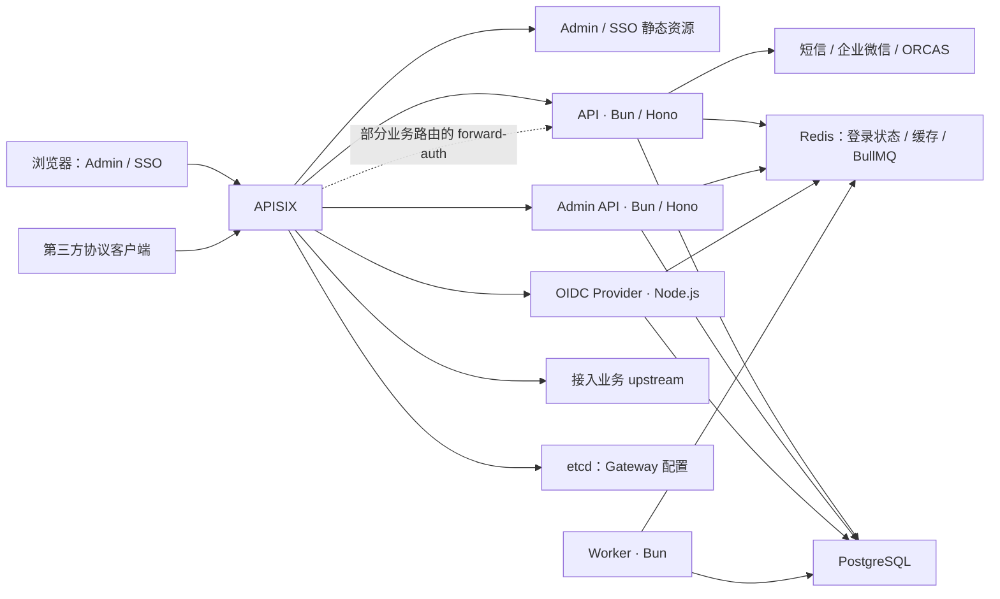

# 系统架构视图

本文连接 IAM 的运行时、信任边界、数据所有权和恢复责任。跨 runtime 设计、改变数据流或准备发布时从这里进入；
目录选址见[仓库地图](repository-map.md)，关键约束的验证入口见[架构验证归属](architecture-verification.md)。
模块内部规则仍由所链接的架构文档和 ADR 拥有；本文不替代发布手册，也不表示生产环境已完成部署验收。

## 逻辑拓扑

箭头表示逻辑依赖，不表示所有操作都访问每个依赖，也不表示物理共机、数据库读写分离或生产网络隔离。
共享 packages 在消费方进程内执行，不是独立网络服务。主要入口由
[IAM manifests](../../gateway/manifests/prod/iam.yaml)声明：

| 入口 | Runtime owner |
|---|---|
| `/portal`、`/iam-admin` 及其子路径 | SSO 与 Admin 静态前端；页面通过 app-local service 发起业务请求。 |
| `/api/iam/public/*`、`/api/iam/open/*`、`/api/iam/internal/*`、`/api/iam/auth/*`；`/sso/*` | API；前四类由 Gateway 去除 `/api/iam` 前缀，协议解析和鉴权按 API 的具体入口处理。 |
| `/api/iam/admin/*`、`/api/iam/rpc/*` | Admin API；Gateway 去除 `/api/iam` 前缀，REST 与 tRPC 复用管理能力。 |
| `/oidc` 及其子路径 | OIDC Provider；自身 HTTP composition 分发 interaction、登录守卫与 OIDC protocol。 |
| Queue consumer、health/readiness、可选 Bull Board、one-shot repair | Worker；HTTP 面不是业务 API，命令与 consumer 的资源生命周期由 Worker composition 拥有。 |

IAM 自身 routes 不统一使用 `forward-auth`。例如 [Tender manifests](../../gateway/manifests/prod/tender.yaml)中的部分
业务路径调用 IAM authz；[GDS manifests](../../gateway/manifests/prod/gds.yaml)有自己的 authz endpoint 与适用路径。
新增接入必须确认具体 route 的认证 owner，不能从“经过 Gateway”推断已完成认证或授权。

## 信任与协议边界

| 边界 | 职责与契约入口 |
|---|---|
| 浏览器 → 后端 | 浏览器输入、菜单和按钮状态不构成授权事实。Admin capability 与 `allowedActions` 镜像服务端决定，每次请求仍由 Admin API 授权；见[前端契约](frontend-architecture.md#管理路由与权限)与 [ADR-0017](../adr/0017-centralize-admin-role-policy-with-request-time-scope.md)。 |
| 代理 → IAM / 接入业务 | Gateway 拥有 host/path rewrite、真实 IP 信任配置与按 route 设置的 header。可信代理 CIDR、入口网络和实际端口可达范围需要部署验收，仓库图不能证明 header 来源可信或后端不可直连；见[Gateway 发布手册](../releases/apisix-gateway-release.md)。 |
| 协议入口 → 业务模块 | API、Admin API、OIDC Provider 分别拥有各自协议解析、认证和错误映射；normalized actor 与请求上下文通过显式接口流入业务层，见[后端架构](backend-architecture.md#请求审计与可观测上下文)。 |
| IAM → 第三方 | Custom SSO 与 OIDC 共享主体投影能力，但各自拥有 wire 与 artifact 生命周期；Independent client 自建的本地会话由第三方负责，IAM 撤销不等于第三方本地退出。见[第三方 SSO 对接](../features/sso/third-party-sso-integration.md)与 [OIDC 对接](../features/oidc/oidc-integration.md)。 |

短信、企业微信和 ORCAS 由 API composition 注入外部 adapter，分别服务于验证码、微信登录与 Custom SSO Session workflow；
失败语义以各调用方契约为准。
新增外部调用沿[后端事务与 afterCommit 规则](backend-architecture.md#transactions-与-aftercommit)选择执行位置，
不能把网络调用视为可随 PostgreSQL transaction 一起回滚的操作。

## 数据权威来源与恢复责任

| 状态 | 权威来源与 owner | 派生或恢复边界 |
|---|---|---|
| 用户、任职、组织、角色、Client 配置等业务事实 | PostgreSQL；业务写入口拥有 mutation，`@iam/db` 拥有 schema 与持久化基础能力。 | 共享包选址和 DTO 演进遵守[共享契约](contracts-and-database.md)，读模型或队列不反向成为源业务事实。 |
| User Profile / Subject Facts | `@iam/user-profile-read-model` 从源事实构建；PostgreSQL 的 Profile 与 Dirty Version 记录发布及新鲜度状态。 | Redis Facts 是可重建缓存；Worker 拥有重建与 publication，Reader 拥有窄行 read-through，见[发布契约](backend-architecture.md#user-profile-subject-facts-publication)。 |
| Principal Session / Temporary Login Restriction | Redis 实时状态，由 Session Kernel / LoginRestriction 拥有。 | PostgreSQL 审计不能重建登录状态或历史会话清单；丢失状态的后果见 [ADR-0005](../adr/0005-keep-live-login-state-in-redis.md)。 |
| Subject Access Barrier | Redis 保存请求时访问屏障；lifecycle coordinator 和 Worker recovery 对照 PostgreSQL 账号、transition intent 与当前 Facts 收敛。 | 缺失或不确定状态失败关闭，不能按普通缓存 miss 默认启用；恢复入口及调度责任见[Barrier 契约](backend-architecture.md#subject-access-barrier)。 |
| Client Runtime Snapshot | PostgreSQL 拥有 Client 配置；共享 Snapshot Module 拥有 Redis control 与三类 Runtime payload。 | 可重建，但不等于普通 TTL 缓存。Worker 拥有 targeted repair 和停流后的 full repair/verify，见 [ADR-0021](../adr/0021-bind-protocol-runtime-cache-consistency-to-snapshot-acquisition.md)。 |
| BullMQ rebuild 工作 | Queue 是唤醒和处理通道；User Profile 的待处理事实保存在 PostgreSQL Dirty 状态。 | 入队成功不证明 publication 完成；提交后 enqueue 失败由 repair 恢复，见[失效契约](backend-architecture.md#user-profile-失效)。 |
| Audit 与运行日志 | PostgreSQL `audit_log` 记录业务审计；应用日志经 Alloy → Loki，由 Grafana 查询。 | 日志不替代当前授权或业务事实。敏感字段与 after-effect 审计失败见[审计契约](../features/audit/audit-logging.md)。 |

因此，Redis 故障或恢复不能统一按“删缓存后回源”处理：实时登录状态、访问屏障、Runtime Snapshot 和队列分别有自己的
owner 与恢复路径。Redis backup restore 后的 Client Runtime 必须在停流下执行 full repair 与独立 verify，不能依赖
TTL 或逐 Client 访问自然收敛。当前 full repair/verify 只拥有当前 Snapshot namespace，不清理或验证旧 Runtime key；
旧部署、旧备份的升级迁移须另行安排，不能混跑旧 reader/writer。完整步骤由
[Snapshot 恢复手册](../releases/client-runtime-snapshot-restore.md)拥有，首次切换的历史边界见
[历史 hard-cutover 手册](../releases/client-runtime-snapshot-hard-cutover.md)。

## 一致性边界

- **账号访问**：API、Admin、Custom SSO 与 OIDC 在每个受影响接口的首次可信主体解析后取得一次许可；成功、拒绝和暂态失败固定。已许可在途调用不复查账号状态，下一调用重新检查；Kernel 只管对象生命周期，Projection 复用许可。旧代不因重新启用恢复，协调切换见[维护手册](../releases/subject-access-operation-cutover.md)。

- **数据库写入与发布**：影响 Profile 的源事实 mutation 与 invalidation 在同一源 transaction 内；publication 再原子提交
  Profile 与 Dirty processed，随后单调发布 Redis。`required` after-commit 失败仍可能已有数据库提交，不能据错误自动重放业务写入。
- **Client 配置**：请求成功接受 Snapshot 后可继续使用；Admin mutation 的传播成功影响后续 acquisition。传播失败可能让后续请求
  继续取得旧 Snapshot，须显式 repair；这不等于协议配置版本或 Session 撤销，见 [ADR-0022](../adr/0022-adopt-snapshot-consistency-for-client-traffic-gate.md)。
  同操作的协议配置与 Gate 分别固定首次结果，普通失败精确处理目标；Admin 协议变更只撤销早于本次提交版本的对象，
  晚到命令保留边界与更高代。枚举不是在途排空，极迟旧写入由下一调用精确拒绝；见[最终契约](../features/sso/protocol-validation-contract.md)。
- **主体事实与授权**：普通 Profile 可以消费最后发布事实；`iam:authorization` 使用 Authorization Freshness Barrier。
  Custom SSO 在交付时构建投影，OIDC 在授权时创建 Claims Snapshot，后续协议交付复用该快照；见[投影契约](backend-architecture.md#client-subject-projection)。
- **Admin 范围**：服务端按请求时 PostgreSQL 事实授权，已通过检查的请求可能在并发撤权后完成。该模型不保证提交时线性化撤权；
  适用范围及重新决策条件见 [ADR-0017](../adr/0017-centralize-admin-role-policy-with-request-time-scope.md)。

这些边界有意不同。新增跨 runtime workflow 时先明确事实 owner、观察时点、失败后已生效的作用与恢复 owner，
再选择公开接口和验证层；改变已有边界时同步更新其权威契约或 ADR，以及[验证归属](architecture-verification.md)。

## 部署与观测边界

生产 Compose 分别声明[后端与数据服务](../../docker/docker-compose-prod.yml)、[前端](../../docker/docker-compose-frontend-prod.yml)、
[Gateway](../../docker/docker-compose-gateway-prod.yml)与[观测服务](../../docker/docker-compose-observability-prod.yml)。
它们是部署输入，不能单独证明生产 profile、网络、TLS、备份恢复或外部依赖已经验收。

当前 [Alloy 配置](../../observability/alloy/iam-logs.prod.alloy)采集带相应标签的 Docker 日志并写入 Loki；APISIX OTLP span
进入 Alloy 后使用 debug exporter，不能据此宣称已有持久化 trace backend。采集标签、敏感字段、保留与 smoke 由
[观测运行手册](../releases/observability-system-logs.md)负责。真实环境的 readiness、停流、旧实例 drain、恢复和放流证据
由发布负责人取得，不能由本地测试或这张拓扑图代替。

Spec #157 的全部 56 条故事、20 项实现和 10 项测试决定见[一次消费最终账本](../features/sso/custom-sso-one-shot-grant-contract.md)。
#161 在正式 HTTP/Redis 上组合定向清理、独立核验、同根新授权与已有凭据访问；完整 OIDC 保留集复用 #160。
统一 writer/consumer、基线、停流排空、smoke 与回退见[保留会话升级手册](../releases/custom-sso-one-shot-grant-upgrade.md)，目标环境未执行。
