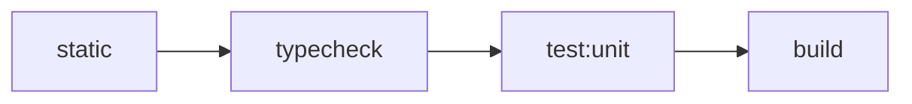

# 测试编排架构

> 状态：Current。本文描述 monorepo 已实施的 canonical test collections、资源所有权、编排与验证契约。

核心决策见 [ADR-0009](../adr/0009-adopt-canonical-test-collections.md)。Architecture Guard 的规则准入与观察边界见
[架构守卫规范](architecture-guard.md)；可执行入口见[构建、测试与开发命令](../development/commands.md)。

系统关键约束由哪个 owner 验证、现有代表性测试及其证明范围，见[架构验证归属](architecture-verification.md)。

## 公开测试语言

仓库只使用 Unit、Integration、E2E 三层。Integration 的六个 sibling profiles 表达资源模型与 harness owner：

| Profile | 观察目标 | 外部资源 |
|---|---|---|
| `component` | 进程内多个 module 协作，出站 seam 使用 fake 或 in-memory adapter | 无 |
| `process` | 真实子进程、端口、readiness、退出与进程树清理 | 本机进程与端口 |
| `redis` | production Redis adapter 行为 | 调用方负责；agent 可临时启动 Docker 容器 |
| `postgres` | schema、transaction 与 repository 行为 | 调用方负责；agent 可临时启动 Docker 容器 |
| `composition` | production composition 与多个真实 adapter 协作 | profile 声明的全部资源 |
| `browser` | 真实浏览器 harness，允许替代 journey 不经过的系统 seam | 浏览器与 package-local web server |

profile 不是新的测试层级、速度标签或 Gate。多资源测试按测试重点与 harness owner 唯一归属。

## 测试质量原则

测试应对行为变化敏感，对不改变行为的内部重构保持稳定。优先通过所属模块的公开接口，给出明确输入、状态或操作，
观察结果、错误及必要副作用；失败时应能直接知道哪项要求被破坏。以下原则适用于所有 collection，资源需求仍按上节分类。

- 一个用例聚焦一个可命名的行为场景。同一行为的前后状态、返回值和副作用可以一起断言；互不依赖的成功、拒绝、
  恢复和输入变体使用独立用例或具名参数化案例，不把所有 API 调用塞进一个测试。
- 测试独立建立并清理状态，不依赖执行顺序。异步操作必须等待完成；并发与 pending 状态优先使用显式同步信号、
  受控 Promise 或适用的受控时钟。真实 Redis 到期和进程退出仍使用真实资源，不用应用假时钟替代资源语义。
- 只在所测模块的外部边界替换依赖，优先保留模块内部真实协作。出站接口上的提交参数、脱敏、零写入和禁止重放是
  有价值的行为观察；内部 helper 名称、调用顺序和调用次数只有本身属于当前契约时才锁定。
- Fake 必须让待验证行为有失败的可能：缓存测试应区分命中与再次回源；筛选测试应观察传出的条件或真实筛选结果。
  固定返回值相等不能证明缓存有效，mock 加密输出不含明文不能证明生产加密安全。
- 纯类型兼容由 typecheck 收集的 `*.type-contract.ts` 验证，保留正向约束和必要的 `@ts-expect-error`；不创建空函数
  调用或恒真断言的运行时测试。共享 mapper 的完整结果由 owner 验证，消费方只验证自身适配。
- 行为测试不通过其他源文件中的变量名、注释或调用文本推断资源隔离、清理和业务语义；使用能观察该事实的接口。
  静态分析工具自身的路径/import fixture 是其公开输入，继续按 Architecture Guard 的允许模型验证。
- 性能采样与正确性证明分开。已接受的资源预算应有直接、适用的证据；不把一次实现的完整端点调用数或 socket
  `data` 回调次数冻结成永久正确性契约。采样结果不能冒充命令数、往返数或业务串行波次。

评审时检查：去掉待保护的行为，测试是否会失败；只改变内部实现，测试是否仍可通过；失败能否定位具体要求。
不以测试数量、mock 数量、matcher 名称或覆盖率代替这些判断，也不为本原则增加断言扫描器。
原则来源：[好的与不好的单元测试](https://chatgpt.com/share/6aa8d88c-bd6c-83e9-9a84-84646123864d)。

## 当前契约与测试清理

永久测试应证明去掉迁移背景后仍成立的当前可观察要求。评审候选时按保护目标分类，不按 `legacy`、`V1` 或
`removed` 等关键词批量删除：

| 分类 | 处置依据 |
|---|---|
| 纯墓碑 | 历史名称、字段、命令或目录缺席本身没有独立当前要求，删除该检查及仅供其使用的 helper。 |
| 冗余检查 | 当前完整结果相等已覆盖的字段否定可以删除；冻结、敏感输入裁剪等独立语义仍须保留。 |
| 当前边界的历史表达 | 要求仍有效，改用当前完整结果、公开解析、消费方结构兼容或实际行为证明。 |
| 现行迁移、兼容或恢复能力 | 有当前生产 owner 且执行实际行为，继续保留；历史输入、无 fallback 和 non-owner namespace 保护不能按名称退役。 |
| 临时迁移检查 | 按 feature 记录 owner、reason、removal date，到期核对并移除，不进入永久架构规则集合。 |

删除前在交付或评审摘要说明原保护目标、当前是否成立、替代测试或冗余原因。仍成立但缺少直接证据的要求，必须在
同一提交补齐替代证明，或先验证替代测试通过再删除旧检查；同时核对专用 fixture、故障开关和清理登记是否仍可达。
只序列化手写 fixture 的测试不能证明生产输出隔离，只抛错而不观察副作用的测试不能证明零写入。

DTO/wire 的完整结果由正式 mapper/serializer owner 验证，包括必要的嵌套结果；裁剪测试必须实际提供额外字段并
调用生产解析或映射。App 的单纯 re-export 不重复维护共享字段词典，只验证自身转换、协议适配和调用行为。
接口以消费方所需能力及 provider-to-port 结构兼容验证；subject-only reader、只读 verifier 等明确安全封装另有直接
证明。不要把旧成员黑名单换成完整 factory 方法白名单，未被消费的新方法不普遍构成测试失败条件。

测试清理不授权改变生产行为或新增 seam。替代测试暴露生产缺陷时，保留最小失败证据并单独报告，不降低断言换取通过。
交付摘要区分已执行、仅保留和未执行的通道；测试数减少、关键词零命中或 coverage 百分比不能替代契约验收。
这些分类由实现与评审核对，不新增断言语义扫描器、永久历史词典、baseline 或逐文件 mapping Guard；Architecture Guard
与 Collection Guard 继续遵守各自既有观察模型。

## 禁止纯展示测试

所有 collection 均禁止新增或保留只锁定静态 UI、展示文案或视觉实现细节的测试与断言，包括固定标题、说明文字、
静态标签字典、装饰图标、CSS class、颜色、间距、字重、固定 DOM 排列，以及只保存这些内容的 HTML/DOM/截图快照。
仅检查固定 mock 数据中的姓名、电话或目录字段被原样显示，也属于纯展示；它不足以成为独立的行为用例。
仅为使测试显得有交互而打开页面、点击展开固定说明或等待一次请求，不会使静态展示检查变成行为验证。

前端行为测试应能说明：给定什么输入、权限、状态或用户操作，产品必须产生什么可观察的功能结果。没有用户点击不代表
没有行为；权限控制、数据转换、条件展示和异步状态变化都可以具有独立的功能契约。

| 观察目标 | 处置 |
|---|---|
| 固定页面标题、帮助文字、按钮配色或布局；导出的静态字典逐项等于硬编码文案 | 删除独立用例；混合用例只删除这些断言。 |
| 权限未加载时不开放操作、只读目录不提供写入口、登录检查中不展示表单 | 保留对应权限或状态条件与可见、隐藏、禁用等功能结果。 |
| 提交后的错误反馈、重试恢复、跳转、刷新、表单校验及提交参数 | 保留触发条件与结果；纯样式和无关固定说明不附带进入断言。 |
| 数据排序或格式化、嵌套数据转换、缺失值回退、状态或错误类型映射到相应提示 | 保留真实输入到输出的规则；不把固定样例回显或复制静态标签表包装成映射测试。 |
| 协议响应、序列化、转义或敏感信息不泄露 | 按相应协议或安全契约保留，不能因输出是文本或 HTML 而归为纯展示。 |

`getByText`、`getByRole`、`toBeVisible`、`toHaveTextContent` 等 API 本身不是删除依据。使用文案定位操作目标、
等待页面就绪或观察功能状态可以保留；精确文案只有在措辞本身属于当前功能契约时才需要锁定。行为测试中的整页快照
不能替代对目标功能结果的直接断言，也不能成为附带锁定视觉细节的理由。

清理按用例和断言逐项进行，保留混合文件中的行为证明，并移除只供已删检查使用的 import、fixture 和 helper。
仍成立的功能要求缺少直接证明时，沿用上节的替代验证规则；不以把纯渲染用例改名为行为测试、增加无关点击或复制到
其他 collection 的方式保留它。

本规则由测试编写者与评审者按保护目标执行。不通过 matcher 黑名单、断言文本扫描器或快照文件计数判断行为价值；
Architecture Guard 与 Collection Guard 的既有观察边界保持不变。

## 路径、命名与 collection

- Unit 保留 owner-local 窄根，通常为 `src/**/*.test.ts[x]`；tooling owner 可以使用 `test/` 或
  `scripts/__tests__/`。
- Admin 与 SSO frontend 的 Unit 分别在一个 package-local Vitest 进程中使用 Node 与 DOM execution environments。
  普通 `*.test.ts[x]` 默认进入 Node，只有 `*.dom.test.ts[x]` 显式进入 jsdom。Node 不加载全局 DOM setup；DOM 才加载
  Testing Library 与必要的浏览器兼容 setup。需要 HTTP mock 的文件显式注册 package-local MSW lifecycle，不以 MSW
  的使用决定 Node/DOM 环境。Node 与 DOM 仍属于同一个 Unit collection，不形成新的公开命令或 profile。
- 非 browser Integration 位于 `test-integration/<profile>/**/*.integration.test.ts[x]`。
- Browser Integration 位于 `test-integration/browser/**/*.spec.ts`。

API 的 OIDC 退出 Browser Integration 使用真实候选 API、动态 loopback 测试 RP 和专用 `IAM_API_TEST_REDIS_URL`，
不 mock IAM 协议请求。该通道单 Chromium、单 worker、零重试；fixture 子进程经 readiness 后交付浏览器种子，父进程关闭
stdin 后清理本次 HTTP server 与随机 Redis namespace，启动失败也进入同一收尾。其取消/确认、Cookie、state 与安全错误
证据不替代全系统 E2E、真实第三方 RP 或部署；后者继续使用独立通道。
- Full-system E2E 独占 `e2e/system/**/*.spec.ts`。Root `pnpm test:e2e` 是唯一完整 collection owner；workspace-local
  `admin:journey`、`hr-admin:journey` 与 `oidc:journey` 只保留为单 journey 调试入口。
- 版本无关的 User Profile backfill、repair 与 readiness 是操作命令，不采用测试命名，也不属于任何 collection；
  PostgreSQL command Integration 验证命令进程；Full-system E2E 从存量 v2 row 经真实 Worker backfill 收敛到 v3，随后在
  Gateway routes 发布前实际运行 PostgreSQL 与 Redis/Subject Facts/Subject Access 两道 production gate，并通过真实 HTTP
  验证 canonical Filter、legacy/Public/Delegation adapter 与 Employment invalidation 的代表矩阵。
- Employment 全库诊断通过 `@iam/user-profile-read-model/worker` 与 Worker `employment:verify` 验证；Component
  覆盖分类、完整 ID 集合与稳定排序，PostgreSQL contract 验证真实只读库存和命令退出码。它不等价于 Profile builder
  发布前的父对象 fail-closed 守卫，后者的独立行为测试继续保留。

每个测试候选必须由一个且仅一个 canonical collection 收集。Admin Client 配置/Secret/状态的真实传播位于
`composition`，generic InternalAuthz cache 另保留 Redis contract；共享统一 Snapshot 与 Subject Access 在 Core Redis。
Kernel 两类会话只发布 Redis collection（`IAM_SESSION_KERNEL_TEST_REDIS_URL`）；Custom SSO 纯 wire/redirect Unit 保留，
完整协议与故障由 API HTTP Redis 的正式操作 factory 承接，旧空 Custom component/redis 命令已删除。
OIDC 模块 Redis 使用 `IAM_OIDC_TEST_REDIS_URL`，API HTTP 使用 `IAM_API_TEST_REDIS_URL`。

旧四对象/Provider/version/Claims Snapshot 测试随旧在线图退役；当前替代必须按行为观察，不能用计数或启动替代。
并发、损坏、归属、期限与索引归 Kernel；消费与失败结果、补偿、ORCAS、当前披露、取消/确认退出归 API/协议 owner；
配置 no-op/COMMIT/Secret隔离归 Admin；source 五模型/特殊 Client/非目标/ACL/部分失败归 Worker 新进程 CLI。
详细最高入口与证明限制见[验证归属](architecture-verification.md)。所有正常状态由 production owner 建立，破坏变体和离线 schema
留在 owner `/testing`，消费者不手写协议 key、Lua 或 serialization。历史 writer 的冻结 SHA 证据在统一维护手册单列。
Custom SSO strict V2 schema、mapper、错误与 preview 契约由 `@iam/custom-sso` 的 Unit collection 收集；Projection 的中性裁剪与 Catalog 契约继续由其 Component collection 收集。API 保留 OpenAPI、输出交付与错误映射测试；Admin preview 的配置响应、SSO 数据处理与页面状态由各自行为测试证明，固定样例回显不单独建测试。前端构建与类型检查不替代浏览器行为执行。

E2E workspace 的 command runner 输出隔离和取消清理在其 `Integration/process` 中通过真实子进程验证，
由 `pnpm --filter @iam/e2e-system test:integration:process` 收集；纯 capture 与 discovery parser 留在 Unit。

## Root 与 package commands

新 OIDC owner 的状态/维护 Redis 测试由 `@iam/oidc` 收集，使用专用 `IAM_OIDC_TEST_REDIS_URL`；
API 正式根认证与 OIDC HTTP 组合使用 API Redis profile。旧 Provider app 已退役，历史 writer 证明独立固定 SHA，不能当最终候选执行。现行协议能力与验证入口见 [OIDC 协议契约](../features/oidc/oidc-integration.md)。

长期 root interface 为：

```text
pnpm test
pnpm test:unit
pnpm test:integration
pnpm test:integration:component
pnpm test:integration:process
pnpm test:integration:redis
pnpm test:integration:postgres
pnpm test:integration:composition
pnpm test:integration:browser
pnpm test:e2e
pnpm check:test-collection
```

`pnpm test` 永久代理 `pnpm test:unit`。有 Unit collection 的 package 也令 `test` 代理 `test:unit`；没有 Unit
collection 的 package 不发布空 `test`。旧 `test:smoke`、`test:external`、package-local `test:postgres`/
`test:redis` 与 frontend `e2e` collection aliases 已删除。

`@iam/e2e-system` 当前通过 root `pnpm test:e2e` 从 exact-project 空 volumes 运行 migrations、五个 repo
runtimes、固定 synthetic scenario seed、单一 `127.0.0.1` Gateway route readiness、失败诊断与 cleanup。Runtime healthy 后先校验
rendered Compose 中 API、Gateway、Admin 与 seed 的 canonical origin/authority 合同，再运行 seed；seed 通过 production
Drizzle、Role Assignment、User Profile 与 Subject Access owner 建立数据并做 owner read-back，不复制 Redis key、serializer 或 Lua 协议。
Descriptor 落盘后、infra 与 migration 前会先
构建 project-scoped Gateway 诊断查询镜像，使早期失败也能在 cleanup 前保存 route state；诊断阶段不临时 build 或暴露
APISIX Admin host port。Descriptor 落盘后、diagnostic tool build 与任何资源创建前，先原子写入只含 stage/timestamp 的安全
`not-attempted` migration receipt；初始化失败时不创建资源。Migration command 前再更新为 `attempted`，随后只更新为 `applied`
或不含原始错误、命令及环境的 `failed` receipt。Full-system Compose/runtime 只使用 feature 固定或 run-generated synthetic
data/credentials，不接受 production endpoint、production credential 或真实 PII。Compose 日志按完整行保留 recent tail；单行超过
service byte cap 时整行替换为 `[TRUNCATED]`。Diagnostics 保留有界原始内容，不做 JSON/YAML/JWK/PEM/credential 分类或脱敏；
synthetic token/password/key 允许出现在受 artifact directory、retention 与访问控制治理的临时产物中。
普通 command runner 不把 child stdout/stderr 回显到 console；原始输出只由有界 capture 进入 artifact。Compose ps/health、
每个固定 service log、Gateway state 或 existing-evidence inventory 任一采集失败时，仍 all-settled 写完可得证据、placeholder 与 index，
随后令顶层 run 非零并继续 best-effort exact-project cleanup。所有 source failure 都走普通 required-source 路径，不存在 typed
unconfirmed-termination 特殊 gate。若 run-scoped Playwright staging 存在，diagnostics 把 raw `trace.zip`、PNG 与 WebM 安全移动到
run artifact directory，保留原始内容；metadata index 只辅助列出 type/name/size，不替代或删除 raw 文件。Intake 与其他 source一样
受独立 deadline 约束，并限制最多 128 个文件、单文件 16 MiB、合计 64 MiB；路径越界、symlink、枚举、限额或移动失败都是 required
diagnostic failure。
Preflight 在 descriptor 和资源创建前受独立 60 秒 deadline 约束；该阶段失败时不存在 exact project 或已创建资源，因此直接
非零退出，不运行 project diagnostics/cleanup。Descriptor 落盘后的 runtime setup、readiness、timeout 与可捕获 signal 进入同一
`collectDiagnostics -> cleanup` 路径；cleanup failure 保持顶层非零。`runtime:cleanup` 只接受明确 descriptor 或 exact
project，不枚举模糊前缀，也不执行全局 prune。Cleanup 对 exact project 执行一次
`compose down -v --remove-orphans --rmi local`；不再查询/删除 image IDs 或复查 container/network/volume/image 为零。普通 down
failure 令 cleanup 非零并保留 descriptor，允许残留供显式 recovery 重试，且不得影响 unrelated Docker 资源。cleanup 使用独立
deadline。Signal/timeout 对当前 child/tree 做一次 best-effort 终止并有界等待：Windows 可调用一次 `taskkill /T /F`，POSIX 可终止
process group 或 direct child；不记录 PID CreationDate、不使用 CIM leaf-to-root fallback、不确认 process identity，也没有 typed
unconfirmed-termination gate。正常完成应尝试 clean，但异常路径不以 inventory=0 作为硬门禁。Gateway
readiness 对 OIDC discovery 不只检查 HTTP 200，还精确核对 canonical origin 下的 issuer、authorization、token、JWKS、UserInfo
与 RP-initiated logout URLs；Custom SSO 的 internal/external well-known configuration 也必须回读同一 canonical origin。Seed receipt
只记录 stage、timestamps、failure category 或 run-scoped public references，不记录 credential、token 或 secret。

`admin:journey` 在上述 lifecycle 的 protocol readiness 之后运行浏览器 preflight，并以单 Chromium project、单 worker、零 retry
执行 `admin-custom-sso.spec.ts`。Journey 用 bootstrap Admin client 通过真实 SSO 登录 Admin，由真实 Admin UI 创建跨树 Organization
Responsibility，再轮询 Internal Detail/DSL 与 Custom SSO UserInfo 证明 PostgreSQL/Redis 发布一致，并证明 Gateway/authorization 裁剪责任。
随后 Admin UI 配置并启用 managed Custom SSO，将目标 Client 切入 Maintenance；公开 authorize 与 user-info 观察
`503 AUTH.MAINTENANCE`，恢复正常后取得并复用同一 Custom Token，再在维护中执行真实 disable/enable mutation。
Admin 通过捕获的 ClientSession 身份显式撤销目标 Client 的会话，确认旧 Token 永久失效，并由同一有效 UserSession 重新授权。
浏览器失败证据沿用 run-scoped Playwright staging，随后进入统一
diagnostics 与 exact-project cleanup。`hr-admin:journey` 复用同一 lifecycle 与浏览器约束；seed 通过真实 `iam-admin` Client、
两个 HR Scope Roots、跨根 role-bearing Employment、双端四组合、隐藏 Open blocker、mixed-role Full Admin、ordinary actor
与无有效 scope 的 HR actor 建立不扩权场景，经 production Worker 发布后真实 SSO 登录。Journey 验收 Organization
Responsibility 菜单、Type Catalog、独立 Assignment 页面及 Organization/Employment/User 嵌入面板，执行
Create → Pause → Resume → End → Ended 历史，并验证 selector 裁剪、server-owned `allowedActions`、隐藏 Audit、direct
URL/猜测 ID、REST/tRPC 四组合（in/in 进入领域冲突，其他组合 404）、安全 cardinality/Organization blocker、scope
撤销后下一次读取与 mutation 均 404，
以及 ordinary/no-scope actor 403。随后 production Drizzle verifier 在 cleanup 前证明 lifecycle audit、
`organization-responsibility-updated` invalidation/Profile 收敛、隐藏 blocker 保持、撤销的 Role Assignment 消失且越界
无写入；有界 Admin API log capture 验证 `RESOURCE_OUT_OF_SCOPE` denial 不泄露 Assignment、holder、Organization path
或 scope/root 集合。同一 full actor 在移除 `iam:hr-admin` Role Assignment 前后分别命中 mixed/full policy 分支，
并以隐藏 Assignment 的 Pause/Resume 证明两种身份都保持全局读取与 mutation 能力。
`oidc:journey` 复用同一 lifecycle 与浏览器约束；独立 Admin 浏览器上下文在 Maintenance 中执行
OIDC disable/enable 并恢复正常，test-owned RP helper 生成 S256 verifier/challenge 并接收 registered callback。公开 authorize、token 与
`/oidc/me` 验收标准暂态错误、恢复、PKCE、Code 单次使用与当前 `iam:employments` 披露。Authorization Code 取得后通过
真实 Employment Pause → Resume → End 验证当前发布事实；错误 PKCE 消费 Code 并终止其原 ClientSession，正确 verifier 重试仍失败，
同一有效 UserSession 重新授权后取得新 Code 与 Token。UserInfo 读取当前事实，已结束任职的责任不再披露；ID Token 明确排除
employment/authorization responsibility。Discovery、JWKS 与 `/oidc/health` 在单个 Client 维护中保持可用，
RP-initiated logout 在维护中终止当前根下的访问。Local HTTP 配置令 API 的 `oidc_interaction_binding` Cookie `Secure=false`，
并继续验证 `HttpOnly`、`SameSite=Lax` 与 `Path=/oidc`；登录后的根 Cookie 则使用 `Path=/`。三个 journey 都不使用
`page.route` 替代 repo-owned core。完整命令在同一个 exact-project lifecycle 中固定按 Admin → HR Admin → OIDC 运行；任一 journey
失败都先收集 diagnostics 再尝试 cleanup，cleanup failure 始终使 root command 非零。

Root `test:unit` 通过 Turbo fan out package Unit tasks，并由 `test:unit:root` 精确收集四个 root tooling tests。
六个 profile commands 只 fan out 同名 package tasks。Integration 资源由调用方负责：可以直接提供专用 URL，也可以由
agent 先启动临时 Docker 容器。`test:integration` 本身不创建资源；它在启动任何 profile 前一次性检查所有资源 URL，
再按以下顺序串行运行并传播第一个失败：

```text
component -> process -> redis -> postgres -> composition -> browser
```

每项专用 URL 均不得回退 runtime 或其他 test URL。缺少任一 URL 时，命令在启动 profile 前失败。
Agent 可以补齐临时资源后重新运行，但命令不得 skip、自动 retry 或读取 runtime/development 配置。

## 双入口验收与产物隔离

#200 为 root Full-system collection 添加独立双入口阶段：先完成上述同 origin 基线，再启动另一个 exact project，
以 `internal.iam.localhost` / `external.iam.localhost` 和动态 Gateway 端口执行
`dual-entry.spec.ts`。基线的 OIDC selector 也收集该文件，因此相同 origin 另有实际场景；
双入口阶段只运行该文件，复用完整 migrations、seed、readiness、正式 APISIX 与诊断/清理 owner。
它直接观察两协议相对登录、同一 managed Client 按本次落地 origin 回调、固定 business callback、host-only Cookie、授权 `iss`、退出与未知 host/伪造 header。
E2E 从正式 manifest 发布 API upstream 的受控 Host rewrite，并回读已发布 upstream 后才运行旅程；不改生产 manifest 的部署输入。
旧状态升级使用显式固定源码目录的独立演练，不在普通 composition 中隐式拉取旧代码；
suite/RP、三个旧 Worker 进程和非目标保留的证据入口见[协议套件与演练入口](../development/commands.md#oidc-协议套件与旧来源演练)。

API Browser Integration 的 Playwright 输出固定为 `apps/api/test-results/browser`，不能使用会清理其他通道产物的
默认 `apps/api/test-results` 根。独立协议套件的持久验收材料放在调用方明确的任务目录，避免被浏览器 runner 清理。

## Collection Guard

`pnpm check:test-collection` 是永久 Guard，只验证：

1. canonical 路径与命名下的每个候选都被收集；
2. 每个候选只属于一个 collection；
3. 文件路径、命名与 profile 归属一致；
4. root command 经 Turbo dry-run 可达 owner package task。

Vitest 与 Playwright 使用机器可读 list；Bun adapter 观察 package command 声明的窄目录。漏收、重收、归属不一致、
task 不可达、adapter 失败或输出不可解析都给出可定位诊断并非零退出。Guard 不读取测试断言，不推断资源使用，也不分析
AST、type 或 data flow。迁移 baseline、逐文件 mapping、临时 exceptions 与 live equality verifiers 已退役，永久 Guard
不保存历史兼容映射。

## Turbo task graph 与缓存

Turbo 是唯一跨 package orchestrator；package 继续拥有 runner、configs、fixtures 与 scripts。Unit/component 使用
`transit` 传播依赖源码变化，而不通过 `^test` 执行依赖 package 的测试：

```json
{
  "tasks": {
    "transit": { "dependsOn": ["^transit"] },
    "test:unit": { "dependsOn": ["transit"] },
    "test:integration:component": { "dependsOn": ["transit"] },
    "test:integration:process": { "dependsOn": ["transit"], "cache": false },
    "test:e2e": { "dependsOn": ["transit"], "cache": false }
  }
}
```

Frontend package 内部的 Vitest projects、setup 与测试支持代码仍由该 package 自己持有；仓库不提供 root Vitest
workspace、跨 package 共享配置模块或共享 setup。Admin/SSO Component Integration 与 DOM Unit 是不同的行为边界：
前者继续整体使用 jsdom、完整 setup 与 `test-integration/component/**/*.integration.test.ts[x]` 收集规则，后者只是
Unit collection 内的显式执行环境。

Unit/component 只有在输入、env、fixtures、时间与随机性都可重现时允许缓存。process、redis、postgres、composition、
browser、Full-system E2E 与其他外部验证均 `cache:false`。资源 tasks 通过 Turbo strict env 只透传 owner-specific test URLs。

## 并发、timeout 与清理

| Collection | Turbo package concurrency | Runner 预算 |
|---|---:|---|
| Unit | 2 | Admin/SSO Vitest `maxWorkers: 4`；其他 Vitest `maxWorkers: 25%`；Bun `--max-concurrency=2` |
| component | 2 | Vitest `maxWorkers: 25%`；Bun `--max-concurrency=2` |
| process / redis / postgres / composition | 1 | 单 package；资源 owner 独占 |
| browser | 1 | Playwright 管理单 Chromium project |
| Full-system E2E | 1 | 三次 Playwright journey 均为单 Chromium project、单 worker、零 retry |

Timeout 只保护测试不永久挂起，不承担性能 SLA。Process harness 必须使用真实 readiness 信号、同时观察 child exit/error、
限制 stdout/stderr 缓冲，并在成功、失败、timeout 与中断路径清理完整进程树、端口与临时目录。不得通过放宽全局 timeout、
重试或吞掉 cleanup 错误换取绿色结果。

### Bun 异步断言

当前固定的 Bun 1.3.14 中，`bun:test` 的 async matcher 可能在 matcher 内同步重入 event loop；数据库、Redis、HTTP、
subprocess、readiness 或其他依赖 I/O callback 完成的 Promise 因此可能悬挂。仓库解除此兼容约束前，新增或修改的 Bun 测试
必须先用普通 `await` 完成异步操作，再对结果做同步断言：

```ts
const report = await databaseOperation();
expect(report).toMatchObject(expectedReport);
```

失败路径先捕获 rejection，再同步断言错误；不要把 I/O-backed Promise 直接传给 `.resolves`、`.rejects` 或 async
`toThrow`。即使外层写成 `await expect(databaseOperation()).resolves...` 也没有消除 matcher 内的 event-loop 重入。
这属于测试 runner 兼容边界，不得用增大 timeout、重试或修改 production I/O lifecycle 掩盖。Bun 修复并完成仓库级
真实 PostgreSQL/Redis/process 回归验证后，才能移除此约束；上游跟踪见
[oven-sh/bun#33261](https://github.com/oven-sh/bun/issues/33261)。Vitest 测试不受本条 Bun 专用约束影响。

PostgreSQL 测试只清理自己创建的随机 schema。Redis 测试只清理自己的随机 namespace；禁止对共享实例执行
`FLUSHDB`/`FLUSHALL`。Integration 测试命令和 harness 不负责启动 Docker、PostgreSQL 或 Redis。Agent 可以在运行命令前
启动任务独占的临时容器，但必须等待服务 ready、传入专用 URL，并负责测试成功、失败和中断后的精确清理。Browser
profile 可以按 Playwright config 启动 package-local web server。缺少资源 URL 时命令仍然 fail closed，且不得回退开发或
生产资源。

Admin API 的真实事务与 PostgreSQL correctness contract 使用 owner-specific
`IAM_ADMIN_API_TEST_DATABASE_URL`；其 harness 必须通过 production Admin UoW factory 注入随机 schema client，不能回退
进程级数据库 singleton。

维护者决定 Client Runtime targeted/full repair 与独立 verify 的真实成功路径统一沿用 #68 的 owner-specific
`IAM_WORKER_TEST_REDIS_URL`，不为 full repair 增加第二个 cleanup URL，也不枚举或推断其他可见 test/runtime Redis 的
hostname、port 或 logical DB identity。调用方仍须提供专用、非 production Redis；harness 保留 #68 对 Worker 自身 runtime
tuple 的直接防误用检查，full restore contract 在写 fixture 前证明 Module-owned inventory 为空，并只登记本次
Client/restore fixture 与 non-owner sentinel。该 profile 运行 production Redis-only command composition：targeted contract 以独立 observer 验证普通/敏感 payload 均重新回源、重复 repair 安全且 sentinel 保留；restore contract 建立当前 Snapshot owner inventory，验证
分批 full repair、部分失败重跑、另起 Worker process 的 scan-only full verify 与 non-owner sentinel 保留。
旧 OIDC、Custom SSO 与 Traffic Gate key 不属于当前 owner inventory，其残留不使 verify 失败；测试不证明旧 namespace 已清空。
测试结束只精确 `UNLINK` 本次登记键并验证
owner inventory 无残留，禁止 `FLUSHDB`/`FLUSHALL`。

API Core 的 Client Runtime full restore contract 使用现有 `IAM_API_CORE_TEST_REDIS_URL`，按 Redis profile 串行运行。
写入 fixture 前先验证当前 Snapshot owner inventory 为空，测试后只精确清理登记的 fixture，并验证 owner inventory 无残留。
非 owner namespace 可保留；不要求整个 logical DB 为空，也不使用 `FLUSHDB`/`FLUSHALL`。
旧 Session cleanup CLI、共享 harness 与专属 Redis 配置已退役；API composition 继续使用 API 自有 PostgreSQL/Redis 资源。

## 默认验证与交付

Spec #178 当前候选的实际命令与结果按逐票交接记录；历史切片结果不代替最终树，环境切换另行验收。

基础 `pnpm verify` 固定 fail fast：



`pnpm verify:static` 通过同一 runner 的 `--static` 参数只运行静态阶段：lint、文档索引、环境变量命名 Guard、
Architecture Guard 与 Collection Guard。`verify` 不读取真实 PostgreSQL/Redis，
不启动 browser 或 Full-system stack，也不隐式执行 Integration。开发者按改动风险显式追加相关 profiles；完整
`test:integration` 只在调用方准备好全部专用资源时运行。

两级 provider-neutral 聚合 Gate 只组合上述 owner commands，并保持 fail fast：

```text
pnpm verify:ci       = verify -> test:integration
pnpm verify:release  = verify:ci -> test:e2e
```

Gate 本身不读取资源配置，不复制 Integration preflight 或 Full-system E2E 的 descriptor、diagnostics 与 exact-project
cleanup，也不把命令名解释为 provider adoption。各 owner command 的资源与 lifecycle 契约见
[构建、测试与开发命令](../development/commands.md)。

每票每轮交接前运行 `pnpm verify:static`，最终候选的 `pnpm verify` 复用同一静态阶段；无需另外重复执行
`pnpm check:test-collection`。独立命令保留用于聚焦排查。收集检查通过不表示测试断言已执行或通过；执行或解析失败
同样阻断交接与交付。责任、交接材料和失败处理见[开发工作流](../agents/workflow.md#验证节奏)。

统一 Snapshot 使用 Core Redis、Admin PG/Redis composition 与 Worker 新进程 CLI，测试不能代替停流/drain/独立核验。
当前操作流程见[统一维护手册](../releases/unified-session-maintenance.md)，旧三类 Snapshot 恢复仅为历史。

| 阶段 | 最小范围 |
|---|---|
| 开发内循环 | 当前 Unit/profile、单文件或测试名 |
| Ticket 实现 | 每轮交接前 `pnpm verify:static`、完整受影响范围的 typecheck 与行为测试、diff 检查 |
| 准备 merge/release | 最终内容上一次 `pnpm verify`（含 Collection Guard），再按风险显式执行 Integration/Gateway 等检查 |

2026-08-06 的 Windows 本地候选周期在同一次完整连续流程中依次通过 `pnpm verify` 3/3、全资源 `pnpm verify:ci` 1/1、
干净 E2E `pnpm verify:release` 1/1，且最终 task-owned 与 exact-project Docker inventory 均为零。Feature 历史中的正式
evidence 失败和 setup retries 继续保留；环境或代码根因修复后从头重启的完整流程可用于验收，但不得在同一流程内重试单个
阶段或隐藏历史。当前没有 CI 平台；Linux/真实 CI 仍为 `pending`，平台状态不能通过 placeholder command、silent skip 或
本地重跑伪装为已采用。
