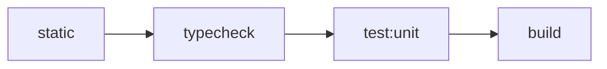

# 测试编排架构

> 状态：Current。本文描述 monorepo 已实施的 canonical test collections、资源所有权、编排与验证契约。

核心决策见 [ADR-0009](../adr/0009-adopt-canonical-test-collections.md)。Architecture Guard 的规则准入与观察边界见
[架构守卫规范](architecture-guard.md)；可执行入口见[构建、测试与开发命令](../development/commands.md)。

## 公开测试语言

仓库只使用 Unit、Integration、E2E 三层。Integration 的六个 sibling profiles 表达资源模型与 harness owner：

| Profile | 观察目标 | 外部资源 |
|---|---|---|
| `component` | 进程内多个 module 协作，出站 seam 使用 fake 或 in-memory adapter | 无 |
| `process` | 真实子进程、端口、readiness、退出与进程树清理 | 本机进程与端口 |
| `redis` | production Redis adapter 行为 | 调用方负责；agent 可临时启动 Docker 容器 |
| `postgres` | schema、transaction 与 repository 行为 | 调用方负责；agent 可临时启动 Docker 容器 |
| `composition` | production composition 与多个真实 adapter 协作 | profile 声明的全部资源 |
| `browser` | 真实浏览器 harness，允许替代 journey 不经过的系统 seam | 浏览器与 package-local web server |

profile 不是新的测试层级、速度标签或 Gate。多资源测试按测试重点与 harness owner 唯一归属。

## 路径、命名与 collection

- Unit 保留 owner-local 窄根，通常为 `src/**/*.test.ts[x]`；tooling owner 可以使用 `test/` 或
  `scripts/__tests__/`。
- Admin 与 SSO frontend 的 Unit 分别在一个 package-local Vitest 进程中使用 Node 与 DOM execution environments。
  普通 `*.test.ts[x]` 默认进入 Node，只有 `*.dom.test.ts[x]` 显式进入 jsdom。Node 不加载全局 DOM setup；DOM 才加载
  Testing Library 与必要的浏览器兼容 setup。需要 HTTP mock 的文件显式注册 package-local MSW lifecycle，不以 MSW
  的使用决定 Node/DOM 环境。Node 与 DOM 仍属于同一个 Unit collection，不形成新的公开命令或 profile。
- 非 browser Integration 位于 `test-integration/<profile>/**/*.integration.test.ts[x]`。
- Browser Integration 位于 `test-integration/browser/**/*.spec.ts`。
- Full-system E2E 独占 `e2e/system/**/*.spec.ts`。Root `pnpm test:e2e` 是唯一完整 collection owner；workspace-local
  `admin:journey`、`hr-admin:journey` 与 `oidc:journey` 只保留为单 journey 调试入口。
- 版本无关的 User Profile backfill、repair 与 readiness 是操作命令，不采用测试命名，也不属于任何 collection；
  PostgreSQL command Integration 验证命令进程；Full-system E2E 从存量 v2 row 经真实 Worker backfill 收敛到 v3，随后在
  Gateway routes 发布前实际运行 PostgreSQL 与 Redis/Subject Facts/Subject Access 两道 production gate，并通过真实 HTTP
  验证 canonical Filter、legacy/Public/Delegation adapter 与 Employment invalidation 的代表矩阵。

每个测试候选必须由一个且仅一个 canonical collection 收集。Admin API 的 client runtime 真实 contract 位于 `redis`
profile：Custom SSO 与 Traffic Gate 通过 production Admin runtime 的 `clientRuntimeInvalidation` seam 与真实 Client service
mutation 验证 required Snapshot invalidation；legacy `clientCache` 只验证仍由它拥有的通用 cache invalidation。Traffic Gate
acquisition 由 canonical Snapshot Adapter/Reader 的 Component contract，以及共享真实 Redis 与 production composition contract
覆盖。该 profile 不初始化与 contract 无关的 queue；process profile 只保留 entry/readiness/exit/cleanup。Redis-dependent 状态由各 production owner
在 `redis` 或 `composition` profile 建立，测试 fixture 不实现 Redis 协议、key、serialization、TTL、Lua 或 transaction
排列。原 process-smoke RESP server、testing export 与 compatibility cases 已在真实 owner coverage 通过后退役。

## Root 与 package commands

长期 root interface 为：

```text
pnpm test
pnpm test:unit
pnpm test:integration
pnpm test:integration:component
pnpm test:integration:process
pnpm test:integration:redis
pnpm test:integration:postgres
pnpm test:integration:composition
pnpm test:integration:browser
pnpm test:e2e
pnpm check:test-collection
```

`pnpm test` 永久代理 `pnpm test:unit`。有 Unit collection 的 package 也令 `test` 代理 `test:unit`；没有 Unit
collection 的 package 不发布空 `test`。旧 `test:smoke`、`test:external`、package-local `test:postgres`/
`test:redis` 与 frontend `e2e` collection aliases 已删除。

`@iam/e2e-system` 当前通过 root `pnpm test:e2e` 从 exact-project 空 volumes 运行 migrations、六个 repo
runtimes、固定 synthetic scenario seed、单一 `127.0.0.1` Gateway route readiness、失败诊断与 cleanup。Runtime healthy 后先校验
rendered Compose 中 API、OIDC Provider、Gateway、Admin 与 seed 的 canonical origin/authority 合同，再运行 seed；seed 通过 production
Drizzle、Role Assignment、User Profile 与 Subject Access owner 建立数据并做 owner read-back，不复制 Redis key、serializer 或 Lua 协议。
Descriptor 落盘后、infra 与 migration 前会先
构建 project-scoped Gateway 诊断查询镜像，使早期失败也能在 cleanup 前保存 route state；诊断阶段不临时 build 或暴露
APISIX Admin host port。Descriptor 落盘后、diagnostic tool build 与任何资源创建前，先原子写入只含 stage/timestamp 的安全
`not-attempted` migration receipt；初始化失败时不创建资源。Migration command 前再更新为 `attempted`，随后只更新为 `applied`
或不含原始错误、命令及环境的 `failed` receipt。Full-system Compose/runtime 只使用 feature 固定或 run-generated synthetic
data/credentials，不接受 production endpoint、production credential 或真实 PII。Compose 日志按完整行保留 recent tail；单行超过
service byte cap 时整行替换为 `[TRUNCATED]`。Diagnostics 保留有界原始内容，不做 JSON/YAML/JWK/PEM/credential 分类或脱敏；
synthetic token/password/key 允许出现在受 artifact directory、retention 与访问控制治理的临时产物中。
普通 command runner 不把 child stdout/stderr 回显到 console；原始输出只由有界 capture 进入 artifact。Compose ps/health、
每个固定 service log、Gateway state 或 existing-evidence inventory 任一采集失败时，仍 all-settled 写完可得证据、placeholder 与 index，
随后令顶层 run 非零并继续 best-effort exact-project cleanup。所有 source failure 都走普通 required-source 路径，不存在 typed
unconfirmed-termination 特殊 gate。若 run-scoped Playwright staging 存在，diagnostics 把 raw `trace.zip`、PNG 与 WebM 安全移动到
run artifact directory，保留原始内容；metadata index 只辅助列出 type/name/size，不替代或删除 raw 文件。Intake 与其他 source一样
受独立 deadline 约束，并限制最多 128 个文件、单文件 16 MiB、合计 64 MiB；路径越界、symlink、枚举、限额或移动失败都是 required
diagnostic failure。
Preflight 在 descriptor 和资源创建前受独立 60 秒 deadline 约束；该阶段失败时不存在 exact project 或已创建资源，因此直接
非零退出，不运行 project diagnostics/cleanup。Descriptor 落盘后的 runtime setup、readiness、timeout 与可捕获 signal 进入同一
`collectDiagnostics -> cleanup` 路径；cleanup failure 保持顶层非零。`runtime:cleanup` 只接受明确 descriptor 或 exact
project，不枚举模糊前缀，也不执行全局 prune。Cleanup 对 exact project 执行一次
`compose down -v --remove-orphans --rmi local`；不再查询/删除 image IDs 或复查 container/network/volume/image 为零。普通 down
failure 令 cleanup 非零并保留 descriptor，允许残留供显式 recovery 重试，且不得影响 unrelated Docker 资源。cleanup 使用独立
deadline。Signal/timeout 对当前 child/tree 做一次 best-effort 终止并有界等待：Windows 可调用一次 `taskkill /T /F`，POSIX 可终止
process group 或 direct child；不记录 PID CreationDate、不使用 CIM leaf-to-root fallback、不确认 process identity，也没有 typed
unconfirmed-termination gate。正常完成应尝试 clean，但异常路径不以 inventory=0 作为硬门禁。Gateway
readiness 对 OIDC discovery 不只检查 HTTP 200，还精确核对 canonical origin 下的 issuer、authorization、token、JWKS、UserInfo
与 RP-initiated logout URLs；Custom SSO 的 internal/external well-known configuration 也必须回读同一 canonical origin。Seed receipt
只记录 stage、timestamps、failure category 或 run-scoped public references，不记录 credential、token 或 secret。

`admin:journey` 在上述 lifecycle 的 protocol readiness 之后运行浏览器 preflight，并以单 Chromium project、单 worker、零 retry
执行 `admin-custom-sso.spec.ts`。Journey 用 bootstrap Admin client 通过真实 SSO 登录 Admin，由真实 Admin UI 创建跨树 Organization
Responsibility，再轮询 Internal Detail/DSL 与 Custom SSO UserInfo 证明 PostgreSQL/Redis 发布一致，并证明 Gateway/authorization 裁剪责任。
随后 Admin UI 将目标 client 切入 Maintenance，在维护中配置并启用 Gateway Custom SSO；公开 authorize 与 user-info 观察
`503 AUTH.MAINTENANCE`，恢复正常后取得并复用未变更的 Local Session，再在维护中执行真实 disable/enable mutation、确认旧 Session
永久失效，并由同一 Principal Session 签发新的 V2 artifact。浏览器失败证据沿用 run-scoped Playwright staging，随后进入统一
diagnostics 与 exact-project cleanup。`hr-admin:journey` 复用同一 lifecycle 与浏览器约束；seed 通过真实 `iam-admin` Client、
两个 HR Scope Roots、跨根 role-bearing Employment、双端四组合、隐藏 Open blocker、mixed-role Full Admin、ordinary actor
与无有效 scope 的 HR actor 建立不扩权场景，经 production Worker 发布后真实 SSO 登录。Journey 验收 Organization
Responsibility 菜单、Type Catalog、独立 Assignment 页面及 Organization/Employment/User 嵌入面板，执行
Create → Pause → Resume → End → Ended 历史，并验证 selector 裁剪、server-owned `allowedActions`、隐藏 Audit、direct
URL/猜测 ID、REST/tRPC 四组合（in/in 进入领域冲突，其他组合 404）、安全 cardinality/Organization blocker、scope
撤销后下一次读取与 mutation 均 404，
以及 ordinary/no-scope actor 403。随后 production Drizzle verifier 在 cleanup 前证明 lifecycle audit、
`organization-responsibility-updated` invalidation/Profile 收敛、隐藏 blocker 保持、撤销的 Role Assignment 消失且越界
无写入；有界 Admin API log capture 验证 `RESOURCE_OUT_OF_SCOPE` denial 不泄露 Assignment、holder、Organization path
或 scope/root 集合。同一 full actor 在移除 `iam:hr-admin` Role Assignment 前后分别命中 mixed/full policy 分支，
并以隐藏 Assignment 的 Pause/Resume 证明两种身份都保持全局读取与 mutation 能力。
`oidc:journey` 复用同一 lifecycle 与浏览器约束；独立 Admin 浏览器上下文在 Maintenance 中执行
OIDC disable/enable 并恢复正常，test-owned RP helper 生成 S256 verifier/challenge 并接收 registered callback。公开 authorize、token 与
`/oidc/me` 验收标准暂态错误、恢复、PKCE、code 单次使用与 `iam:employments` responsibility snapshot；Authorization Code 取得后通过
真实 Employment Pause 级联使当前 Profile 不再含责任，既有 Code→Token→UserInfo 仍重放 authorization-time snapshot，ID Token 明确排除
employment/authorization responsibility。Discovery、JWKS 与 `/oidc/health` 在维护中保持可用，
RP-initiated logout 在维护中永久终止访问。Local HTTP 配置只令 interaction Cookie `Secure=false`，并继续验证 `HttpOnly`、
`SameSite=Lax` 与 `Path=/oidc`。三个 journey 都不使用
`page.route` 替代 repo-owned core。完整命令在同一个 exact-project lifecycle 中固定按 Admin → HR Admin → OIDC 运行；任一 journey
失败都先收集 diagnostics 再尝试 cleanup，cleanup failure 始终使 root command 非零。

Root `test:unit` 通过 Turbo fan out package Unit tasks，并由 `test:unit:root` 精确收集四个 root tooling tests。
六个 profile commands 只 fan out 同名 package tasks。Integration 资源由调用方负责：可以直接提供专用 URL，也可以由
agent 先启动临时 Docker 容器。`test:integration` 本身不创建资源；它在启动任何 profile 前一次性检查所有资源 URL，
再按以下顺序串行运行并传播第一个失败：

```text
component -> process -> redis -> postgres -> composition -> browser
```

预检包括 `IAM_API_CORE_CLEANUP_TEST_REDIS_URL`；它不得回退普通 Redis URL。缺少任一 URL 时，命令在启动 profile 前失败。
Agent 可以补齐临时资源后重新运行，但命令不得 skip、自动 retry 或读取 runtime/development 配置。

## Collection Guard

`pnpm check:test-collection` 是永久 Guard，只验证：

1. canonical 路径与命名下的每个候选都被收集；
2. 每个候选只属于一个 collection；
3. 文件路径、命名与 profile 归属一致；
4. root command 经 Turbo dry-run 可达 owner package task。

Vitest 与 Playwright 使用机器可读 list；Bun adapter 观察 package command 声明的窄目录。漏收、重收、归属不一致、
task 不可达、adapter 失败或输出不可解析都给出可定位诊断并非零退出。Guard 不读取测试断言，不推断资源使用，也不分析
AST、type 或 data flow。迁移 baseline、逐文件 mapping、临时 exceptions 与 live equality verifiers 已退役，永久 Guard
不保存历史兼容映射。

## Turbo task graph 与缓存

Turbo 是唯一跨 package orchestrator；package 继续拥有 runner、configs、fixtures 与 scripts。Unit/component 使用
`transit` 传播依赖源码变化，而不通过 `^test` 执行依赖 package 的测试：

```json
{
  "tasks": {
    "transit": { "dependsOn": ["^transit"] },
    "test:unit": { "dependsOn": ["transit"] },
    "test:integration:component": { "dependsOn": ["transit"] },
    "test:integration:process": { "dependsOn": ["transit"], "cache": false },
    "test:e2e": { "dependsOn": ["transit"], "cache": false }
  }
}
```

Frontend package 内部的 Vitest projects、setup 与测试支持代码仍由该 package 自己持有；仓库不提供 root Vitest
workspace、跨 package 共享配置模块或共享 setup。Admin/SSO Component Integration 与 DOM Unit 是不同的行为边界：
前者继续整体使用 jsdom、完整 setup 与 `test-integration/component/**/*.integration.test.ts[x]` 收集规则，后者只是
Unit collection 内的显式执行环境。

Unit/component 只有在输入、env、fixtures、时间与随机性都可重现时允许缓存。process、redis、postgres、composition、
browser、Full-system E2E 与其他外部验证均 `cache:false`。资源 tasks 通过 Turbo strict env 只透传 owner-specific test URLs。

## 并发、timeout 与清理

| Collection | Turbo package concurrency | Runner 预算 |
|---|---:|---|
| Unit | 2 | Admin/SSO Vitest `maxWorkers: 4`；其他 Vitest `maxWorkers: 25%`；Bun `--max-concurrency=2` |
| component | 2 | Vitest `maxWorkers: 25%`；Bun `--max-concurrency=2` |
| process / redis / postgres / composition | 1 | 单 package；资源 owner 独占 |
| browser | 1 | Playwright 管理单 Chromium project |
| Full-system E2E | 1 | 三次 Playwright journey 均为单 Chromium project、单 worker、零 retry |

Timeout 只保护测试不永久挂起，不承担性能 SLA。Process harness 必须使用真实 readiness 信号、同时观察 child exit/error、
限制 stdout/stderr 缓冲，并在成功、失败、timeout 与中断路径清理完整进程树、端口与临时目录。不得通过放宽全局 timeout、
重试或吞掉 cleanup 错误换取绿色结果。

### Bun 异步断言

当前固定的 Bun 1.3.14 中，`bun:test` 的 async matcher 可能在 matcher 内同步重入 event loop；数据库、Redis、HTTP、
subprocess、readiness 或其他依赖 I/O callback 完成的 Promise 因此可能悬挂。仓库解除此兼容约束前，新增或修改的 Bun 测试
必须先用普通 `await` 完成异步操作，再对结果做同步断言：

```ts
const report = await databaseOperation();
expect(report).toMatchObject(expectedReport);
```

失败路径先捕获 rejection，再同步断言错误；不要把 I/O-backed Promise 直接传给 `.resolves`、`.rejects` 或 async
`toThrow`。即使外层写成 `await expect(databaseOperation()).resolves...` 也没有消除 matcher 内的 event-loop 重入。
这属于测试 runner 兼容边界，不得用增大 timeout、重试或修改 production I/O lifecycle 掩盖。Bun 修复并完成仓库级
真实 PostgreSQL/Redis/process 回归验证后，才能移除此约束；上游跟踪见
[oven-sh/bun#33261](https://github.com/oven-sh/bun/issues/33261)。Vitest 测试不受本条 Bun 专用约束影响。

PostgreSQL 测试只清理自己创建的随机 schema。Redis 测试只清理自己的随机 namespace；禁止对共享实例执行
`FLUSHDB`/`FLUSHALL`。Integration 测试命令和 harness 不负责启动 Docker、PostgreSQL 或 Redis。Agent 可以在运行命令前
启动任务独占的临时容器，但必须等待服务 ready、传入专用 URL，并负责测试成功、失败和中断后的精确清理。Browser
profile 可以按 Playwright config 启动 package-local web server。缺少资源 URL 时命令仍然 fail closed，且不得回退开发或
生产资源。

Admin API 的真实事务与 PostgreSQL correctness contract 使用 owner-specific
`IAM_ADMIN_API_TEST_DATABASE_URL`；其 harness 必须通过 production Admin UoW factory 注入随机 schema client，不能回退
进程级数据库 singleton。

维护者决定 Client Runtime targeted/full repair 与独立 verify 的真实成功路径统一沿用 #68 的 owner-specific
`IAM_WORKER_TEST_REDIS_URL`，不为 full repair 增加第二个 cleanup URL，也不枚举或推断其他可见 test/runtime Redis 的
hostname、port 或 logical DB identity。调用方仍须提供专用、非 production Redis；harness 保留 #68 对 Worker 自身 runtime
tuple 的直接防误用检查，full restore contract 在写 fixture 前证明 Module-owned inventory 为空，并只登记本次
Client/restore fixture 与 non-owner sentinel。该 profile 运行 production Redis-only command composition：targeted contract 以独立 observer 验证三类
payload 均重新回源、重复 repair 安全且 sentinel 保留；restore contract 建立 versioned 与三套 legacy owner inventory，验证
分批 full repair、另起 Worker process 的 scan-only full verify 与 sentinel 保留。测试结束只精确 `UNLINK` 本次登记键并验证
owner inventory 无残留，禁止 `FLUSHDB`/`FLUSHALL`。

Destructive legacy cleanup 不使用普通 namespace-isolated Redis。它只接受调用方提供的
`IAM_API_CORE_CLEANUP_TEST_REDIS_URL`，该 URL 必须指向独占、初始为空且可销毁的 logical DB 或 instance，并且不能与任何
可见的普通 test/runtime Redis identity 相同。其真实 Redis contract 同时验证 ACL 禁止 `FLUSHDB`/`FLUSHALL`、non-target
sentinel 保留，以及独立 client 观察到的完整 before/after inventory 精确等于目标删除集合。API Core Redis contract 与 API
composition 复用同一个 API Core-owned testing harness 完成 identity preflight、初始 inventory、CLI 执行和最终 teardown；
调用方不各自实现弱化的 destructive cleanup validator。

## 默认验证与交付

基础 `pnpm verify` 固定 fail fast：



`static` 依次运行 lint、文档索引、环境变量命名 Guard 与 Architecture Guard。`verify` 不读取真实 PostgreSQL/Redis，
不启动 browser 或 Full-system stack，也不隐式执行 Integration。开发者按改动风险显式追加相关 profiles；完整
`test:integration` 只在调用方准备好全部专用资源时运行。

两级 provider-neutral 聚合 Gate 只组合上述 owner commands，并保持 fail fast：

```text
pnpm verify:ci       = verify -> test:integration
pnpm verify:release  = verify:ci -> test:e2e
```

Gate 本身不读取资源配置，不复制 Integration preflight 或 Full-system E2E 的 descriptor、diagnostics 与 exact-project
cleanup，也不把命令名解释为 provider adoption。各 owner command 的资源与 lifecycle 契约见
[构建、测试与开发命令](../development/commands.md)。

Client Runtime Snapshot 不增加 feature-specific root gate；验收矩阵由发布平台或 release owner 显式调用共享 Module
Component/Redis、三类 Adapter Component、Admin Component/PostgreSQL/composition rehearsal、Worker Component/Process/Redis 与
Full-system E2E 的 owner commands。API Core 的真实 Redis contract 证明 Module 的受控 source fact/invalidation；Admin composition
rehearsal 再用临时 PostgreSQL schema、真实 Admin target-bound mutation、required Redis invalidation 和 OIDC/Custom SSO/Traffic
Gate 公开 Reader 证明 canary 的 Maintenance 事实与恢复事实均被重新 acquisition。Maintenance 与可信 Snapshot acquisition failure
的不同业务映射仍由各 Adapter 的 Component contract 负责。任何测试结果都不能替代 production freeze、drain、PONR 或 namespace
verify 证据。

| 阶段 | 最小范围 |
|---|---|
| 开发内循环 | 当前 Unit/profile、单文件或测试名 |
| Ticket 实现 | 最高层相关 collection、受影响 package lint/typecheck 与永久 Guard |
| 准备 merge/release | 最终内容上一次 `pnpm verify`，再按风险显式执行 Integration/Gateway 等检查 |

2026-08-06 的 Windows 本地候选周期在同一次完整连续流程中依次通过 `pnpm verify` 3/3、全资源 `pnpm verify:ci` 1/1、
干净 E2E `pnpm verify:release` 1/1，且最终 task-owned 与 exact-project Docker inventory 均为零。Feature 历史中的正式
evidence 失败和 setup retries 继续保留；环境或代码根因修复后从头重启的完整流程可用于验收，但不得在同一流程内重试单个
阶段或隐藏历史。当前没有 CI 平台；Linux/真实 CI 仍为 `pending`，平台状态不能通过 placeholder command、silent skip 或
本地重跑伪装为已采用。
