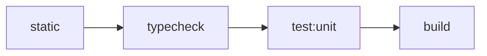

# 测试编排架构

> 状态：Current。本文描述 monorepo 已实施的 canonical test collections、资源所有权、编排与验证契约。

核心决策见 [ADR-0009](../adr/0009-adopt-canonical-test-collections.md)。Architecture Guard 的规则准入与观察边界见
[架构守卫规范](architecture-guard.md)；可执行入口见[构建、测试与开发命令](../development/commands.md)。

## 公开测试语言

仓库只使用 Unit、Integration、E2E 三层。Integration 的六个 sibling profiles 表达资源模型与 harness owner：

| Profile | 观察目标 | 外部资源 |
|---|---|---|
| `component` | 进程内多个 module 协作，出站 seam 使用 fake 或 in-memory adapter | 无 |
| `process` | 真实子进程、端口、readiness、退出与进程树清理 | 本机进程与端口 |
| `redis` | production Redis adapter 行为 | caller-owned Redis |
| `postgres` | schema、transaction 与 repository 行为 | caller-owned PostgreSQL |
| `composition` | production composition 与多个真实 adapter 协作 | profile 声明的全部资源 |
| `browser` | 真实浏览器 harness，允许替代 journey 不经过的系统 seam | 浏览器与 package-local web server |

profile 不是新的测试层级、速度标签或 Gate。多资源测试按测试重点与 harness owner 唯一归属。

## 路径、命名与 collection

- Unit 保留 owner-local 窄根，通常为 `src/**/*.test.ts[x]`；tooling owner 可以使用 `test/` 或
  `scripts/__tests__/`。
- 非 browser Integration 位于 `test-integration/<profile>/**/*.integration.test.ts[x]`。
- Browser Integration 位于 `test-integration/browser/**/*.spec.ts`。
- Full-system E2E 独占 `e2e/system/**/*.spec.ts`。当前仓库只保留这一路径契约，不发布 `test:e2e`。
- `subject-projection:rehearsal` 是近规模操作命令，不采用测试命名，也不属于任何 collection。

每个测试候选必须由一个且仅一个 canonical collection 收集。Admin API 的
`test-smoke/client-cache-invalidation.composition-smoke.ts` 是 process test spawn 的非测试 fixture；它不符合 candidate
命名，不形成旧 collection 或公开命令。

## Root 与 package commands

长期 root interface 为：

```text
pnpm test
pnpm test:unit
pnpm test:integration
pnpm test:integration:component
pnpm test:integration:process
pnpm test:integration:redis
pnpm test:integration:postgres
pnpm test:integration:composition
pnpm test:integration:browser
pnpm check:test-collection
```

`pnpm test` 永久代理 `pnpm test:unit`。有 Unit collection 的 package 也令 `test` 代理 `test:unit`；没有 Unit
collection 的 package 不发布空 `test`。旧 `test:smoke`、`test:external`、package-local `test:postgres`/
`test:redis` 与 frontend `e2e` collection aliases 已删除。

Root `test:unit` 通过 Turbo fan out package Unit tasks，并由 `test:unit:root` 精确收集四个 root tooling tests。
六个 profile commands 只 fan out 同名 package tasks。`test:integration` 在启动任何 profile 前一次性检查所有
caller-owned resources，再按以下顺序串行运行并传播第一个失败：

```text
component -> process -> redis -> postgres -> composition -> browser
```

预检包括 `IAM_API_CORE_CLEANUP_TEST_REDIS_URL`；它不得回退普通 Redis URL。外部资源缺失必须明确失败，不得 skip、
retry 或读取 runtime/development 配置。

## Collection Guard

`pnpm check:test-collection` 是永久 Guard，只验证：

1. canonical 路径与命名下的每个候选都被收集；
2. 每个候选只属于一个 collection；
3. 文件路径、命名与 profile 归属一致；
4. root command 经 Turbo dry-run 可达 owner package task。

Vitest 与 Playwright 使用机器可读 list；Bun adapter 观察 package command 声明的窄目录。漏收、重收、归属不一致、
task 不可达、adapter 失败或输出不可解析都给出可定位诊断并非零退出。Guard 不读取测试断言，不推断资源使用，也不分析
AST、type 或 data flow。迁移 baseline、逐文件 mapping、临时 exceptions 与 live equality verifiers 已退役，永久 Guard
不保存历史兼容映射。

## Turbo task graph 与缓存

Turbo 是唯一跨 package orchestrator；package 继续拥有 runner、configs、fixtures 与 scripts。Unit/component 使用
`transit` 传播依赖源码变化，而不通过 `^test` 执行依赖 package 的测试：

```json
{
  "tasks": {
    "transit": { "dependsOn": ["^transit"] },
    "test:unit": { "dependsOn": ["transit"] },
    "test:integration:component": { "dependsOn": ["transit"] },
    "test:integration:process": { "dependsOn": ["transit"], "cache": false }
  }
}
```

Unit/component 只有在输入、env、fixtures、时间与随机性都可重现时允许缓存。process、redis、postgres、composition、
browser、Full-system E2E 与其他外部验证均 `cache:false`。资源 tasks 通过 Turbo strict env 只透传 owner-specific test URLs。

## 并发、timeout 与清理

| Collection | Turbo package concurrency | Runner 预算 |
|---|---:|---|
| Unit / component | 2 | Vitest `maxWorkers: 25%`；Bun `--max-concurrency=2` |
| process / redis / postgres / composition | 1 | 单 package；资源 owner 独占 |
| browser | 1 | Playwright 管理单 Chromium project |

Timeout 只保护测试不永久挂起，不承担性能 SLA。Process harness 必须使用真实 readiness 信号、同时观察 child exit/error、
限制 stdout/stderr 缓冲，并在成功、失败、timeout 与中断路径清理完整进程树、端口与临时目录。不得通过放宽全局 timeout、
重试或吞掉 cleanup 错误换取绿色结果。

PostgreSQL 测试只清理自己创建的随机 schema。Redis 测试只清理自己的随机 namespace；禁止对共享实例执行
`FLUSHDB`/`FLUSHALL`。外部测试不自行启动 Docker、PostgreSQL 或 Redis；browser profile 可以按 Playwright config 启动
package-local web server。所有 caller-owned URLs 缺失时都 fail closed，不回退开发或生产资源。

## 默认验证与交付

基础 `pnpm verify` 固定 fail fast：



`static` 依次运行 lint、文档索引、环境变量命名 Guard 与 Architecture Guard。`verify` 不读取真实 PostgreSQL/Redis，
不启动 browser 或 Full-system stack，也不隐式执行 Integration。开发者按改动风险显式追加相关 profiles；完整
`test:integration` 只在调用方准备好全部专用资源时运行。

| 阶段 | 最小范围 |
|---|---|
| 开发内循环 | 当前 Unit/profile、单文件或测试名 |
| Ticket 实现 | 最高层相关 collection、受影响 package lint/typecheck 与永久 Guard |
| 准备 merge/release | 最终内容上一次 `pnpm verify`，再按风险显式执行 Integration/Gateway 等检查 |

当前没有 CI 平台。Windows process collection 已完成连续无 retry 验收；Linux/CI 仍为 `pending`。平台状态不能通过
placeholder command 或 silent skip 伪装为已采用。
