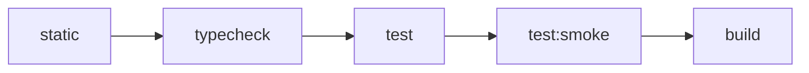

# 测试编排架构

> 状态：Current。本文描述已实施的根/package 测试通道、资源预算与验证契约。Windows 本地连续验收已于
> 2026-07-24 完成；Linux 与 CI runner 仍为 `pending`。

本文定义 monorepo 测试的通道、资源所有权、跨 package 编排、缓存、并发、timeout、隔离和验收模型。核心决策见
[ADR-0003](../adr/0003-adopt-layered-test-lanes-and-resource-budgets.md)。
本文负责验证通道与资源编排；Architecture Guard 的设计、规则准入、观察模型与复杂度边界见
[架构守卫规范](architecture-guard.md)。

## 设计目标

优先级从高到低为：

1. 确定性与可信度：相同输入应得到相同结果，失败不能依赖“再跑一次”消失。
2. 开发反馈速度：日常 `test` 保持环境无关、可缓存、可定向。
3. 全仓吞吐：在不破坏前两项的前提下并行。
4. CI 成本：当前没有 CI 平台，不能以尚不存在的平台优化替代本地正确性。

本架构不把 timeout 当性能预算，不要求首期建立覆盖率门槛、JUnit 汇总、趋势看板或自动容器生命周期。

## 通道与命令契约

| 通道 | Package script | Root entry | 资源模型 | 默认缓存 |
|---|---|---|---|---|
| 普通测试 | `test` | `pnpm test` | 单元、组件、契约、纯内存集成 | 开启 |
| 进程 smoke | `test:smoke` | `pnpm test:smoke` | 真实应用入口、子进程、端口、就绪探针 | 关闭 |
| 显式外部 entry | `test:external` | `pnpm test:external` | 真实应用入口及调用方提供的专用 PostgreSQL/Redis | 关闭 |
| PostgreSQL | `test:postgres` | 按改动类型显式调用 | 调用方提供的专用数据库、随机 schema | 关闭 |
| Redis | `test:redis` | 按改动类型显式调用 | 调用方提供的专用 Redis、随机 key namespace | 关闭 |
| 浏览器 E2E | `e2e` | 按改动类型显式调用 | 浏览器、应用服务及其依赖 | 关闭 |
| Gateway/其他外部验证 | 专用动词脚本 | 按改动类型显式调用 | 外部工具或运行环境 | 关闭 |
| 覆盖率 | `test:coverage` | 独立按需入口 | 普通测试加 instrumentation | 可独立配置 |

`pnpm test` 不包含 smoke、显式外部 entry、真实 PostgreSQL/Redis、E2E 或 Gateway 检查。`pnpm verify` 是环境无关的完整基线，
固定按以下阶段串行：



`static` 聚合 lint 与仓库级静态 guards，并保证每项只执行一次；`pnpm check:architecture` 是唯一静态架构入口，不进入
package `test`。一个阶段失败后不再启动后续阶段；同一阶段内部由 Turbo 按预算并行 package。PostgreSQL、E2E、Gateway
等检查不是 `verify` 的隐式依赖，而是由 agent 根据当前改动与风险显式追加。

## 分类规则与文件命名

分类先看资源模型，再看文件名或测试作者对 “unit”“integration”“smoke” 的称呼：

1. 测试是否启动独立进程、监听端口或验证真实 runtime entry？
   - 是：进入 `test:smoke`。
2. 测试是否需要调用方提供的数据库、Redis、浏览器、容器或其他外部服务？
   - 是：进入对应显式通道。
3. 其余测试是否能在进程内、固定输入下完成并安全缓存？
   - 是：进入普通 `test`。
4. 无法归类时，先按更昂贵的资源通道处理，并在设计评审中明确所有权。

命名约定：

- `*.test.ts[x]`：普通测试，包括纯内存 integration。
- `*.smoke.test.ts[x]`：只允许由 `test:smoke` 收集。
- `*.external.test.ts[x]`：放入 package 的 `test-external/`，只允许由 `test:external` 收集。
- PostgreSQL 测试放入 package 明确的 PostgreSQL test 目录，由 `test:postgres` 收集。
- Redis contract 测试放入 package 明确的 Redis test 目录，由 `test:redis` 收集。
- Playwright 测试放入 `e2e/`。

资源模型覆盖历史命名。`apps/api` 和 `apps/admin-api` 的 OpenAPI HTTP 检查是进程内测试，现名为
`openapi.test.ts` 并由普通 `test` 收集；`apps/oidc-provider/src/__tests__/entry.smoke.test.ts` 启动真实 Node.js
runtime，只由 `test:smoke` 收集。
共享 process harness 的普通契约测试由 `@iam/api-core` 的 `test` 收集；验证真实 Windows Job process tree 的测试位于
`packages/api-core/test-smoke/`，只由该 package 的 `test:smoke` 收集。

## 编排与所有权

Turbo 是唯一跨 package orchestrator。每个 package 继续拥有 runner、收集规则、fixture 和 package-local scripts；根目录
不建立跨 workspace 的 Vitest project，也不直接拼接各 package 的测试文件。共享 runner preset可以复用默认值，但每个 package
必须显式 opt in，特殊资源通道不能被共享 preset 隐式纳入。

普通测试采用 transit node 传播依赖变化，而不是用 `test.dependsOn: ["^test"]` 强制执行依赖 package 的测试：

```json
{
  "tasks": {
    "transit": {
      "dependsOn": ["^transit"]
    },
    "test": {
      "dependsOn": ["transit"]
    },
    "test:smoke": {
      "dependsOn": ["transit"],
      "cache": false
    },
    "test:external": {
      "dependsOn": ["transit"],
      "cache": false
    }
  }
}
```

该配置的自动化结构测试通过 Turbo dry-run 锁定：依赖源码变化会使消费者测试 cache 失效，但选择一个 package 的 `test`
不会仅因依赖关系而执行其依赖 package 的 `test`。如果某个测试消费实际 build 产物，该 package 单独声明 build task 依赖，
不能把例外升级成全仓默认。

## 并发预算

初始预算是安全上限，不是推荐占满的目标：

| 通道 | Turbo package concurrency | Runner 内部预算 |
|---|---:|---|
| 普通 `test` | 2 | Vitest `maxWorkers: 25%`；Bun 并发不超过 2 |
| `test:smoke` | 1 | 单 worker、单 package |
| `test:external` | 1 | 单 worker；每个数据库与 Redis logical DB 只有一个 owner |
| `test:postgres` | 由专用环境决定，默认 1 | 每个 schema/namespace 有唯一 owner |
| `test:redis` | 由专用环境决定，默认 1 | 每次运行使用随机 key namespace，不清空 Redis |
| Playwright `e2e` | Playwright 自主管理 | 不与普通测试或 smoke 竞争运行 |

提高预算必须满足三项约束：在目标 runner 上有连续样本；一次只改变 Turbo 或 runner 中的一层；同时观察墙钟、失败率和残留资源。
不得因单机 CPU 数较高而让外层 package 并发与内层 worker 数同时无界增长。

## 缓存契约

普通 `test` 只有在以下条件成立时才允许缓存：

- 不读取未声明的开发者本机服务或可变全局状态。
- 影响结果的 env、配置、fixture、生成输入和内部 workspace 源码进入 Turbo hash。
- 测试固定或注入时间、随机数和网络边界。
- 测试不把临时文件写到共享位置。

`test:smoke`、`test:external`、`test:postgres`、`test:redis`、E2E 和其他外部资源测试一律 `cache: false`。Coverage 使用独立任务，
声明 `coverage/**` 输出，不能污染普通 `test` 的缓存语义。Remote Cache 可以在未来平台上启用，但正确性不得依赖它。

## Timeout、就绪与清理

Timeout 只保护测试不永久挂起：

- Package-local Vitest 普通测试统一使用 10 秒；Bun 普通测试保留运行器默认 5 秒。
- 明确标注的 hermetic integration 可以在用例或 suite 层局部使用 15 秒。
- Process smoke 的 readiness deadline 初始为 30 秒，并另设有界 cleanup deadline。
- E2E 使用 Playwright 的 action、navigation 和 test timeout，不复用普通 runner timeout。

Process smoke harness 必须同时满足：

1. 直接取得可用端口并避免“先保留、释放、再监听”的竞争窗口；如果 runtime 无法接收已绑定 handle，至少使用可检测冲突并可重试的
   OS 分配策略。
2. 启动后通过 HTTP、TCP 或协议级探针判断真实就绪，不以日志文本作为唯一信号。
3. readiness 等待与子进程 `exit`/`error` 竞争；进程提前退出时立即报告退出码和已捕获输出。
4. stdout/stderr 使用有界缓冲，成功时可静默，失败时完整呈现足够诊断。
5. 正常、断言失败、timeout 和测试进程中断路径都清理完整进程树；cleanup 超时或失败是显式失败。
6. 每个测试拥有独立临时目录、端口和进程 owner，不依赖上一次运行的残留状态。
7. 子进程环境只从跨平台 runtime 最小白名单和测试专用 override 构造；禁止继承完整 `process.env`，会自动加载 env
   文件的 runtime 必须在 smoke 命令中显式关闭该行为。

启动耗时的性能目标由独立 benchmark 管理。不得继续提高已声明的全局 timeout、重复执行失败测试或吞掉 cleanup 错误来换取绿色结果。

## 外部资源隔离

- PostgreSQL：通常由调用方显式提供专用测试 URL；harness 创建随机 schema、应用当前 migrations，并只清理自己创建的 schema。
  显式 entry lane 若要验证 production composition 的数据库级行为，必须使用非 system、非 runtime fallback、由该次运行独占且
  可销毁的数据库；测试拥有并可清理该数据库中的全部 fixture。
- Redis：普通 `test:redis` 使用随机 namespace/key prefix，禁止清空共享实例。Ticket 12 的 API/OIDC `test:external` 是窄例外：
  调用方必须提供非生产、独占、可销毁的 Redis logical DB，lane 可为验证真实 entry 而 inventory/清理整个 logical DB。该前提不
  适用于共享 Redis、生产 Redis 或其他 `test:redis`，也不是扩大生产清理范围的先例。
- 文件系统：使用 OS 临时目录下的运行级子目录，清理只作用于已验证的 owner 路径。
- 端口与进程：每次运行唯一分配，记录 PID/handle，并在所有结束路径回收进程树。
- 时间、随机数、网络：普通测试通过注入或固定值消除非确定性；真实网络只允许出现在显式外部通道。

外部测试不自行启动 Docker、PostgreSQL、Redis 或浏览器服务。可以另建一键准备环境的命令，但它与测试命令分离；缺少必需环境时
测试应快速失败并说明所需变量，不能静默 skip，也不能回退到开发数据库。API/OIDC `test:external` 同时要求各自的 test-only
PostgreSQL 与 Redis URL；普通 `test:smoke` 不读取这些可选 URL，始终使用自身持有的 RESP fixture 和明确不可达 PostgreSQL，
因此开发机或 shell 中遗留的外部 URL 不能改变 hermetic smoke 的资源模型。

Custom SSO Subject Projection 的 Ticket 12 发布验收由维护者或 agent 在调用方拥有的临时近似规模环境按 runbook 组合
现有外部 lane、package-local process smoke、公开接口和操作命令手动完成。仓库不提供根级一键 orchestrator、JSONL
receipt、机器 evidence manifest/transcript 或自动 phase 状态机；结果以简洁人类可读表格记录，资源仍遵守本节精确 owner
和清理规则。

## Flaky 治理

必需 gate 不通过 retry 变绿；保留第一次失败的输出和资源证据。确认 flaky 后按基础设施缺陷处理。临时 quarantine 必须同时记录
owner、原因、跟踪 ticket、到期日和风险，并继续在非阻塞通道运行；禁止永久 `skip`。退出 quarantine 前，用与故障模式匹配的
连续或压力运行证明修复，而不是只运行一次。

## 开发与交付层级

| 阶段 | 最小测试范围 |
|---|---|
| 开发内循环 | 当前 package、单文件或测试名 |
| Ticket 实现 | 最高层相关测试、受影响 package、依赖影响面和相关 package smoke |
| 准备 merge/release | 在最终实现内容上运行一次完整 `pnpm verify`，再按改动类型执行外部通道 |
| Future main/nightly | 在 CI 平台建立后增加 uncached、随机顺序或重复压力运行 |

改动类型附加项至少包括：

- 数据库 schema/查询行为：`db:check` 和相关 `test:postgres`。
- Redis 脚本、transaction 或并发原子性：相关 `test:redis`。
- 前端浏览器行为：相关 Playwright `e2e`。
- Gateway manifest：对应 validate/diff 安全检查。
- 运行时 entry/composition：对应 app 的 `test:smoke`。

## 当前平台验收与 adoption

当前没有 CI 平台。2026-07-24 的 Windows 本地验收在禁用 smoke 任务缓存、不重试失败轮次的条件下完成：

- 当时由 OIDC package 收集的 `test:smoke` 连续 20/20 次通过；
- 正式 `pnpm verify` 连续 3/3 次通过；
- 每轮均无 timeout、retry，以及由 harness 持有的残留 OIDC 进程、监听端口或临时目录。

2026-07-25 又完成 `@iam/api` 的 focused Windows local adoption：Bun 真实入口以 `--no-env-file` 和最小 runtime env
白名单构造 production composition，并通过 HTTP OpenAPI probe 就绪；测试只使用不可达的 PostgreSQL、Redis、ORCAS 占位地址。共享
process-smoke harness 的提前退出、readiness timeout、端口冲突、完整进程树和临时目录清理契约继续由公开测试接口锁定。
同日完成测试归属收口：共享 harness 的 24 个普通契约测试由 `@iam/api-core` 的 Bun ordinary lane 收集，1 个真实
Windows Job 测试由其 package-local smoke lane 收集；OIDC 当前 smoke lane 只保留 4 个 app-owned 文件中的 8 个测试。
同日也完成 `@iam/admin-api` 的 focused Windows local adoption：package-local `test:smoke` 使用共享 harness 启动真实 Bun
entry，以最小 runtime env、独占端口和临时目录构造 production composition，并通过 `/admin/doc` OpenAPI probe 就绪；
PostgreSQL 与 Redis 只使用不可达占位地址。
同日完成 `@iam/worker` 的 focused Windows local adoption：package-local `test:smoke` 使用共享 harness 启动真实 Bun entry，
以最小 runtime env 和独占端口构造 production composition。测试保留生产 User Profile 模块的构造，但关闭 queue worker
启动并将 PostgreSQL、Redis 指向不可达占位地址，再通过 Bull Board HTML probe 确认 HTTP readiness；进程树、端口和临时目录
继续由共享 harness 持有并清理。

2026-08-02 为 Ticket 12 增加 `@iam/api` 与 `@iam/oidc-provider` 的显式 `test:external` adoption：hermetic smoke
固定使用不可达 PostgreSQL 与自有 RESP fixture；external lane 才接收必需的 test-only PostgreSQL/Redis URL，并覆盖真实
production entry 的 Independent、OIDC 与 Subject Access 公开流程。该 lane 缺资源 fail fast、Turbo cache 关闭、根级并发为 1。

正式脚本必须用 Node.js、Bun、Turbo 或其他跨平台 API 编排，不得在 `package.json` 中依赖 Bash、PowerShell 或 `cmd.exe`
专有语法。Linux 与未来 CI 的状态保持 `pending`，直到在实际 runner 上运行同一契约。

| Backend workspace | 当前分类 | 真实 process smoke | Adoption 状态 |
|---|---|---|---|
| `@iam/api-core` | Bun 普通测试限定在 `src/`，真实 Redis contract 限定在 `test-redis/`，`*.smoke.test.ts` 限定在 `test-smoke/` | package-local `test:smoke` 以最小 runtime env 和独立临时目录覆盖 Windows Job tree owner | `complete`（Windows local）；Linux/CI `pending` |
| `@iam/oidc-provider` | 普通、`*.smoke.test.ts`、`test-external/` 与 `test-redis/` 由四个 Vitest config 互斥收集 | `test:smoke` hermetic；`test:external` 覆盖专用真实 PG/Redis 的 authorize/token/UserInfo/logout；`test:redis` 覆盖 Provider Session 状态 Lua | `complete`（Windows local）；Linux/CI `pending` |
| `@iam/api` | Bun 普通测试限定在 `src/`，smoke/external/Redis 分别限定在自己的目录 | `test:smoke` hermetic；`test:external` 覆盖专用真实 PG/Redis 的 Independent 与 Subject Access 公开流程 | `complete`（Windows local）；Linux/CI `pending` |
| `@iam/admin-api` | Bun 普通测试限定在 `src/`，`*.smoke.test.ts` 限定在 `test-smoke/` | package-local `test:smoke` 通过共享 harness 覆盖真实 Bun entry、隔离资源、production composition 与 `/admin/doc` readiness | `complete`（Windows local）；Linux/CI `pending` |
| `@iam/worker` | Bun 普通测试限定在 `src/`，`*.smoke.test.ts` 限定在 `test-smoke/` | package-local `test:smoke` 通过共享 harness 覆盖真实 Bun entry、production composition、隔离资源与 Bull Board readiness | `complete`（Windows local）；Linux/CI `pending` |

### User Profile 失效与 Subject Facts publication 的公开测试 seam

User Profile 失效由以下调用方可观察 seam 共同验证：

1. `UserProfileInvalidation.recordChanges` 覆盖 source change 到受影响用户与 canonical reason 的映射、去重、dirty
   version 推进，以及同一 transaction 的单次 after-commit 批量 wake-up；测试只 fake 数据库、BullMQ、clock 和
   transaction lifecycle 等系统边界。
2. UnitOfWork lifecycle 契约覆盖 transaction-port factory 与 transaction callback 共享同一个 `afterCommit`
   registration port，并获得当前 `{ requestId, traceId }` observability；rollback 不运行提交后任务，enqueue 失败维持
   best-effort 语义。
3. Worker maintenance 覆盖 backfill/repair，rebuild processor 覆盖 dirty 状态机；shared job contract、producer 与
   worker job dispatch 共同验证 single-user versioned rebuild protocol 的解析、批量投递和消费。Builder contract
   使用 known literal 验证当前有效任职、organization path、两个 client 的 role/privilege 裁剪与确定排序。
4. 根级 `pnpm check:architecture` 负责稳定 module edge 的 owner 和依赖方向；三端 package-local process smoke 验证真实
   runtime entry、env parsing 与 production composition。API 以 `/public/doc`、Admin API 以 `/admin/doc`、Worker
   以 Bull Board HTML 作为协议级 readiness probe。
5. `@iam/user-profile-read-model test:postgres` 通过公开 publication seam 验证 dirty row lock、锁后版本/状态重验、
   profile + source version + processed 的同 transaction commit、rollback 与低版本拒绝。它要求
   `IAM_USER_PROFILE_TEST_DATABASE_URL`，每次创建并只删除自己的随机 schema。
6. `@iam/user-profile-read-model test:redis` 通过两个独立 publisher 和 observer 验证并发 CAS 与超出 JavaScript
   安全整数范围的 Dirty Version 比较。它要求 `IAM_USER_PROFILE_TEST_REDIS_URL`，每次使用随机 prefix，只定向删除
   自己的 keys，禁止 `FLUSHDB`/`FLUSHALL`。
7. `@iam/user-profile-read-model/subject-facts` 的公开 reader contract 通过可计数 PostgreSQL/Redis adapters 验证有效
   cache hit、损坏/未知 schema 回源、single-flight、窄列与单行查询预算、Profile stale allowance、每次严格授权的
   Dirty 查询、一次 Profile 重载和 fail-closed 结果。PostgreSQL lane 补充真实 Subject Identifier join/read，
   Redis lane 补充同一 cache adapter 的读取与版本 CAS；两者仍使用各自专用 URL 和隔离规则。可注入 observer 只记录
   `operation/outcome/durationMs`，contract 同时证明 cache hit、跨 Subject 缓存污染、Profile/Dirty load 和
   single-flight 的计数语义，以及 logger adapter 不泄漏 Subject、Facts、Dirty、Secret 或 Token。

### Client Subject Projection 的公开测试 seam

1. `ClientSubjectProjectionService.resolve` contract suite 是主 seam。它通过 facts/access/freshness ports 和纯内存
   adapter 覆盖 Catalog/Selection fail closed、只选 Subject Identifier 时不读 Facts、Profile 字段省略、
   Employment Profile 排序，以及两个 client 交叉角色/权限 fixture 的裁剪、去重与稳定排序；测试不构造或读取
   Legacy User Detail。
2. `@iam/client-subject-projection/custom-sso` 的公开 mapping contract 是协议补充 seam，只验证 V1 wire 的版本、
   嵌套、null/空父对象省略、已选空数组保留及显式字段白名单。它不通过内部 Projection helper 或 collaborator
   调用次数证明协议行为。
3. Package self-consumer tests 与 typecheck 验证 root、`custom-sso`、`testing` exports；Architecture Guard 通过
   production source path 和规范静态依赖约束全部 Projection core 的反向依赖，并限制 Custom SSO mapper 只消费
   root public Interface；canonical subpath 与 repository-relative path 按同一 owner 判断。
4. API 的 Custom SSO retryable error adapter contract 通过真实 Hono error handler 验证 Projection Not Ready 与
   Subject Access unavailable 分别映射为稳定 `503` code、配置的 `Retry-After` 和脱敏日志；该 adapter 不复用到
   OIDC。API process smoke 启动真实 production composition，检查 `/sso/token` 仅暴露 POST Basic/form，并验证
   `/sso/token`、`/public/user-info` 与 `/auth/authz` 的 OpenAPI retryable 503/header contract。
5. Gateway manifest contract 对 dev/prod 同时验证精确 `/sso/token` route 高于浏览器 `/sso/*` route，且不继承
   CORS；authorize/callback 所需的浏览器 CORS 策略保持不变。Custom SSO adapter tests 覆盖 Gateway/Independent
   reservation 单赢家、错误 redirect/config version 不预占、ORCAS 失败可恢复、运行时无私有 payload reader/writer，以及
   Projection 超过原始 lease window 时 heartbeat 续租、稳定 retryable `503` 和成功后消费。
6. Gateway delivery contract 覆盖最小 Kernel metadata、每次当前 Client/config/Barrier 复核、最小共享认证上下文、
   `/public/user-info` 当前 selection、`/auth/authz` 强制字段白名单与 body/header 相同 Base64。可计数 adapters 证明
   authz cache hit 零 PostgreSQL，subject-only 零 Facts read；真实 API entry smoke 进一步把 PostgreSQL 指向不可达
   地址，预置 Client runtime/Facts Redis cache 后仍要求两个 endpoint 成功，从 production wiring 证明热路径不回源。

### Subject Access Barrier 的公开测试 seam

1. `@iam/api-core/subject-access` 普通测试通过业务语义化 atomic store Fake 覆盖严格 record、enabled/disabled/
   uncertain fail-closed、同 transition rollback、提交后 finalize、原子 claim/lease、crash retry、并发不重领、
   跨页公平、stale transition 防重排、stable ack 与新 pre-block 线性化、缺失 record 不自动启用及安全日志；
   Session validator contract 证明 disabled 形成 Kernel 可撤销结果并在后续 validator 前短路，而 unavailable
   原样传播。
2. Admin 用户 service 与离职 use case 是账号 mutation 的最高测试 seam。测试覆盖 pre-block 失败零数据库/审计/失效/
   撤销副作用、transaction rollback 恢复、commit 后 disabled、finalize failure 保持 indexed blocking、repair 收敛、
   重新启用不恢复旧 Session，以及新用户等待首次 Facts 发布。
3. API/Admin authentication handler 通过真实 Hono error handler 验证 `401 / SESSION_INVALID` 清除全局/局部与 ORCAS
   Cookie，`503 / SUBJECT_ACCESS_UNAVAILABLE` 不清 Cookie；Custom SSO Session Kernel adapter tests 同时覆盖有效
   Principal Session 和 Credential 的 Barrier validation。
4. `@iam/api-core` `test:redis` 使用随机 namespace 和独立 writer/observer clients，证明 Lua transition 单赢家、
   wrong-transition 拒绝、同 transition finalize/rollback 幂等、重复并发 rollback、claim lease/crash retry、
   stale reschedule 拒绝、finalize-vs-rollback 线性化、Session Kernel authorization artifact 原子消费仅一个
   winner，以及 Custom SSO Grant begin/renew/release/consume 使用 Redis TIME 与 attempt/deadline fence；清理只删除当前测试
   namespace，不使用 `FLUSHDB`。`@iam/user-profile-read-model` `test:postgres` 证明 repair authority 只读窄
   user/profile/Dirty 字段并在 processed version 一致时发布 Facts。两个外部通道都要求 caller-provided 专用 URL，
   缺失时 fail fast，不 fallback 或 skip。
5. API、Admin API 与 OIDC Provider 的 `test:smoke` 使用测试自持的最小 RESP Redis、预置严格 Session Kernel
   Principal/Credential 后启动真实 entry 子进程，并从公开 HTTP/OIDC 协议验证缺失 Barrier 返回 fail-closed 503、
   不清 Cookie，且子进程确实读取 `subject-access:v1:record:<Subject Identifier>`。API smoke 还预置 Gateway
   Client Binding、当前 Client runtime cache 与 Subject Facts cache，在 PostgreSQL 明确不可达时通过公开
   `/auth/authz`、`/public/user-info` 验证成功投影、header/body 一致和零回源。Worker smoke 通过命令完成型
   process harness 运行真实 `user-profile:repair --subject-access-only`，证明 production composition 首先调用
   PostgreSQL stale-transition reaper；在占位 PostgreSQL 不可达时要求进程失败关闭，且不继续执行 Redis recovery/repair。
   reaper 的成功、幂等与行锁并发契约由显式 PostgreSQL lane 验证；测试不导出或直接调用 app-local Subject Access factory。
6. API 显式 `test:postgres` 通过 `IAM_API_TEST_DATABASE_URL` 在随机 schema 应用当前 migrations，并用两个真实并发
   transaction 证明同手机号 Purveyor contact 注册只创建一个 user/employment，两个审计结果指向同一 user。
   测试故意扩大无锁 lookup/insert 窗口；缺少专用 URL 时 fail fast，不回退 `DATABASE_URL` 或
   `IAM_API_DATABASE_URL`。
7. API 显式 `test:redis` 要求 `IAM_API_TEST_REDIS_URL`，用真实 Redis 验证 Custom SSO Client runtime 的
   positive/negative TTL、reader Lua publish generation fence、既有 Client Admin mutation begin/complete、晚到
   complete 不能清除新 fence，以及没有后续 mutation 时 fence TTL 到期后从权威 source 自动收敛。Admin service
   behavior tests 还必须证明 Client create 不建立无 row lock 的 pre-commit fence，只在提交后执行 required
   invalidation。每个 Redis 测试使用随机合法 client code 并精确登记、删除自己的 keys，不执行 `SCAN`、
   `FLUSHDB` 或 `FLUSHALL`；缺少 URL 时 fail fast，不回退 runtime Redis，也不 silent skip。
8. API Core 的 Custom SSO cutover process smoke 运行真实 package cleanup script，以测试自持 RESP server 预置全部
   allowlist 范围和 `oidc:*` 对照 key，依次证明 dry-run 零删除、残留 `--verify` 非零、apply 完整删除、clean verify
   零退出、OIDC 保留和输出不含完整 key。该 smoke 只证明命令边界；生产维护窗口仍需独立备份、范围复核，并通过
   当前 production entry 证明 legacy-shaped artifact 在 cleanup 前后均被拒绝且旧 key 未被读取；不启动历史 owner。

### Temporary Login Restriction 的公开测试 seam

1. `LoginRestriction` 公开接口的普通测试使用业务语义化 atomic storage port 的 Fake，覆盖混合失败、阈值、滚动窗口、
   规范 cause/trigger、自然过期、原子清理、索引读取与修复；Fake 不解析 Lua、KEYS/ARGV 或 Redis 命令排列。
2. 密码与手机登录 use case 测试只通过 consumer-owned `loginRestriction` port 验证状态检查、失败/成功委托，以及
   `LOGIN_PROTECTION_UNAVAILABLE` 与审计原因的 fail-closed 语义。
3. 显式 `@iam/api-core` `test:redis` 使用同一公开接口和独立 writer/observer clients，补充 atomic storage Fake
   无法证明的 production Lua、并发计数、阈值/index 原子出现及 clear 与新失败的 Redis 执行顺序线性化。
4. Admin session management service/shared adapter seam 覆盖分页与精确用户筛选、用户缺失状态、规范 cause 与
   Trigger Method、到期时间、原子解除、幂等无变化、503、审计和作用后审计失败；port contract 验证 production
   `LoginRestriction` structural typing，且测试断言解除不调用 Session inventory/control。Admin Playwright 覆盖
   第二标签页、本地倒计时无轮询、确认文案、success/no-op、列表与解除 503，以及作用后刷新且不重试 mutation。

### Valid Principal Session inventory 的公开测试 seam

1. Session Kernel 公开接口的普通测试使用稳定 Redis storage port Fake，覆盖可选 Session Origin 与旧 v1 对象兼容、
   仅用户根会话进入全局索引，以及创建、续期、撤销后 inventory 的可观察结果；Fake 不读取序列化对象来推导期望，
   也不检查 transaction 命令排列。
2. Inventory 普通测试覆盖 `expiresAt` 倒序、相同 score 的确定顺序、精确用户筛选、自然过期清理、悬空成员修复、
   跨分块页面补足、清理后的计数和旧会话不在读取时回填。测试把 clock 与 UUID random 作为系统边界注入，不使用
   Redis `SCAN` 或私有 helper seam。
3. 密码、手机验证码、OA 和微信登录 use-case 测试只验证服务端 request context 形成的有界 Session Origin 被传入
   Principal Session 创建边界；不读取 Redis object，也不断言 Session Kernel 的内部写入顺序。
4. Admin session management service/adapter seam 覆盖其他用户一次 bulk 撤销、本人服务端 current-root 例外、缺失
   当前 ID 的零 mutation、空索引/并发 no-op、cleanup 脱敏计数与作用后审计失败；不重复断言 Kernel 的 Redis 遍历。
   Admin Playwright 覆盖普通用户与本人确认文案、统一按钮、success/no-op/cleanup 和作用后刷新且不重试。

从本架构成为 Current 起，新建或实质修改 backend runtime entry/composition 时，必须同时添加或更新该 app 的
`test:smoke`；未改动的既有 app 可以按 adoption 表逐步补齐。

## 已实施基线与演进边界

Current 基线已经包含根与 package scripts、Turbo task graph、runner 配置、共享 process-smoke harness 及其 API Core
ordinary/Windows Job smoke、OIDC/API/Admin API/Worker entry smoke、结构测试和 Windows 本地验收。当前命令见
[构建、测试与开发命令](../development/commands.md)，实现与本地交付规则见
[AI 开发工作流](../agents/workflow.md)。

`@iam/api-core` 另有显式 `test:redis`：调用方必须通过 `IAM_API_CORE_TEST_REDIS_URL` 提供专用 Redis，测试为每次运行
生成随机 key namespace，只清理自己拥有的 namespace，不启动 Docker、不执行 `FLUSHDB`/`FLUSHALL`。该通道通过
`LoginRestriction` 公开接口验证 Lua 与并发线性化，并通过 production Subject Access bootstrap 验证 batch
seed-if-absent 不覆盖现有 enabled/disabled record；它不进入 `pnpm test` 或 `pnpm verify`，缺少 URL 时命令快速失败并
说明配置要求。

`@iam/db` 的普通 `test` 只收集 `src/` 下的环境无关测试；显式 `test:postgres` 要求调用方通过
`IAM_DB_TEST_DATABASE_URL` 提供专用、非系统 PostgreSQL 数据库。Subject Identifier migration contract 为每次运行创建
随机 schema，只执行对应 feature migration，并从 PostgreSQL 的公开列与约束行为验证 migration contract。Subject Facts
staged migration 与 cutover 收紧 migration 在同一通道分别验证 legacy compatibility，以及 pre-DDL 全量 guard、四个
`NOT NULL`、Subject Identifier 唯一索引、强化 Client config CHECK 和显式 rollback。该通道还使用真实 Drizzle
migrator 验证 forward → journal-aware rollback → forward replay：rollback 只删除 name、folder timestamp 与 migration
SHA-256 全匹配的 journal 行，不改变其他 migration identity；重复 rollback 幂等，同名 identity 不一致则在 DDL 前
fail closed。普通唯一索引测试使用近生产规模
行数并持有 writer lock，证明 migration 会等待 writer、因此只允许在 maintenance freeze 内执行。结束时只删除自己创建的
schema。该通道不读取 `DATABASE_URL`、不启动 Docker、不进入 `pnpm test` 或 `pnpm verify`，缺少专用 URL 时快速失败且
不 silent skip。

`@iam/worker` 的普通 `test` 与 `test:smoke` 不收集 `test-postgres/`；显式 `test:postgres` 要求调用方通过
`IAM_WORKER_TEST_DATABASE_URL` 提供专用、非系统 PostgreSQL 数据库。每次运行在随机 schema 应用当前 migrations，随后
通过 production Subject Projection Client repository/service 验证 disabled-but-not-deleted legacy intent 被纳入、deleted
client 被排除、apply 原子移除六个 legacy Custom SSO `ext_attributes` key 并保留无关属性，以及
apply/verify/reapply 不重复递增 config version。该通道不读取或回退 `DATABASE_URL`/
`IAM_WORKER_DATABASE_URL`，不自行启动数据库，也不进入 `pnpm verify`；缺少变量时快速失败且不 silent skip。

`@iam/user-profile-read-model` 的普通 `test` 只收集 `src/`；PostgreSQL 与 Redis contract 分别只由显式
`test:postgres`、`test:redis` 收集。PostgreSQL 通道覆盖启用、禁用和删除 user 的可恢复幂等 backfill，以及独立 verify
对 dirty mismatch 的定位；Redis 通道覆盖单条 CAS 与 batch prewarm 不覆盖较新 facts。两条通道都要求调用方提供上述
专用 URL，不回退到 `DATABASE_URL` 或 runtime Redis，不自行启动服务，也不进入 `pnpm verify`；缺少变量时必须快速失败
且不 silent skip。

`@iam/oidc-provider` 的显式 `test:redis` 只收集 `test-redis/`，要求调用方通过
`IAM_OIDC_PROVIDER_TEST_REDIS_URL` 提供专用 Redis。每次 scope 随机化 interaction、Provider Session、client 与
Session Kernel namespace，只定向清理自己拥有的 key；测试通过 production Provider Session state store 与真实
Session Kernel 验证 attempt-bound atomic claim、generation CAS、generation membership、TTL refresh、owner cleanup、
完整 Principal Session + generation lifecycle fence 的精确销毁，以及 Redis 已提交但调用方丢失响应时的幂等确认。旧 Session
payload 缺少任一 lifecycle mirror 时销毁必须 fail-safe no-op；anchor 与 membership 仍受 TTL 限制，后续写入完整 mirror 的
Session payload 可执行精确清理，因此该兼容路径不会形成无界永久数据。该通道不读取 runtime Redis 配置、不自行启动 Redis、
不进入 `pnpm test` 或 `pnpm verify`，缺少 URL 时快速失败。

`@iam/api` 的普通 `test` 不收集 `test-postgres/`；显式 `test:postgres` 要求调用方通过
`IAM_API_TEST_DATABASE_URL` 提供专用、非系统 PostgreSQL 数据库。每次运行创建并仅删除自己的随机 schema，
应用当前 migrations 后验证 Purveyor contact advisory-lock 并发契约。该通道不读取或回退
`DATABASE_URL`/`IAM_API_DATABASE_URL`，不自行启动数据库，也不进入 `pnpm verify`。
显式 `test:redis` 只收集 `test-redis/`，要求调用方通过 `IAM_API_TEST_REDIS_URL` 提供专用 Redis；它不读取
runtime Redis 配置、不自行启动 Redis、不进入 `pnpm test` 或 `pnpm verify`，并在缺少 URL 时快速失败。

后续提高并发、改变 cache/input、接入新的 process smoke 或建立 Linux/CI runner 时，必须在目标平台重新验证相同资源契约，
并同步本文的预算、adoption 与平台状态；不得用未经运行的脚本兼容性推断平台已经验收。
