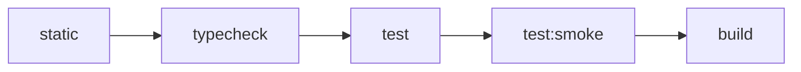

# 测试编排架构

> 状态：Current。本文描述已实施的根/package 测试通道、资源预算与验证契约。Windows 本地连续验收已于
> 2026-07-24 完成；Linux 与 CI runner 仍为 `pending`。

本文定义 monorepo 测试的通道、资源所有权、跨 package 编排、缓存、并发、timeout、隔离和验收模型。核心决策见
[ADR-0003](../adr/0003-adopt-layered-test-lanes-and-resource-budgets.md)。
本文负责验证通道与资源编排；Architecture Guard 的设计、规则准入、观察模型与复杂度边界见
[架构守卫规范](architecture-guard.md)。

## 设计目标

优先级从高到低为：

1. 确定性与可信度：相同输入应得到相同结果，失败不能依赖“再跑一次”消失。
2. 开发反馈速度：日常 `test` 保持环境无关、可缓存、可定向。
3. 全仓吞吐：在不破坏前两项的前提下并行。
4. CI 成本：当前没有 CI 平台，不能以尚不存在的平台优化替代本地正确性。

本架构不把 timeout 当性能预算，不要求首期建立覆盖率门槛、JUnit 汇总、趋势看板或自动容器生命周期。

## 通道与命令契约

| 通道 | Package script | Root entry | 资源模型 | 默认缓存 |
|---|---|---|---|---|
| 普通测试 | `test` | `pnpm test` | 单元、组件、契约、纯内存集成 | 开启 |
| 进程 smoke | `test:smoke` | `pnpm test:smoke` | 真实应用入口、子进程、端口、就绪探针 | 关闭 |
| PostgreSQL | `test:postgres` | 按改动类型显式调用 | 调用方提供的专用数据库、随机 schema | 关闭 |
| 浏览器 E2E | `e2e` | 按改动类型显式调用 | 浏览器、应用服务及其依赖 | 关闭 |
| Gateway/其他外部验证 | 专用动词脚本 | 按改动类型显式调用 | 外部工具或运行环境 | 关闭 |
| 覆盖率 | `test:coverage` | 独立按需入口 | 普通测试加 instrumentation | 可独立配置 |

`pnpm test` 不包含 smoke、真实数据库、E2E 或 Gateway 检查。`pnpm verify` 是环境无关的完整基线，固定按以下阶段串行：



`static` 聚合 lint 与仓库级静态 guards，并保证每项只执行一次；`pnpm check:architecture` 是唯一静态架构入口，不进入
package `test`。一个阶段失败后不再启动后续阶段；同一阶段内部由 Turbo 按预算并行 package。PostgreSQL、E2E、Gateway
等检查不是 `verify` 的隐式依赖，而是由 agent 根据当前改动与风险显式追加。

## 分类规则与文件命名

分类先看资源模型，再看文件名或测试作者对 “unit”“integration”“smoke” 的称呼：

1. 测试是否启动独立进程、监听端口或验证真实 runtime entry？
   - 是：进入 `test:smoke`。
2. 测试是否需要调用方提供的数据库、Redis、浏览器、容器或其他外部服务？
   - 是：进入对应显式通道。
3. 其余测试是否能在进程内、固定输入下完成并安全缓存？
   - 是：进入普通 `test`。
4. 无法归类时，先按更昂贵的资源通道处理，并在设计评审中明确所有权。

命名约定：

- `*.test.ts[x]`：普通测试，包括纯内存 integration。
- `*.smoke.test.ts[x]`：只允许由 `test:smoke` 收集。
- PostgreSQL 测试放入 package 明确的 PostgreSQL test 目录，由 `test:postgres` 收集。
- Playwright 测试放入 `e2e/`。

资源模型覆盖历史命名。`apps/api` 和 `apps/admin-api` 的 OpenAPI HTTP 检查是进程内测试，现名为
`openapi.test.ts` 并由普通 `test` 收集；`apps/oidc-provider/src/__tests__/entry.smoke.test.ts` 启动真实 Node.js
runtime，只由 `test:smoke` 收集。
共享 process harness 的普通契约测试由 `@iam/api-core` 的 `test` 收集；验证真实 Windows Job process tree 的测试位于
`packages/api-core/test-smoke/`，只由该 package 的 `test:smoke` 收集。

## 编排与所有权

Turbo 是唯一跨 package orchestrator。每个 package 继续拥有 runner、收集规则、fixture 和 package-local scripts；根目录
不建立跨 workspace 的 Vitest project，也不直接拼接各 package 的测试文件。共享 runner preset可以复用默认值，但每个 package
必须显式 opt in，特殊资源通道不能被共享 preset 隐式纳入。

普通测试采用 transit node 传播依赖变化，而不是用 `test.dependsOn: ["^test"]` 强制执行依赖 package 的测试：

```json
{
  "tasks": {
    "transit": {
      "dependsOn": ["^transit"]
    },
    "test": {
      "dependsOn": ["transit"]
    },
    "test:smoke": {
      "dependsOn": ["transit"],
      "cache": false
    }
  }
}
```

该配置的自动化结构测试通过 Turbo dry-run 锁定：依赖源码变化会使消费者测试 cache 失效，但选择一个 package 的 `test`
不会仅因依赖关系而执行其依赖 package 的 `test`。如果某个测试消费实际 build 产物，该 package 单独声明 build task 依赖，
不能把例外升级成全仓默认。

## 并发预算

初始预算是安全上限，不是推荐占满的目标：

| 通道 | Turbo package concurrency | Runner 内部预算 |
|---|---:|---|
| 普通 `test` | 2 | Vitest `maxWorkers: 25%`；Bun 并发不超过 2 |
| `test:smoke` | 1 | 单 worker、单 package |
| `test:postgres` | 由专用环境决定，默认 1 | 每个 schema/namespace 有唯一 owner |
| Playwright `e2e` | Playwright 自主管理 | 不与普通测试或 smoke 竞争运行 |

提高预算必须满足三项约束：在目标 runner 上有连续样本；一次只改变 Turbo 或 runner 中的一层；同时观察墙钟、失败率和残留资源。
不得因单机 CPU 数较高而让外层 package 并发与内层 worker 数同时无界增长。

## 缓存契约

普通 `test` 只有在以下条件成立时才允许缓存：

- 不读取未声明的开发者本机服务或可变全局状态。
- 影响结果的 env、配置、fixture、生成输入和内部 workspace 源码进入 Turbo hash。
- 测试固定或注入时间、随机数和网络边界。
- 测试不把临时文件写到共享位置。

`test:smoke`、`test:postgres`、E2E 和其他外部资源测试一律 `cache: false`。Coverage 使用独立任务，声明 `coverage/**` 输出，
不能污染普通 `test` 的缓存语义。Remote Cache 可以在未来平台上启用，但正确性不得依赖它。

## Timeout、就绪与清理

Timeout 只保护测试不永久挂起：

- Package-local Vitest 普通测试统一使用 10 秒；Bun 普通测试保留运行器默认 5 秒。
- 明确标注的 hermetic integration 可以在用例或 suite 层局部使用 15 秒。
- Process smoke 的 readiness deadline 初始为 30 秒，并另设有界 cleanup deadline。
- E2E 使用 Playwright 的 action、navigation 和 test timeout，不复用普通 runner timeout。

Process smoke harness 必须同时满足：

1. 直接取得可用端口并避免“先保留、释放、再监听”的竞争窗口；如果 runtime 无法接收已绑定 handle，至少使用可检测冲突并可重试的
   OS 分配策略。
2. 启动后通过 HTTP、TCP 或协议级探针判断真实就绪，不以日志文本作为唯一信号。
3. readiness 等待与子进程 `exit`/`error` 竞争；进程提前退出时立即报告退出码和已捕获输出。
4. stdout/stderr 使用有界缓冲，成功时可静默，失败时完整呈现足够诊断。
5. 正常、断言失败、timeout 和测试进程中断路径都清理完整进程树；cleanup 超时或失败是显式失败。
6. 每个测试拥有独立临时目录、端口和进程 owner，不依赖上一次运行的残留状态。
7. 子进程环境只从跨平台 runtime 最小白名单和测试专用 override 构造；禁止继承完整 `process.env`，会自动加载 env
   文件的 runtime 必须在 smoke 命令中显式关闭该行为。

启动耗时的性能目标由独立 benchmark 管理。不得继续提高已声明的全局 timeout、重复执行失败测试或吞掉 cleanup 错误来换取绿色结果。

## 外部资源隔离

- PostgreSQL：调用方显式提供专用测试 URL；harness 创建随机 schema、应用当前 migrations，并只清理自己创建的 schema。
- Redis：使用随机 namespace/key prefix，禁止清空共享实例。
- 文件系统：使用 OS 临时目录下的运行级子目录，清理只作用于已验证的 owner 路径。
- 端口与进程：每次运行唯一分配，记录 PID/handle，并在所有结束路径回收进程树。
- 时间、随机数、网络：普通测试通过注入或固定值消除非确定性；真实网络只允许出现在显式外部通道。

外部测试不自行启动 Docker、PostgreSQL、Redis 或浏览器服务。可以另建一键准备环境的命令，但它与测试命令分离；缺少必需环境时
测试应快速失败并说明所需变量，不能静默 skip，也不能回退到开发数据库。

## Flaky 治理

必需 gate 不通过 retry 变绿；保留第一次失败的输出和资源证据。确认 flaky 后按基础设施缺陷处理。临时 quarantine 必须同时记录
owner、原因、跟踪 ticket、到期日和风险，并继续在非阻塞通道运行；禁止永久 `skip`。退出 quarantine 前，用与故障模式匹配的
连续或压力运行证明修复，而不是只运行一次。

## 开发与交付层级

| 阶段 | 最小测试范围 |
|---|---|
| 开发内循环 | 当前 package、单文件或测试名 |
| Ticket 实现 | 最高层相关测试、受影响 package、依赖影响面和相关 package smoke |
| 准备 merge/release | 在最终实现内容上运行一次完整 `pnpm verify`，再按改动类型执行外部通道 |
| Future main/nightly | 在 CI 平台建立后增加 uncached、随机顺序或重复压力运行 |

改动类型附加项至少包括：

- 数据库 schema/查询行为：`db:check` 和相关 `test:postgres`。
- 前端浏览器行为：相关 Playwright `e2e`。
- Gateway manifest：对应 validate/diff 安全检查。
- 运行时 entry/composition：对应 app 的 `test:smoke`。

## 当前平台验收与 adoption

当前没有 CI 平台。2026-07-24 的 Windows 本地验收在禁用 smoke 任务缓存、不重试失败轮次的条件下完成：

- 当时由 OIDC package 收集的 `test:smoke` 连续 20/20 次通过；
- 正式 `pnpm verify` 连续 3/3 次通过；
- 每轮均无 timeout、retry，以及由 harness 持有的残留 OIDC 进程、监听端口或临时目录。

2026-07-25 又完成 `@iam/api` 的 focused Windows local adoption：Bun 真实入口以 `--no-env-file` 和最小 runtime env
白名单构造 production composition，并通过 HTTP OpenAPI probe 就绪；测试只使用不可达的 PostgreSQL、Redis、ORCAS 占位地址。共享
process-smoke harness 的提前退出、readiness timeout、端口冲突、完整进程树和临时目录清理契约继续由公开测试接口锁定。
同日完成测试归属收口：共享 harness 的 24 个普通契约测试由 `@iam/api-core` 的 Bun ordinary lane 收集，1 个真实
Windows Job 测试由其 package-local smoke lane 收集；OIDC 当前 smoke lane 只保留 4 个 app-owned 文件中的 8 个测试。
同日也完成 `@iam/admin-api` 的 focused Windows local adoption：package-local `test:smoke` 使用共享 harness 启动真实 Bun
entry，以最小 runtime env、独占端口和临时目录构造 production composition，并通过 `/admin/doc` OpenAPI probe 就绪；
PostgreSQL 与 Redis 只使用不可达占位地址。
同日完成 `@iam/worker` 的 focused Windows local adoption：package-local `test:smoke` 使用共享 harness 启动真实 Bun entry，
以最小 runtime env 和独占端口构造 production composition。测试保留生产 User Profile 模块的构造，但关闭 queue worker
启动并将 PostgreSQL、Redis 指向不可达占位地址，再通过 Bull Board HTML probe 确认 HTTP readiness；进程树、端口和临时目录
继续由共享 harness 持有并清理。

正式脚本必须用 Node.js、Bun、Turbo 或其他跨平台 API 编排，不得在 `package.json` 中依赖 Bash、PowerShell 或 `cmd.exe`
专有语法。Linux 与未来 CI 的状态保持 `pending`，直到在实际 runner 上运行同一契约。

| Backend workspace | 当前分类 | 真实 process smoke | Adoption 状态 |
|---|---|---|---|
| `@iam/api-core` | Bun 普通测试限定在 `src/`，`*.smoke.test.ts` 限定在 `test-smoke/` | package-local `test:smoke` 以最小 runtime env 和独立临时目录覆盖 Windows Job tree owner | `complete`（Windows local）；Linux/CI `pending` |
| `@iam/oidc-provider` | 普通与 `*.smoke.test.ts` 由两个 Vitest config 互斥收集 | package-local `test:smoke` 只覆盖 app-owned 的真实 entry、HTTP、token 与协议端口 | `complete`（Windows local）；Linux/CI `pending` |
| `@iam/api` | Bun 普通测试限定在 `src/`，`*.smoke.test.ts` 限定在 `test-smoke/` | package-local `test:smoke` 通过共享 harness 覆盖真实 Bun entry、隔离 env、production composition 与 HTTP readiness | `complete`（Windows local）；Linux/CI `pending` |
| `@iam/admin-api` | Bun 普通测试限定在 `src/`，`*.smoke.test.ts` 限定在 `test-smoke/` | package-local `test:smoke` 通过共享 harness 覆盖真实 Bun entry、隔离资源、production composition 与 `/admin/doc` readiness | `complete`（Windows local）；Linux/CI `pending` |
| `@iam/worker` | Bun 普通测试限定在 `src/`，`*.smoke.test.ts` 限定在 `test-smoke/` | package-local `test:smoke` 通过共享 harness 覆盖真实 Bun entry、production composition、隔离资源与 Bull Board readiness | `complete`（Windows local）；Linux/CI `pending` |

### User Profile 失效功能的公开测试 seam

User Profile 失效由以下调用方可观察 seam 共同验证：

1. `UserProfileInvalidation.recordChanges` 覆盖 source change 到受影响用户与 canonical reason 的映射、去重、dirty
   version 推进，以及同一 transaction 的单次 after-commit 批量 wake-up；测试只 fake 数据库、BullMQ、clock 和
   transaction lifecycle 等系统边界。
2. UnitOfWork lifecycle 契约覆盖 transaction-port factory 与 transaction callback 共享同一个 `afterCommit`
   registration port，并获得当前 `{ requestId, traceId }` observability；rollback 不运行提交后任务，enqueue 失败维持
   best-effort 语义。
3. Worker maintenance 覆盖 backfill/repair，rebuild processor 覆盖 dirty 状态机；shared job contract、producer 与
   worker job dispatch 共同验证 single-user versioned rebuild protocol 的解析、批量投递和消费。
4. 根级 `pnpm check:architecture` 负责稳定 module edge 的 owner 和依赖方向；三端 package-local process smoke 验证真实
   runtime entry、env parsing 与 production composition。API 以 `/public/doc`、Admin API 以 `/admin/doc`、Worker
   以 Bull Board HTML 作为协议级 readiness probe。

从本架构成为 Current 起，新建或实质修改 backend runtime entry/composition 时，必须同时添加或更新该 app 的
`test:smoke`；未改动的既有 app 可以按 adoption 表逐步补齐。

## 已实施基线与演进边界

Current 基线已经包含根与 package scripts、Turbo task graph、runner 配置、共享 process-smoke harness 及其 API Core
ordinary/Windows Job smoke、OIDC/API/Admin API/Worker entry smoke、结构测试和 Windows 本地验收。当前命令见
[构建、测试与开发命令](../development/commands.md)，实现与本地交付规则见
[AI 开发工作流](../agents/workflow.md)。

后续提高并发、改变 cache/input、接入新的 process smoke 或建立 Linux/CI runner 时，必须在目标平台重新验证相同资源契约，
并同步本文的预算、adoption 与平台状态；不得用未经运行的脚本兼容性推断平台已经验收。
