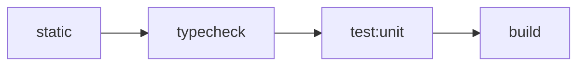

# 测试编排架构

> 状态：Current。本文维护测试分类、收集、跨 package 编排及测试资源的生命周期。

collection 指一个 runner 或命令拥有的测试集合；owner 指维护该集合及其 harness 的 app、package 或 root tooling。
按需要选择入口：

| 要解决的问题             | 本文入口                                                                         |
| ------------------------ | -------------------------------------------------------------------------------- |
| 测试放在哪一层           | [公开测试语言](#公开测试语言)                                                    |
| 如何编写或清理测试       | [测试质量原则](#测试质量原则)                                                    |
| 文件放哪里、如何收集     | [路径、命名与 collection](#路径命名与-collection)、[测试收集维护](#测试收集维护) |
| Root 与 package 如何编排 | [命令分工](#root-与-package-commands)、[Turbo 与缓存](#turbo-task-graph-与缓存)  |
| 如何管理资源和失败       | [并发与清理](#并发timeout-与清理)、[Full-system E2E](#full-system-e2e)           |
| 验证结果能支持什么结论   | [默认验证与交付](#默认验证与交付)                                                |

分类决策及取舍见 [ADR-0009](../adr/0009-adopt-canonical-test-collections.md)；具体命令、参数与资源 URL 见
[命令入口](../development/commands.md)。业务约束的验证 owner、代表性测试和证明范围由
[架构验证归属](architecture-verification.md)维护；静态规则的准入与观察边界由
[架构守卫规范](architecture-guard.md)维护。

## 公开测试语言

仓库只使用 Unit、Integration、E2E 三层。Integration 的六个并列 profile 表达资源模型与 harness owner：

| Profile       | 观察目标                                             | 外部资源                          |
| ------------- | ---------------------------------------------------- | --------------------------------- |
| `component`   | 进程内多个模块协作，出站边界使用 fake 或内存 adapter | 无                                |
| `process`     | 真实子进程、端口、readiness、退出与进程树清理        | 本机进程与端口                    |
| `redis`       | 生产 Redis adapter 行为                              | 调用方提供专用 Redis              |
| `postgres`    | schema、transaction 与 repository 行为               | 调用方提供专用 PostgreSQL         |
| `composition` | 生产 composition 与多个真实 adapter 协作             | profile 声明的全部资源            |
| `browser`     | 真实浏览器 harness，可替代旅程未经过的系统边界       | 浏览器与 package-local web server |

profile 不增加测试层级，也不表示速度或发布 Gate。多资源测试按观察重点与 harness owner 唯一归属。
Full-system E2E 使用完整临时系统，其资源由 E2E workspace 管理。

## 测试质量原则

测试应对行为变化敏感，对不改变行为的内部重构保持稳定。优先通过所属模块的公开接口，给出明确输入、状态或操作，
观察结果、错误和必要副作用；失败时应能直接知道哪项要求被破坏。

- **聚焦场景**：一个用例保护一个可命名的行为。同一行为的前后状态、返回值和副作用可以一起断言；互不依赖的成功、
  拒绝、恢复和输入变体使用独立用例或具名参数化案例。
- **独立状态**：每个测试建立并清理自己的状态，不依赖执行顺序。异步操作必须等待完成；并发与 pending 状态优先使用
  显式同步信号、受控 Promise 或适用的受控时钟。真实 Redis 到期与进程退出仍使用真实资源。
- **替换外部依赖**：只在所测模块的外部边界替换依赖，保留内部真实协作。提交参数、脱敏、零写入和禁止重放是有效观察；
  内部 helper 名称、调用顺序和次数只有本身属于当前契约时才锁定。
- **让测试能够失败**：缓存测试须区分命中与再次回源；筛选测试须观察传出的条件或真实筛选结果。固定返回值相等不能证明
  缓存有效，mock 加密输出不含明文不能证明生产加密安全。
- **选择适用证据**：纯类型兼容由 typecheck 收集的 `*.type-contract.ts` 验证，保留正向约束和必要的 `@ts-expect-error`。
  不创建空函数调用或恒真断言的运行时测试；共享 mapper 的完整结果由 owner 验证，消费方验证自身适配。
- **直接观察行为**：不通过其他源文件中的变量名、注释或调用文本推断资源隔离、清理和业务语义。静态分析工具自身的
  路径/import fixture 是公开输入，按 Architecture Guard 的允许模型验证。
- **区分性能与正确性**：资源预算使用直接、适用的证据，不把一次实现的完整端点调用数或 socket `data` 回调次数冻结成
  永久契约。性能采样不能冒充命令数、往返数或业务串行波次。

评审时核对：去掉待保护的行为，测试是否会失败；只改变内部实现，测试是否仍可通过；失败能否定位具体要求。
测试数量、mock 数量、matcher 名称和覆盖率不能代替这些判断，也不为本原则增加断言扫描器。
原则来源：[好的与不好的单元测试](https://chatgpt.com/share/6aa8d88c-bd6c-83e9-9a84-84646123864d)。

### 当前契约与测试清理

永久测试应证明去掉迁移背景后仍成立的当前要求。按保护目标分类，不按 `legacy`、`V1` 或 `removed` 等关键词批量删除：

| 分类                     | 处置依据                                                                                                   |
| ------------------------ | ---------------------------------------------------------------------------------------------------------- |
| 纯墓碑                   | 历史名称、字段、命令或目录缺席没有独立当前要求，删除检查及专用 helper。                                    |
| 冗余检查                 | 完整结果相等已覆盖的字段否定可以删除；冻结、敏感输入裁剪等独立语义仍须保留。                               |
| 当前边界的历史表达       | 要求仍有效，改用当前完整结果、公开解析、消费方结构兼容或实际行为证明。                                     |
| 现行迁移、兼容或恢复能力 | 有当前生产 owner 且执行实际行为，继续保留；历史输入、无 fallback 和非 owner namespace 保护不能按名称退役。 |
| 临时迁移检查             | 在 feature 中记录 owner、reason、removal date，到期核对并移除，不进入永久架构规则。                        |

删除前说明原保护目标、当前是否成立、替代测试或冗余原因。仍成立但缺少直接证据的要求，须在同一提交补齐替代证明，
或先验证替代测试通过再删除旧检查；同时核对专用 fixture、故障开关和清理登记是否仍可达。

DTO/wire 的完整结果由正式 mapper/serializer owner 验证，包括必要的嵌套结果；裁剪测试须提供额外字段并调用生产解析
或映射。只序列化手写 fixture 不能证明生产输出隔离，只抛错而不观察副作用不能证明零写入。App 的单纯 re-export
不重复维护共享字段词典，只验证自身转换、协议适配和调用行为。

接口按消费方所需能力与 provider-to-port 结构兼容验证；subject-only reader、只读 verifier 等安全封装另有直接证明。
不把旧成员黑名单换成完整 factory 方法白名单，未被消费的新方法不普遍构成失败条件。

测试清理不授权改变生产行为或新增 seam。替代测试暴露生产缺陷时，保留最小失败证据并单独报告，不降低断言换取通过。
交付摘要区分已执行、仅保留和未执行的通道；测试数减少、关键词零命中或 coverage 百分比不能替代验收。
这些判断由实现者与评审者完成，不新增断言语义扫描器、永久历史词典、baseline 或逐文件 mapping Guard。

### 禁止纯展示测试

所有 collection 均禁止只锁定静态 UI、展示文案或视觉实现细节的测试与断言。固定标题、静态标签字典、装饰图标、
CSS class、颜色、间距、字重、固定 DOM 排列及只保存这些内容的快照都属于此类；固定 mock 数据原样回显也不足以构成
独立行为。打开页面、展开固定说明或等待一次请求，不会改变这些检查的性质。

前端行为测试须说明输入、权限、状态或操作与功能结果之间的关系。权限控制、数据转换、条件展示和异步状态变化
可以没有用户点击，仍具有独立功能契约。

| 观察目标                                                           | 处置                                                                   |
| ------------------------------------------------------------------ | ---------------------------------------------------------------------- |
| 固定标题、帮助文字、按钮配色或布局；静态字典等于硬编码文案         | 删除独立用例；混合用例只删除这些断言。                                 |
| 权限未加载时不开放操作、只读目录不提供写入口、登录检查中不展示表单 | 保留条件与可见、隐藏、禁用等功能结果。                                 |
| 错误反馈、重试恢复、跳转、刷新、表单校验及提交参数                 | 保留触发条件与结果，去掉纯样式和无关固定说明。                         |
| 排序、格式化、嵌套转换、缺失值回退、状态或错误类型映射             | 保留真实输入到输出的规则；固定样例回显或复制静态标签表不构成映射测试。 |
| 协议响应、序列化、转义或敏感信息不泄露                             | 按协议或安全契约保留，不能因输出是文本或 HTML 而归为纯展示。           |

`getByText`、`getByRole`、`toBeVisible`、`toHaveTextContent` 等 API 本身不是删除依据。文案可用于定位操作、等待就绪
或观察状态；措辞本身属于当前功能契约时才锁定精确文案。整页快照不能替代对功能结果的直接断言。

按用例和断言逐项清理，保留混合文件中的行为证明，移除专用 import、fixture 和 helper。缺少替代证明时遵守
[测试清理规则](#当前契约与测试清理)，不通过改名、无关点击或移动 collection 保留纯展示用例。
不新增 matcher 黑名单、断言文本扫描器或快照计数门禁；Architecture Guard 继续使用既有观察模型。

## 路径、命名与 collection

每个测试候选由一个且仅一个 canonical collection 收集，目录与命名表达其归属：

| Collection             | 路径与命名                                                                                       |
| ---------------------- | ------------------------------------------------------------------------------------------------ |
| Unit                   | owner-local 窄根，通常为 `src/**/*.test.ts[x]`；tooling 可使用 `test/` 或 `scripts/__tests__/`。 |
| 非 browser Integration | `test-integration/<profile>/**/*.integration.test.ts[x]`。                                       |
| Browser Integration    | `test-integration/browser/**/*.spec.ts`。                                                        |
| Full-system E2E        | `e2e/system/**/*.spec.ts`，由 root `pnpm test:e2e` 独占。                                        |

Admin/SSO frontend 的 Unit 在各自一个 package-local Vitest 进程中使用 Node 与 DOM 两种环境：普通 `*.test.ts[x]`
默认进入 Node，`*.dom.test.ts[x]` 显式进入 jsdom。只有 DOM 加载 Testing Library 与浏览器兼容 setup；需要 HTTP mock
的文件显式注册 package-local MSW lifecycle。MSW 的使用不决定环境，Node/DOM 不增加公开命令或 profile。
Component Integration 则整体使用 jsdom、完整 setup 与自己的收集目录。

各 package 持有 runner、config、fixture 和 setup。仓库不提供 root Vitest workspace、跨 package 共享配置模块或共享 setup。
正常状态由生产 owner 建立，破坏变体与离线 schema 放在 owner 的 `/testing`；消费方不手写协议 key、Lua 或 serialization。
业务验证的具体归属见[架构验证归属](architecture-verification.md#行为资源与系统验证)。

User Profile backfill、repair、readiness 与 Employment 全库诊断属于操作命令，不采用测试命名，也不属于 collection。
PostgreSQL 命令测试观察真实命令进程；E2E 观察 Worker backfill 与生产 readiness gate。Employment 的 Component 测试
验证分类、完整 ID 集合与排序，PostgreSQL 测试验证只读库存和退出码；它们不替代 Profile 发布前的父对象守卫。
命令入口见[Workspace 入口](../development/commands.md#workspace-入口)。

E2E command runner 的输出隔离与取消清理由该 workspace 的 Process Integration 通过真实子进程验证，
纯 capture 和 discovery parser 留在 Unit。

## Root 与 package commands

Root 通过 Turbo 编排跨 package 测试，package 拥有实际 runner 与本地命令：

| Root 入口                         | 职责                                                                                              |
| --------------------------------- | ------------------------------------------------------------------------------------------------- |
| `pnpm test`                       | 代理 `test:unit`；有 Unit collection 的 package 同样代理，没有 Unit 的 package 不发布空 `test`。  |
| `pnpm test:unit`                  | 执行 package Unit tasks，并通过 `test:unit:root` 收集 root tooling tests。                        |
| `pnpm test:integration:<profile>` | 执行同名 package tasks；process 另运行 `test:integration:process:root`。                          |
| `pnpm test:integration`           | 先一次性检查全部专用资源 URL，再按固定顺序运行六个 profile，传播第一个失败。                      |
| `pnpm test:e2e`                   | 完整 Full-system collection 的唯一 owner，由 `@iam/e2e-system` 管理[生命周期](#full-system-e2e)。 |

聚合 Integration 固定串行执行：

```text
component -> process -> redis -> postgres -> composition -> browser
```

Integration 命令本身不创建资源。缺少任一 URL 时，在启动 profile 前失败；不得 skip、自动 retry 或回退到 runtime、
development、production 或其他 test URL。调用方可补齐专用资源后重新运行。
workspace-local `admin:journey`、`hr-admin:journey`、`oidc:journey` 保留为单旅程调试入口。
完整命令列表与参数见[测试与验证通道](../development/commands.md#测试与验证通道)。

### 测试收集维护

测试由所属 runner 在 owner-local 窄目录自动发现；root Unit 使用 `scripts/__tests__/`，root Process Integration
使用 `scripts/test-integration/process/`。新增测试放入所属目录，维护路径、命名与唯一 collection 归属。

修改 include/exclude、Vitest projects 或 workspace scripts 时，核对归属与 root Turbo task 接入，并运行受影响 owner 的
测试命令。命令成功只证明实际收集的测试执行结果，不自动证明磁盘候选全部收集或没有重复；取舍见
[ADR-0009](../adr/0009-adopt-canonical-test-collections.md)。

### Turbo task graph 与缓存

Turbo 是唯一跨 package orchestrator。测试任务通过 `transit` 传播依赖源码变化，不通过 `^test` 执行依赖 package 的测试：

```json
{
  "tasks": {
    "transit": { "dependsOn": ["^transit"] },
    "test:unit": { "dependsOn": ["transit"] },
    "test:integration:component": { "dependsOn": ["transit"] },
    "test:integration:process": { "dependsOn": ["transit"], "cache": false },
    "test:e2e": { "dependsOn": ["transit"], "cache": false }
  }
}
```

Unit/component 只有在输入、env、fixture、时间和随机性都可重现时允许缓存。process、redis、postgres、composition、
browser、Full-system E2E 及其他外部验证均 `cache:false`。资源任务通过 Turbo strict env 只透传 owner-specific test URLs。

## 并发、timeout 与清理

### 执行预算

| Collection                               | Turbo package concurrency | Runner 预算                                                                                  |
| ---------------------------------------- | ------------------------: | -------------------------------------------------------------------------------------------- |
| Unit                                     |                         2 | Admin/SSO Vitest `maxWorkers: 4`；其他 Vitest `maxWorkers: 25%`；Bun `--max-concurrency=2`。 |
| component                                |                         2 | Vitest `maxWorkers: 25%`；Bun `--max-concurrency=2`。                                        |
| process / redis / postgres / composition |                         1 | 单 package，资源 owner 独占。                                                                |
| browser                                  |                         1 | Playwright 管理单 Chromium project。                                                         |
| Full-system E2E                          |                         1 | 每个旅程均为单 Chromium project、单 worker、零 retry。                                       |

Timeout 用于避免永久挂起，不承担性能 SLA。Process harness 使用真实 readiness 信号，同时观察 child exit/error，
限制 stdout/stderr 缓冲，在成功、失败、timeout 和中断路径清理进程树、端口与临时目录。
不得通过放宽全局 timeout、重试或吞掉 cleanup 错误换取绿色结果。

### 专用资源与隔离

PostgreSQL 测试只清理自己创建的随机 schema；Redis 测试只清理自己的随机 namespace，禁止 `FLUSHDB`/`FLUSHALL`。
Integration 命令和 harness 不启动 Docker、PostgreSQL 或 Redis；browser 可按 Playwright config 启动 package-local web server。
没有专用测试 URL 时，agent 在 Docker 可用的情况下先创建任务独占临时容器，等待 ready，再传入专用 URL。
使用仓库声明的镜像版本、本次任务唯一的 name/label 和动态宿主端口；AFK sandbox 的独占网络方式见
[AFK 工作流](../agents/sandcastle-afk.md#验证节奏)。创建后立即记录准确 container ID，在成功、失败或中断后只按该 ID 清理，
不使用 glob、prefix scan 或 prune，也不使用 development、runtime 或 production 资源。
Docker 不可用或资源无法安全创建时，明确报告未执行的测试及原因，不得记为通过。

以下 harness 还有独立的资源约束；其他 owner URL 见[命令页](../development/commands.md#测试与验证通道)：

| Owner 与通道                | 专用 URL                          | Fixture 与清理约束                                                                                      |
| --------------------------- | --------------------------------- | ------------------------------------------------------------------------------------------------------- |
| Admin API PostgreSQL        | `IAM_ADMIN_API_TEST_DATABASE_URL` | 通过生产 Admin UoW factory 注入随机 schema client，不回退进程级数据库 singleton。                       |
| Worker Redis repair/verify  | `IAM_WORKER_TEST_REDIS_URL`       | targeted/full repair 与独立 verify 共用 owner 资源；保留对 Worker 自身 runtime tuple 的直接防误用检查。 |
| API Core Redis full restore | `IAM_API_CORE_TEST_REDIS_URL`     | 按 Redis profile 串行运行；写 fixture 前确认当前 Snapshot owner inventory 为空。                        |

Worker full restore 同样先确认当前 owner inventory 为空，只登记本次 Client/restore fixture 与 non-owner sentinel。
该通道执行生产 Redis-only command composition，观察普通/敏感 payload 重新回源、重复 repair、分批恢复、部分失败重跑、
另起 Worker 进程的 scan-only verify 及 non-owner sentinel 保留。它不增加第二个 cleanup URL，也不枚举或推断其他
test/runtime Redis 的 identity。

Worker/Core 结束时只精确 `UNLINK` 登记键，并验证当前 owner inventory 无残留。非 owner namespace 可保留；旧 OIDC、
Custom SSO、Traffic Gate key 不属于当前 Snapshot inventory，其残留不使 verify 失败。测试不要求整个 logical DB 为空，
也不证明旧 namespace 已清空。

### 浏览器 harness 与产物

API OIDC 退出 Browser Integration 使用真实候选 API、动态 loopback RP 和专用 `IAM_API_TEST_REDIS_URL`，不 mock IAM
协议请求。其 fixture 子进程经 readiness 交付浏览器种子，父进程关闭 stdin 后清理本次 HTTP server 与随机 Redis
namespace；启动失败也进入收尾。该通道同样单 Chromium、单 worker、零 retry，不替代全系统 E2E、第三方 RP 或部署证据。

API Browser Integration 的输出固定为 `apps/api/test-results/browser`，避免清理其他通道产物。
独立协议套件的持久证据放入调用方明确的任务目录，不使用浏览器 runner 会清理的输出根。

### Bun 异步断言

`bun:test` 的 async matcher 在 Bun 1.3.14 中曾出现 event-loop 重入，导致真实 I/O Promise 悬挂。运行时升级到 Bun 1.4.2
后仍保留兼容约束：数据库、Redis、HTTP、subprocess、readiness 等操作先用普通 `await` 完成，再做同步断言。

```ts
const report = await databaseOperation();
expect(report).toMatchObject(expectedReport);
```

失败路径先捕获 rejection，再同步断言错误。不得把真实 I/O Promise 传给 `.resolves`、`.rejects` 或 async `toThrow`，
外层的 `await expect(...)` 也不能消除该风险。不得以增大 timeout、重试或修改生产 I/O lifecycle 掩盖。
Bun 修复并完成仓库级真实 PostgreSQL/Redis/process 回归后，才能解除约束；上游跟踪见
[oven-sh/bun#33261](https://github.com/oven-sh/bun/issues/33261)。Vitest 不受此 Bun 专用规则影响。

## Full-system E2E

`@iam/e2e-system` 管理完整临时系统，从独立 Compose project 的空 volumes 开始，运行 migrations、五个正式 runtime、
synthetic seed、Gateway readiness、浏览器旅程及诊断清理。每次运行以 descriptor 记录准确的 project，恢复时使用同一目标。
Full-system Compose/runtime 只使用固定测试或本次生成的数据与凭据，不接受生产端点、生产凭据或真实 PII。

### 初始化与就绪

1. **Preflight**：在 descriptor 和资源创建前执行，使用独立 60 秒 deadline。失败直接非零退出，此时没有 project
   diagnostics 或 cleanup。
2. **初始化记录与诊断工具**：descriptor 落盘后，在构建或创建资源前原子写入只含 stage/timestamp 的 `not-attempted`
   migration receipt；写入失败不创建资源。随后构建 project-scoped Gateway 诊断镜像，再启动 infra 和 migration，
   使早期失败也能在 cleanup 前保存 route state。诊断阶段不临时 build，也不暴露 APISIX Admin host port。
3. **Migration**：命令前把 receipt 更新为 `attempted`，结束后记为 `applied` 或安全的 `failed`；不写入原始错误、命令或环境。
4. **Runtime 与 seed**：runtime healthy 后，核对 rendered Compose 中 API、Gateway、Admin 与 seed 的 canonical origin/authority。
   Seed 通过生产 Drizzle、Role Assignment、User Profile 与 Subject Access owner 建立数据并回读，避免复制 Redis 协议。
   Profile backfill 经真实 Worker 收敛；Gateway routes 发布前执行 PostgreSQL 与 Redis/Subject Facts/Subject Access 生产 gate。
   Seed receipt 只记录 stage、timestamps、failure category 或 run-scoped public references，不记录凭据、token 或 secret。
5. **协议与浏览器就绪**：OIDC discovery 除 HTTP 200 外，还须精确匹配 canonical origin 下的 issuer、authorization、token、
   JWKS、UserInfo 与 RP-initiated logout URLs；Custom SSO 的 internal/external well-known configuration 回读同一 origin。
   协议 ready 后执行浏览器 preflight，再开始旅程。

### 旅程编排

同源基线在同一个 project lifecycle 中固定按 Admin → HR Admin → OIDC 执行。每个旅程使用单 Chromium project、
单 worker、零 retry，均通过真实 SSO、Admin/API 与正式 runtime 观察行为，不使用 `page.route` 替代 repo-owned core。
具体场景与证明范围见[系统旅程的验证归属](architecture-verification.md#行为资源与系统验证)及各旅程测试。
任何旅程失败先收集 diagnostics，再尝试 cleanup；cleanup failure 始终令 root command 非零。

### 双入口验收与产物隔离

完整 collection 在同源基线后启动另一个独立 project，以 `internal.iam.localhost` / `external.iam.localhost` 和动态
Gateway 端口运行 `dual-entry.spec.ts`。基线的 OIDC selector 同样收集该文件；双入口阶段只运行此文件，复用完整
migrations、seed、readiness、正式 APISIX 与诊断清理 owner。

该阶段观察两协议相对登录、managed Client 按本次 origin 回调、固定 business callback、host-only Cookie、授权 `iss`、
退出以及未知 host/伪造 header。E2E 从正式 manifest 发布 API upstream 的受控 Host rewrite，回读已发布 upstream 后
才运行旅程，不改生产 manifest 的部署输入。独立 suite/RP 的证据入口见[协议套件](../development/commands.md#oidc-协议套件)。

跨通道产物遵守[浏览器产物隔离](#浏览器-harness-与产物)，避免 runner 清理其他通道的验收材料。

### 失败诊断与清理

Descriptor 落盘后的 setup、readiness、timeout 和可捕获 signal 进入统一的 `collectDiagnostics -> cleanup` 路径。
诊断 source 分别受 deadline 约束，逐项尝试保存可得证据、失败 placeholder 与 index；任何必需 source 失败都使顶层非零，
随后仍尝试清理准确 project。

- **日志与状态**：收集 Compose ps/health、固定 service logs、Gateway state 和已有证据清单。日志按完整行保留有界
  recent tail；单行超过 service byte cap 时整行替换为 `[TRUNCATED]`。普通 command runner 不向 console 回显 child
  stdout/stderr，原始输出仅通过有界 capture 进入 artifact。
- **浏览器产物**：将 run-scoped staging 中的原始 `trace.zip`、PNG、WebM 安全移动到 run artifact directory。
  Intake 最多 128 个文件、单文件 16 MiB、合计 64 MiB；路径越界、symlink、枚举、限额或移动失败均为必需诊断失败。
  Metadata index 只列 type/name/size，不替代或删除原始文件。
- **内容与访问**：diagnostics 保留有界原始内容，不做 JSON/YAML/JWK/PEM/credential 分类或脱敏。合成 token/password/key
  可出现在临时产物中，由 artifact directory 的访问控制与 retention 管理。

Cleanup 使用独立 deadline，对准确 project 执行一次 `compose down -v --remove-orphans --rmi local`，不枚举模糊前缀、
不全局 prune，也不另行查询或删除 image IDs。失败时非零退出并保留 descriptor，供显式 recovery 重试；不得影响无关
Docker 资源。显式 `runtime:cleanup` 只接受 descriptor 或 exact project，命令见
[Full-system E2E 入口](../development/commands.md#full-system-e2e)。

Signal/timeout 对当前 child/tree 做一次尽力终止并有界等待：Windows 可调用一次 `taskkill /T /F`，POSIX 可终止
process group 或 direct child。正常与异常路径都尝试 cleanup；异常清理不以全部资源 inventory 为零作为硬门禁。

## 默认验证与交付

基础 `pnpm verify` 固定快速失败：


```mermaid
flowchart LR
  A["static"] --> B["typecheck"]
  B --> C["test:unit"]
  C --> D["build"]
```

`pnpm verify:static` 使用同一 runner 的 `--static` 参数，只执行只读 format/lint、文档索引、环境变量命名 Guard 和
Architecture Guard。基础 `verify` 不读取真实 PostgreSQL/Redis，也不隐式运行 Integration、浏览器或 Full-system stack；
按改动风险显式追加相关 profile。
完整 `test:integration` 只在调用方准备好全部专用资源时运行。

| 聚合 Gate             | 固定执行顺序                 |
| --------------------- | ---------------------------- |
| `pnpm verify:ci`      | `verify -> test:integration` |
| `pnpm verify:release` | `verify:ci -> test:e2e`      |

Gate 只组合 owner commands，保持快速失败，不另行读取资源配置或复制 preflight、descriptor、diagnostics、cleanup。
命令名不表示已接入 CI 平台；平台采用与验收结论须有独立证据。

手动验证与修复后的结果复用见[工作流补充](../agents/workflow.md#验证节奏)，AFK 交接与批后验证见
[AFK 工作流](../agents/sandcastle-afk.md#验证节奏)。
必需检查执行或解析失败阻断交接与交付；静态检查通过不表示测试断言已执行或通过。
测试也不代替目标环境的停流、drain、恢复和独立核验，操作流程见[统一维护手册](../releases/unified-session-maintenance.md)。

候选 SHA、实际命令、结果、未执行项及平台验收记录留在对应 issue 或验收记录；历史结果不能代替最终候选或环境切换证据。
本页只维护长期验证契约，不保存某次运行的日期、通过次数或交付状态。
