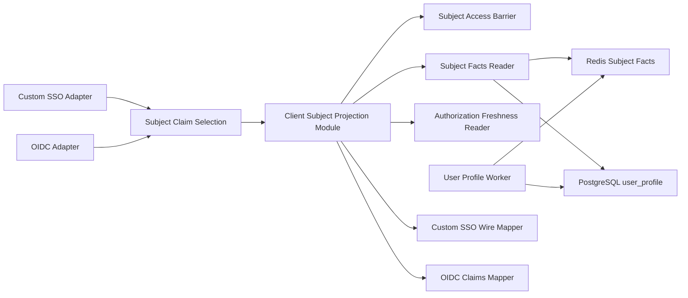

# Client Subject Projection 修复设计

> 本文是已确认的目标设计和候选实现依据，不代表任一环境已完成硬切换。当前外部接口以
> [第三方业务系统 SSO 单点登录对接说明](third-party-sso-integration.md) 为准；生产启用必须完成
> [Custom SSO Subject Projection 硬切换与回滚手册](../../releases/custom-sso-subject-projection-release.md) 的全部门禁。

## 1. 目标结果

Custom SSO 向业务 client 交付的用户信息只包含该 client 显式声明、且 IAM Catalog 允许的 Subject Claims。
Independent Client Credential 与 Gateway Local Session 共用同一个投影契约，但 Custom SSO 与 OIDC 继续拥有彼此
独立的配置、协议 Adapter、Wire Contract 和 session 生命周期。

修复完成后：

- Custom SSO session、credential 和私有 payload 不再保存 `UserDetailDto` 或 Client Subject Projection。
- IAM 数据库用户主键和其他 client 的角色、权限不会进入 `/sso/token`、`/public/user-info` 或
  `X-User-Info`。
- `/auth/authz` 的缓存命中路径不查询 PostgreSQL。
- `iam:authorization` 不允许读取 Dirty 或版本不一致的授权事实。
- OIDC `sub` 保持现有 UUID 值不变；OIDC 不依赖 Custom SSO 配置。

相关决策：

- [ADR-0006：将用户 Subject Identifier 提升为协议中性身份事实](../../adr/0006-elevate-user-subject-identifier.md)
- [ADR-0007：将 Custom SSO Client 配置与其他协议配置分离](../../adr/0007-separate-versioned-custom-sso-client-configuration.md)
- [ADR-0008：采用协议中性的 Client Subject Projection](../../adr/0008-adopt-client-subject-projection.md)

## 2. 范围

### 2.1 本次修改

- Subject Identifier、Principal Reference 和 Principal Session 创建接口。
- Custom SSO client 配置、Secret、配置版本和 Redirect Pattern。
- Custom SSO 配置、启停、删除和 Secret 轮换所需的 Admin API 与 Admin 管理前端。
- Subject Claim Catalog、Subject Claim Selection 和 Client Subject Projection Module。
- `user_profile`、Subject Facts、Dirty 发布事务与 Redis read-through cache。
- Subject Access Barrier。
- Custom SSO Authorization Grant、Independent Client Credential 和 Gateway Local Session 的 payload。
- `/sso/token`、`/public/user-info`、`/auth/authz`。
- OIDC Claims Snapshot、`iam:employments` 和 `iam:authorization` 的事实来源。
- 维护窗口迁移、验证和旧 Custom SSO artifact 清理。

### 2.2 明确不修改

- `/public/user-info` 之外的 `/public/*` 接口契约，包括用户/组织搜索、密码和手机号操作。
- `/auth/authz` 的接口级权限判定；本次只校验 Session 并生成最小 Gateway Subject Header。
- Custom SSO 主流程中现存的 query Session Token 接收与传递、相关日志及响应头防护；统一修复延期。
- ORCAS 专用 Cookie、query、端点和外部 session 语义。
- 现有通用明文 `clientSecret` 及 internal API key 的其他用途。
- Legacy User Detail Read Model 的删除。
- 第三方 Independent client 在 IAM 之外建立的本地 session 及其刷新策略。

## 3. 当前问题

当前 Custom SSO Local Session 私有 payload 保存完整 `UserDetailDto`，共享 `/public/*` 认证中间件又把该对象放入
请求上下文。`/sso/token` 与 `/public/user-info` 因而能够直接返回全局用户详情，包括数据库 ID、全部任职，以及未按
业务 client 过滤的角色和权限。`/auth/authz` 虽然只输出少数字段，仍会为了取得完整详情执行不必要的读模型查询。

泄漏不是某个 DTO 少做一次 `omit`，而是 Session Kernel、认证中间件与公开响应共同依赖了过深的 User Profile
Interface。只在 route 中临时删字段，未来 `UserDetailDto` 扩展时仍会再次泄漏。

## 4. 目标架构



边界规则：

- Custom SSO Adapter 只读取 Custom SSO 配置；OIDC Adapter 只读取 OIDC 配置和已授权 scope。
- Adapter 负责生成 `SubjectClaimSelection` 和映射协议输出，不把配置对象交给投影模块。
- Client Subject Projection Module 不知道 Gateway、Independent、OIDC、HTTP、Cookie 或 Session payload。
- Subject Facts Reader 不向调用方暴露 Legacy `detail` 或 `search_doc`。
- Wire Mapper 只能从投影结果构造输出，不能追加数据库记录或其他 client 的事实。

建议新增 workspace package `@iam/client-subject-projection`，作为共享的 deep Module。`@iam/user-profile-read-model`
继续拥有 Subject Facts 文档 schema、构建、Dirty 和 PostgreSQL 发布；API 与 OIDC composition 通过窄 Port 注入
Subject Facts、Subject Access 和 Authorization Freshness Adapter。

### 4.1 模块 Interface

```ts
type OptionalSubjectClaim =
  | "profile:username"
  | "profile:name"
  | "profile:phone"
  | "profile:employments"
  | "iam:authorization";

interface SubjectClaimSelection {
  catalogVersion: 1;
  optionalClaims: readonly OptionalSubjectClaim[];
}

interface ResolveClientSubjectInput {
  subjectIdentifier: string;
  clientCode: string;
  selection: SubjectClaimSelection;
}

interface ClientSubjectProjectionService {
  resolve(input: ResolveClientSubjectInput): Promise<ClientSubjectProjection>;
}
```

`subjectIdentifier` 是隐式必选结果；client 配置仍必须显式声明它，Adapter 校验后再从
`SubjectClaimSelection.optionalClaims` 中排除。`resolve` 的固定顺序是：

1. 校验 Subject Access Barrier。
2. 仅在需要可选 claim 时加载 Subject Facts。
3. 选择 `iam:authorization` 时执行 Authorization Freshness Barrier。
4. 按当前 `clientCode` 裁剪并组装投影。

投影模块根据 Selection 自己决定新鲜度要求，调用方不能传入 `allowStaleAuthorization` 一类开关。

## 5. Subject Claim Catalog V1

| Catalog claim | 必选 | 来源 | Custom SSO 输出 |
|---|---:|---|---|
| `subjectIdentifier` | 是 | User Profile 类型化列 | `subjectIdentifier` |
| `profile:username` | 否 | User Profile 类型化列 | `profile.username` |
| `profile:name` | 否 | User Profile 类型化列 | `profile.name` |
| `profile:phone` | 否 | User Profile 类型化列 | `profile.phone`；无手机号时省略 |
| `profile:employments` | 否 | Subject Facts | `profile.employments` |
| `iam:authorization` | 否 | Subject Facts + Freshness Barrier | `authorization` |

Catalog 使用语义名称，不接受 DTO 字段名、JSON path 或客户端自定义 claim。未知 Catalog version、未知 claim、重复
claim 或缺少 `subjectIdentifier` 的配置不能启用。新 client 默认只声明 `subjectIdentifier`。

明确不进入 V1 Catalog：

- 数据库 `id`
- `wxId`
- `userType`
- 用户、任职、组织、岗位、角色或权限状态
- `orderNum`、`description`、软删除字段和审计时间
- ORCAS 数据

### 5.1 Employment Profile Claim

`profile:employments` 只包含当前有效任职：

```ts
interface EmploymentProfile {
  isPrimary: boolean;
  organization: {
    code: string;
    name: string;
    type: string;
    path: Array<{ code: string; name: string; type: string }>;
  };
  position: { code: string; name: string };
}
```

任职、岗位和任职组织都必须启用且未删除。组织路径从根到当前组织并包含当前组织。主任职优先，其余按组织 code、
岗位 code 稳定排序；没有有效任职时返回 `[]`。

### 5.2 Client Authorization Claim

`iam:authorization` 包含全部当前有效任职，即使某条任职对当前 client 没有角色：

```ts
interface ClientAuthorization {
  employments: Array<EmploymentProfile & {
    roles: string[];
    privileges: string[];
  }>;
  roles: string[];
  privileges: string[];
}
```

每条任职只读取当前 `clientCode` 的 Effective Roles，并从这些角色派生权限。每条及顶层数组都去重、按 code
稳定排序。该 claim 是授权主体属性，不是某次 API 请求的授权决策。

`profile:employments` 与 `iam:authorization` 是自包含 claim；同时选择时允许 Wire JSON 中出现重复的组织和岗位信息，
避免一个 claim 的语义依赖另一个 claim 是否存在。

## 6. Custom SSO Wire Contract

```json
{
  "version": 1,
  "subjectIdentifier": "01234567-89ab-cdef-0123-456789abcdef",
  "profile": {
    "username": "138550",
    "name": "张三",
    "phone": "13800000000",
    "employments": []
  },
  "authorization": {
    "employments": [],
    "roles": [],
    "privileges": []
  }
}
```

规则：

- 未选择的字段不出现。
- 可空手机号不存在时不出现。
- 未包含任何子字段的 `profile` 不出现。
- 被选择的数组 claim 即使为空也返回 `[]`。
- 不提供 `id`、`userInfo` 或其他兼容别名。

## 7. User Profile 与 Subject Facts

### 7.1 `user_profile` 十七列

| 列 | 类型/约束 | 用途 |
|---|---|---|
| `user_id` | `integer`, PK | 内部关联与 Legacy 查询 |
| `subject_identifier` | `uuid`, NOT NULL, UNIQUE | Subject Facts 主查询键 |
| `username` | `varchar(64)`, NOT NULL | Profile 与旧查询 |
| `name` | `varchar(64)`, NOT NULL | Profile |
| `mobile` | `varchar(20)`, nullable | Profile 与旧查询 |
| `wx_id` | `varchar(255)`, nullable | 旧查询；不进入 Subject Facts |
| `status` | 现有 `UserStatus`, NOT NULL | 旧查询与 Access Barrier 修复 |
| `is_delete` | `boolean`, NOT NULL | 旧查询与 Access Barrier 修复 |
| `search_visible` | `boolean`, NOT NULL | 旧搜索 |
| `profile_schema_version` | `integer`, NOT NULL | 整行及 JSON schema version |
| `source_dirty_version` | `bigint` string mode, NOT NULL | 发布来源版本，应大于零 |
| `detail` | `jsonb`, NOT NULL | Legacy User Detail Read Model |
| `search_doc` | `jsonb`, NOT NULL | 旧 DSL/搜索 |
| `subject_facts` | `jsonb`, NOT NULL | 最小嵌套任职与授权事实 |
| `rebuilt_at` | 现有 timestamp 约定, NOT NULL | 发布时间 |
| `create_time` | 现有 base column | 行创建时间 |
| `update_time` | 现有 base column | 行更新时间 |

保留现有 username、mobile、wxId、visible/schema 和 `search_doc` GIN 索引，新增
`subject_identifier` 唯一索引。`subject_facts` 只整行读取，不建立 GIN 或 JSON path 索引。

`detail` 仍被现有用户详情和搜索接口使用，不是 SSO 兼容字段。Subject Facts Repository 的 select list 不包含
`detail` 或 `search_doc`；删除 `detail` 必须等旧消费者单独迁移。

### 7.2 PostgreSQL `subject_facts` JSON

```ts
interface SubjectFactsDocumentV1 {
  employments: Array<{
    isPrimary: boolean;
    organization: {
      code: string;
      name: string;
      type: string;
      path: Array<{ code: string; name: string; type: string }>;
    };
    position: { code: string; name: string };
    clientAuthorizations: Array<{
      clientCode: string;
      roles: Array<{
        code: string;
        privileges: string[];
      }>;
    }>;
  }>;
}
```

没有角色的有效任职仍然存在，`clientAuthorizations` 为 `[]`。只有具有 Effective Role 的 client 才建立授权项；
投影其他 client 时得到空角色和权限。`clientCode` 已不可修改，因此不保存数据库 client ID。

发布时的稳定顺序：

1. employments：`isPrimary desc`、organization code、position code。
2. client authorizations：client code。
3. roles：role code。
4. privileges：privilege code。

### 7.3 Redis Subject Facts Record

Redis 按 Subject 保存一份逻辑记录，不保存 user×client 投影：

```ts
interface SubjectFactsCacheRecordV1 {
  schemaVersion: number;
  sourceDirtyVersion: string;
  publishedAt: string;
  subjectIdentifier: string;
  profile: {
    username: string;
    name: string;
    phone: string | null;
  };
  facts: SubjectFactsDocumentV1;
}
```

它不包含 `accountAvailable`；账号可用性的唯一运行时来源是 Subject Access Barrier。

### 7.4 原子发布

Worker 可以在数据库事务外构建带 Dirty Version 的候选结果，但发布必须：

1. 开启事务并锁定对应 `user_profile_dirty` 行。
2. 再次确认 user、Dirty Version 和 `processing` 状态仍与任务一致。
3. 在同一事务内 upsert 完整 `user_profile` 并写入 `source_dirty_version`。
4. 在同一事务内把相同 Dirty Version 标记为 `processed`。
5. 状态或版本不匹配时回滚并把候选结果视为 stale，不写 Profile。
6. 提交后用 `sourceDirtyVersion` 做 Redis compare-and-set；旧版本不得覆盖新版本。

Profile upsert 应额外拒绝比现有 `source_dirty_version` 更小的写入，作为并发防线。Redis 更新失败不回滚已提交的
PostgreSQL 事实，由 read-through 和 repair 恢复。

### 7.5 Read-through

- 只请求 Subject Identifier 时不读取 Subject Facts。
- Redis 命中且 schema 有效时直接使用。
- 缺失、损坏或 schema 不支持时，single-flight 查询 `user_profile` 一行并回填。
- 数据库行缺失、版本无效或 JSON 无法解析时返回 `SUBJECT_PROJECTION_NOT_READY`。
- 不回退 `detail`，不现场联查 user/employment/role/privilege 源表。

## 8. Authorization Freshness Barrier

普通 Profile Claim 可以使用最后发布的 Subject Facts。选择 `iam:authorization` 时，每次构建投影都查询
PostgreSQL 中权威的 `user_profile_dirty`：

```text
dirty.status == processed
AND dirty.dirty_version == facts.sourceDirtyVersion
```

`pending`、`processing`、`failed`、Dirty 行缺失或版本不匹配全部 fail closed，且不按 Dirty Reason 放行。Redis
不能替代该权威查询。

缓存版本落后而 PostgreSQL 已发布当前版本时，从 `user_profile` 重载一次并继续；当前事实尚未发布时返回：

```http
HTTP/1.1 503 Service Unavailable
Retry-After: <configured-short-delay>
Content-Type: application/json

{
  "code": "SUBJECT_PROJECTION_NOT_READY",
  "message": "主体信息暂未就绪",
  "data": null
}
```

响应不暴露 Dirty 状态、版本或失败原因。`/auth/authz` 不选择 `iam:authorization`，所以缓存命中路径不执行该
PostgreSQL 查询。

## 9. Subject Access Barrier

Subject Access Barrier 是 Redis 实时安全状态，不属于 Subject Facts：

```ts
type SubjectAccessState = "enabled" | "blocking" | "disabled";

interface SubjectAccessRecordV1 {
  version: 1;
  subjectIdentifier: string;
  state: SubjectAccessState;
  transitionId?: string;
  updatedAt: string;
}
```

校验顺序是先解析有效 Session/Credential，再按其 Subject Identifier 检查 Barrier：

| Barrier 结果 | HTTP 语义 | Cookie |
|---|---|---|
| `enabled` | 继续 | 不变 |
| `disabled` | `401 SESSION_INVALID` | 清除 |
| `blocking` | `503 SUBJECT_ACCESS_UNAVAILABLE` | 不清除 |
| 缺失、读取失败或解析失败 | `503 SUBJECT_ACCESS_UNAVAILABLE` | 不清除 |

上表是 API/Admin 的 HTTP envelope。OIDC 保留同一安全分类，但在协议边界把 disabled 映射为
`login_required`（UserInfo 为 `invalid_token`），把不确定状态映射为 `temporarily_unavailable`；只有 disabled
按原创建路径清除 Cookie，删除属性固定包含 `Path=/`、epoch `Expires` 与 `Max-Age=0`。

账号状态变更流程：

1. 禁用或删除前，先以 transition ID 原子进入 `blocking`；失败则不执行数据库 mutation。
2. 数据库提交成功后切换为 `disabled` 并撤销全部 Principal Session。
3. 数据库回滚时只由相同 transition ID 恢复先前状态。
4. 提交后的 finalize 失败时保留 `blocking`，继续拒绝访问，由索引化 repair 任务核对数据库后收敛。
5. 重新启用时保持不可访问，直到数据库提交且当前 Subject Facts 发布成功，再切换为 `enabled`。
6. 已撤销 Session 不恢复。

repair backlog 使用原子 due-claim：领取时把 ZSET score 推进到 lease deadline，并发 worker 不重复处理；worker
崩溃后 lease 到期重新可见。deferred/failed 只在 record 仍携带同一 transition ID 时重排，稳定态清理与新
pre-block 通过 Lua 线性化。事务内 old/new 状态相同的 Admin 更新使用 `restore_previous`，不留下无事实变更的
`blocking`。

新用户在 Profile 发布前同样不能进入 `enabled`。Barrier 状态缺失不从 Profile cache 推断，以免缓存陈旧重新开放账号。

## 10. Custom SSO Client 配置

数据库列：

- `custom_sso_enabled boolean not null default false`
- `custom_sso_config jsonb null`
- `custom_sso_secret_hash varchar(255) null`
- `custom_sso_config_version integer not null default 0`

严格配置：

```ts
type CommonCustomSsoConfigV1 = {
  validRedirectUrls: string[];
  subjectClaimCatalogVersion: 1;
  subjectClaims: Array<
    | "subjectIdentifier"
    | "profile:username"
    | "profile:name"
    | "profile:phone"
    | "profile:employments"
    | "iam:authorization"
  >;
};

type GatewayCustomSsoConfigV1 = CommonCustomSsoConfigV1 & {
  mode: "gateway";
  orcas: { enabled: boolean };
};

type IndependentCustomSsoConfigV1 = CommonCustomSsoConfigV1 & {
  mode: "independent";
  callbackEndpoint: string;
  logoutEndpoint: string;
};
```

约束：

- 未配置：config 和 secret hash 都为 null，enabled 为 false。
- Gateway：config 非空，secret hash 必须为 null。
- Independent：config 和 secret hash 都必须非空。
- enabled 为 true 时 config 必须非空。
- Zod 使用 strict discriminated union，未知字段和跨模式字段被拒绝。
- 所有配置、启停和 Secret 轮换都原子递增版本。
- Secret 只生成并展示一次，运行时 DTO 不返回 hash 或明文。
- 删除 `userExcluding`，不提供替代或兼容字段。

Custom SSO 不读取 `oidcConfig`、OIDC Secret 或通用明文 `clientSecret`。

### 10.1 Redirect Pattern 与 state

保留受限通配：

- 无通配 URI 只匹配精确路径。
- 只有显式 `/*` 才匹配路径子树。
- `*.` 只匹配一级子域，不匹配根域或多级子域。
- scheme 和 port 必须一致。
- 禁止裸 `*`、公共后缀/IP 通配、URL credentials、动态 query 和 fragment。

Authorization 阶段按模式验证，Grant 保存规范化后的实际 redirect URI；callback 或 token 兑换时必须与 Grant
逐字一致，不再次用模式放宽。

V1 `state` 可选。提供时绑定到 Grant 并在 callback 原样返回；IAM 不解释、不修改、不写普通日志，缺失时不生成
默认值。未来改为必填必须提升契约版本。

### 10.2 Admin 管理前端边界

Admin 前端采用统一编辑入口和协议独立设置模块：

- Client 列表的“编辑”操作导航到独立 `/clients/:clientCode/edit` 页面，不再从列表分别打开基础信息、Custom SSO
  或 OIDC 编辑弹窗。
- Client 编辑页加载一次 Admin Client Detail，并提供应用基础信息、Custom SSO 和 OIDC 等独立设置入口。
- 应用基础信息模块不再读写 `managementLevel`、`requireOrcas`、`validRedirectUrls`、`userExcluding`、
  `callbackEndpoint` 或 `logoutEndpoint`；现有通用 `clientSecret` 仍留在基础信息流程，本次不改变其语义。
- 新增页面私有 Custom SSO 设置模块；现有 `OidcConfigModal` 重构为页面内 OIDC 设置模块。两者各自只通过
  `src/services/client.ts` wrapper 调用协议专用 Admin API，不直接调用底层 API client。
- Custom SSO 设置模块独立负责配置、启用、禁用、删除和 Independent Secret 轮换；OIDC 设置模块不读写
  Custom SSO 状态。
- Client 列表删除旧“管理模式”列，保留只读协议状态摘要，但不再承载协议编辑 workflow。

编辑页使用单一路由 `/clients/:clientCode/edit?section=basic|custom-sso|oidc`：

- 页面标题区显示返回入口、应用名称、不可变 `clientCode` 和全局状态。
- “基础信息”标签页负责应用元数据、现有通用配置、全局启停和 Client 删除。
- “Custom SSO”标签页负责 Custom SSO 设置。
- “OIDC”标签页承接现有 OIDC 设置。
- 当前标签写入 URL query，支持刷新和直接链接；不拆成三套嵌套路由。
- Client 列表只提供统一“编辑”入口；全局状态 mutation 与删除 workflow 从列表移入基础信息标签页。
- Client 列表保留只读 `Custom SSO` 与 `OIDC` 状态摘要列。Custom SSO 摘要显示未配置/已禁用/已启用，
  并在已配置时显示 `Gateway` 或 `Independent`；列表不提供任何协议 mutation。
- 搜索区增加 Custom SSO 状态与模式的结构化筛选；不按 Claims、Redirect URL、回调地址或其他 JSON 配置内容
  筛选。现有 OIDC 筛选保持不变。
- 新建 Client 仍使用轻量 `ClientFormModal`，且只提交应用基础信息；创建成功后导航到新 Client 的统一编辑页。
- 新 Client 的 Custom SSO 和 OIDC 都保持“未配置”，不在创建 mutation 中隐式配置或启用协议。
- OIDC 标签页只把现有 `OidcConfigModal` 重构为页面内设置模块；现有 OIDC 配置字段、Admin API、启停、
  删除与 Secret 轮换语义保持不变。
- OIDC 不采用 Custom SSO 的“启用态只读”规则，也不读取 Custom SSO Claims Catalog 或配置版本。
- 每个标签页拥有自己的 form state。切换标签、返回列表或离开页面时，如当前表单有未保存修改，必须确认是否
  丢弃；不自动保存，也不把草稿写入浏览器持久存储。
- 取消丢弃则留在当前标签；确认后卸载当前设置模块。保存成功后重新加载 Client Detail 并清除 dirty 状态。
- 全局 Client 禁用会阻止协议使用并撤销两个协议的 artifact，但不改写 `customSsoEnabled`、`oidcEnabled` 或
  清除协议配置；重新启用后，原本已启用的协议恢复可用。
- 全局删除继续采用软删除并撤销全部协议 artifact，不要求管理员先分别禁用协议。
- `Maintenance` 不再读取 `userExcluding` 或提供其他用户例外；Custom SSO 不允许按用户绕过维护态。

Custom SSO 状态至少区分“未配置”“已禁用”“已启用”；只有已配置状态才显示
`Gateway` 或 `Independent` 模式。Secret 明文永远不进入 Client 列表或详情 DTO。

模式切换规则：

- 已启用时不能切换模式，管理员必须先禁用 Custom SSO。
- 已禁用时允许直接切换，不要求先删除配置再重建。
- 切换与配置版本递增在同一事务完成，并使旧 Custom SSO artifact 失效。
- `Gateway` 切换为 `Independent` 时生成新 Secret，并仅展示一次。
- `Independent` 切换为 `Gateway` 时清除 Custom SSO Secret Hash。

Claims 表单由 Catalog V1 驱动：

- `subjectIdentifier` 固定选中且不可取消。
- `profile:*` 与 `iam:authorization` 分组显示，管理员不能自由输入 claim 名称。
- 每个选项展示将交付的数据范围；`iam:authorization` 额外说明其严格新鲜度要求，以及数据未就绪时认证可能
  暂时返回 `503`。
- 提交值仍由共享 Admin contract 校验，前端选项限制不能替代服务端 strict validation。

Independent Secret 的前端交付规则：

- 创建 Independent 配置、切换到 Independent 或轮换成功后，进入专用的一次性 Secret 结果弹窗。
- Secret 明文只来自该次 mutation 响应；页面提供复制操作，但不写入列表、详情、日志或浏览器持久存储。
- 结果弹窗不能通过遮罩或键盘关闭；管理员确认“已安全保存”后才能显式关闭。
- 关闭时立即清除组件状态中的 Secret；页面刷新或关闭造成的遗失只能通过再次轮换恢复，不能重新查询。

已启用配置是只读运行态：

- 已启用时只允许查看配置或执行“禁用”。
- 修改 Claims、Redirect、模式、ORCAS/回调地址、轮换 Secret 和删除配置都必须先禁用。
- 新建配置保持禁用；修改已禁用配置也不会隐式启用。
- 管理员完成配置、保存一次性 Secret并将其部署到业务系统后，再显式启用。
- 前端禁用按钮只是操作引导；Admin API 必须独立校验状态前置条件，拒绝绕过 UI 的 mutation。

Claims 选择器旁展示动态响应结构预览：

- 预览由共享 Catalog 元数据和当前 Selection 生成，不在 Admin API 或浏览器查询真实用户。
- 值统一使用固定占位符，只表达最终 Custom SSO Wire JSON 的字段位置和层级。
- 预览明确表现未选择字段及空父对象会被省略；已选择的数组字段没有数据时仍返回空数组。
- 前端不得另行维护一份 Wire 字段映射，避免预览与共享契约漂移。

启用动作只做确定性的本地校验：

- 校验 strict config schema、Redirect Pattern、Claims、模式必填字段，以及 Independent Secret Hash 是否存在。
- Admin API 不访问 `callbackEndpoint`、`logoutEndpoint` 或 Redirect URL 做连通性测试。
- 前端用启用前检查清单表达配置条件；一次 HTTP 探测不作为协议可用性的证据。
- 禁止外部探测避免把 Admin API 变成 SSRF 能力。

Admin 交互保持与现有管理页面一致，不增加乐观锁：

- `customSsoConfigVersion` 用于运行时 cache/artifact 失效，不作为 Admin mutation 的
  `expectedConfigVersion`。
- Admin API 仍在事务内校验当前配置状态和模式前置条件；并发保存采用最后成功写入生效。
- 前端不实现配置冲突的 `409` 刷新与重放流程。

### 10.3 Admin API 与 DTO

Custom SSO 采用与 OIDC 对称、但完全独立的 Admin operations：

| tRPC operation | REST | 前置状态 | 结果 |
|---|---|---|---|
| `customSsoConfigure` | `PUT /clients/:clientCode/custom-sso/configure` | 未配置或已禁用 | 保存严格配置；必要时一次性返回 Secret |
| `customSsoEnable` | `POST /clients/:clientCode/custom-sso/enable` | 已禁用、全局状态正常 | 启用 |
| `customSsoDisable` | `POST /clients/:clientCode/custom-sso/disable` | 已启用 | 禁用并撤销 Custom SSO artifact |
| `customSsoRemove` | `POST /clients/:clientCode/custom-sso/remove` | 已禁用 | 清除配置与 Secret Hash |
| `customSsoRotateSecret` | `POST /clients/:clientCode/custom-sso/rotate-secret` | 已禁用且为 Independent | 轮换并一次性返回 Secret |

所有 operation 都在 Admin API service 内重新读取 Client、校验当前状态、执行事务 mutation、记录审计，并在提交后
触发 Custom SSO protocol revocation/invalidation。它们不接收 `expectedConfigVersion`。

DTO 边界：

- `ClientCreateDto`、`ClientUpdateDto` 和 legacy `ClientInputDto` 都排除 `customSsoEnabled`、
  `customSsoConfig`、`customSsoSecretHash` 与 `customSsoConfigVersion`。
- 从通用 `extAttributes` schema 删除旧 `managementLevel`、`requireOrcas`、`validRedirectUrls`、
  `userExcluding`、`callbackEndpoint` 和 `logoutEndpoint`；不接受兼容字段。
- `ClientAdminListDto` 只增加 `customSsoState` 和 nullable `customSsoMode` 摘要，不返回完整 Custom SSO 配置。
- `ClientAdminDetailDto` 返回严格 `customSsoConfig`、`customSsoState`、`customSsoMode`、
  `hasCustomSsoSecret` 和配置版本，但不返回 Secret Hash 或明文。
- Configure/Rotate mutation 只有确实生成新 Secret 时才在该次响应返回 `customSsoSecret`；其他响应只返回最新
  `ClientAdminDetailDto`。
- Custom SSO Runtime Secret Reader 使用单独的内部 record/interface，不能复用 Admin DTO。

列表查询用结构化 `customSsoStates` 和 `customSsoModes` 条件替换 `managementLevels`。V1 不为少量管理查询新增
JSONB GIN 或表达式索引；以实际 Client 数量与查询计划作为后续加索引依据。

新增独立审计 action：

- `admin.client.custom_sso.configure`
- `admin.client.custom_sso.enable`
- `admin.client.custom_sso.disable`
- `admin.client.custom_sso.remove`
- `admin.client.custom_sso.rotate_secret`

审计 patch 可记录模式、Claims、URL、ORCAS 开关、状态和配置版本；Secret 明文与 Hash 必须在进入审计对象前排除。

### 10.4 Admin 前端 composition

建议页面私有结构：

```text
pages/clients/
├── index.tsx
├── edit.tsx
└── components/
    ├── ClientCreateModal.tsx
    ├── ClientBasicSettings.tsx
    ├── CustomSsoSettings.tsx
    ├── OidcSettings.tsx
    ├── SubjectClaimsSelector.tsx
    ├── SubjectProjectionPreview.tsx
    └── OneTimeSecretModal.tsx
```

- `.umirc.ts` 注册隐藏菜单的 `/clients/:clientCode/edit` route，并保留 `/clients` 菜单入口。
- `index.tsx` 只拥有搜索、创建和导航；创建成功后对 `clientCode` 做路径编码并导航到编辑页。
- `edit.tsx` 拥有详情加载、404/错误状态、当前 section、dirty navigation guard、mutation 后刷新和删除后返回列表。
- 三个 Settings component 只拥有自身表单与状态机，不互相导入协议配置类型。
- `SubjectClaimsSelector` 和 `SubjectProjectionPreview` 只消费共享 Catalog metadata。
- `OneTimeSecretModal` 是 OIDC 与 Custom SSO 可复用的安全展示 primitive，但调用方分别持有自己的 Secret
  mutation 结果；组件不得缓存最近一次 Secret。
- 页面和 component 只调用 `src/services/client.ts` wrapper；wrapper 隐藏 tRPC procedure 名称及 DTO 推断。
- `/clients/:clientCode/edit` 的未知 `section` 值规范化为 `basic`，不存在的 Client 显示明确空状态并提供返回列表入口。

## 11. Session 与 Grant 数据

| Artifact | 必须保存 | 禁止保存 |
|---|---|---|
| Principal Reference | `principalType`, Subject Identifier | DB user ID、displayName |
| Principal Session | Principal Reference、AMR、可信 Session Origin、生命周期元数据 | Principal Snapshot、User Detail |
| Custom SSO Authorization Grant | Subject Identifier、clientCode、mode、redirect URI、可选 state、配置版本、状态/租约、过期时间 | User Detail、投影 |
| Independent Client Credential | Subject Identifier 引用、clientCode、配置版本、生命周期与绑定信息 | User Detail、投影 |
| Gateway Local Session | Subject Identifier 引用、clientCode、配置版本、生命周期与 ORCAS 专用引用 | User Detail、投影 |
| OIDC Authorization Code | OIDC Claims Snapshot、client/scope/config/session 绑定 | Custom SSO 配置 |

删除通用 `PrincipalSnapshot`，不保留空字段或 legacy normalization。Principal Session 创建 Interface 只接受 Subject
Identifier 与认证上下文，不接受 `UserDetailDto`。

### 11.1 Grant 兑换状态机

```text
issued → redeeming → consumed
           │
           └─ 暂时不可用 → issued
```

- client、redirect URI 和配置版本校验通过后才能原子预占。
- `redeeming` 保存随机 attempt ID 和短租约；并发兑换不能同时成功。
- 长操作按 grant、attempt ID 与上一 lease deadline 做 fenced heartbeat 续租；续租不得延长 Grant 原始过期时间。
- `SUBJECT_PROJECTION_NOT_READY` 或 Subject Access 暂不可用时按相同 attempt ID 恢复 `issued`，保持稳定 retryable
  `503`。
- 进程崩溃后租约到期允许重试。
- 只有 Credential 或 Local Session 成功签发时才进入 `consumed`。
- `consumed` 永远不能再次兑换。

Gateway callback 不交付 Client Subject Projection，因此只需完成 Session 与 Barrier 检查；Independent
`/sso/token` 在成功消费 Grant 前必须完成响应投影。

## 12. HTTP 契约

### 12.1 `POST /sso/token`

不保留 GET、query secret 或 `userInfo` 兼容入口：

`transportClientCode` 是 Client Code 原值的 UTF-8 RFC 3986 URI-component percent encoding；普通字母数字
Client Code 不变，`:`、`/`、`%` 和非 ASCII 字符按 `%HH` 编码。相同编码也用于 `Client` 请求头和 Gateway
Local Session Cookie 名，业务校验和持久化仍使用解码后的原始 Client Code。
原值的 64 字符上限与 PostgreSQL `varchar(64)` 一致，按 Unicode code point 计数，不按 JavaScript UTF-16
code unit 或编码后字符串长度计数；因此非 BMP 字符和变长的 `transportClientCode` 不会误占两个原值字符。

```http
POST /sso/token
Authorization: Basic base64(transportClientCode:customSsoSecret)
Content-Type: application/x-www-form-urlencoded

code=<authorization-code>&redirect_uri=<exact-grant-redirect-uri>
```

该端点不开放浏览器 CORS。成功响应：

```json
{
  "code": 200,
  "message": "success",
  "data": {
    "sid": "opaque-independent-credential",
    "ttl": 86399,
    "subject": {
      "version": 1,
      "subjectIdentifier": "01234567-89ab-cdef-0123-456789abcdef"
    }
  }
}
```

### 12.2 `/public/user-info`

认证中间件只生成：

```ts
interface AuthenticatedSubjectContext {
  subjectIdentifier: string;
  authenticatedClientCode: string;
  orcasId?: string;
}
```

handler 根据当前 Custom SSO client 配置生成 `SubjectClaimSelection`，再调用投影模块。它不读取请求上下文中的
`UserDetailDto`。其他旧 `/public/*` handler 如需数据库 user ID 或 username，通过自己的 Account Resolver 按
Subject Identifier 解析。

成功响应的 `data` 直接是 Custom SSO Wire Projection。

Cookie 清理按失效来源决定，而不是只看最终是否为 401：

- Principal Session、Local Session、Subject Access 本身失效时，清理本次请求实际使用的源 Cookie。
- 有效 Principal Session 通过 `Client: iam` 请求时，如果只是 IAM client 的 Custom SSO delivery
  配置缺失、禁用、删除或在投影期间失效，请求返回 401，但保留协议中性的 `global_session` 与 ORCAS Cookie。
- Local Session 绑定的 client 配置或版本失效时，请求返回 401，并清理对应 Local Session 与 ORCAS Cookie。
- `Authorization` header 是请求凭证来源时，不额外制造 Cookie 删除。

实现使用专用错误类型区分 client-local delivery 拒绝与 credential/session 失效，不按错误消息推断清理范围。

### 12.3 `/auth/authz`

成功时 `X-User-Info` 和响应 `data` 都是同一个 Base64 编码的版本化 JSON：

```json
{
  "version": 1,
  "subjectIdentifier": "01234567-89ab-cdef-0123-456789abcdef",
  "username": "138550",
  "name": "张三"
}
```

Subject Identifier 始终存在；username/name 只有 client 声明相应 claim 时才出现。禁止 phone、employments、
authorization、数据库 ID 和兼容字段。

缓存命中性能路径：

```text
Local Session Redis
→ Subject Access Barrier Redis
→ Subject Facts Redis（仅 client 需要 username/name 时）
→ 内存映射
```

该路径 PostgreSQL 查询数为零。

## 13. OIDC Adapter

OIDC 只把自身已配置并实际授权的 scope 映射为 Subject Claim Selection：

| OIDC scope | Selection | OIDC 输出 |
|---|---|---|
| `openid` | mandatory subject | `sub` |
| `profile` | username + name | `preferred_username`, `name` |
| `phone` | phone | `phone_number` |
| `iam:employments` | employments | UserInfo 的 `iam:employments` |
| `iam:authorization` | authorization | UserInfo 的 `iam:authorization` |

标准 `profile` 不包含任职。`iam:employments` 和 `iam:authorization` 不进入 ID Token。

OIDC Claims Snapshot 在授权完成、Authorization Code 签发前创建，并绑定 Subject Identifier、client、scope、
OIDC config version 和 Provider/Principal Session。选择 `iam:authorization` 时，此刻执行 Freshness Barrier；
未就绪映射为 OIDC `temporarily_unavailable`，不签发 Code。

Token Endpoint 只把 Authorization Code 中的 Snapshot 转移到 Access Token，不重新读取当前 Profile。UserInfo
重放 Access Token 中的 Snapshot。OIDC `iam:authorization` 保留现有 `orgCode`、`orgName`、`fullOrgPath`、
`posCode`、`posName` 等 Wire 字段，只新增 `isPrimary`；不输出 Custom SSO 的另一套字段或双字段。

## 14. 数据库与维护窗口迁移

### 14.1 发布前清单

1. 冻结 client 和用户/任职/授权数据写入。
2. 备份 PostgreSQL 与需要保留的 Redis operational data。
3. 列出全部启用 Custom SSO client，确认 mode、Redirect Pattern、Catalog V1 claims 和 callback/logout/ORCAS 配置。
4. 为所有 Independent client 生成并安全分发新 Custom SSO Secret。
5. 无法明确配置或未确认 Secret 接收的启用 client 会阻止发布。

### 14.2 Schema 演进

不修改任何已执行 migration 或 snapshot。新 migration：

1. 将 `user.oidc_subject` 直接重命名为 `subject_identifier`，保留 UUID 值和唯一约束。
2. 给 `user_profile` 增加可空的 `subject_identifier`、`name`、`source_dirty_version`、`subject_facts`。
3. 给 client 增加 Custom SSO 四列及基础 check constraint。
4. 运行版本化批量 backfill 命令，不使用循环单行写入。
5. 完成校验后把四个 User Profile 新列改为 NOT NULL，并建立 Subject Identifier 唯一索引。
6. 只有在代码和离线迁移都不再读取后，删除 `extAttributes` 中旧 Custom SSO 字段；运行时无双读。

增加列、回填、约束收紧拆为可审查的小 migration。大表唯一索引根据测试环境锁等待证据决定是否使用
`CREATE UNIQUE INDEX CONCURRENTLY`；它不能放在普通事务内。

### 14.3 全量预发布门禁

开放流量前必须覆盖全部现存用户，包括禁用和已删除用户：

- `user` 与 `user_profile` 数量和 Subject 映射符合预期。
- Subject Identifier 全部非空且唯一。
- 每个 Profile 的 `source_dirty_version` 等于同用户 Dirty Version。
- 每个 Dirty 状态为 `processed`。
- 每个 `subject_facts` 通过当前 schema。
- 每个 Subject 都有 Access Barrier；正常账号为 `enabled`，禁用/删除账号为 `disabled`。

任一失败都取消切换。运行期 read-through 只修复缓存，不承担旧数据懒迁移。

### 14.4 切换与 artifact

1. 部署理解新 schema 的 Worker、API、Admin API、Admin 前端和 OIDC Provider。
2. 停止旧 Worker，确认没有旧版本任务仍能发布。
3. 预热 Subject Facts 和 Subject Access Barrier。
4. 清理所有旧 Custom SSO grant、binding、credential、local-session payload 和旧 Principal Session。
5. 不主动删除 OIDC 配置、Provider Session、Authorization Code 或 Token；但依赖已清理 Principal Session 的旧
   OIDC artifact 在后续校验时会自然失效，用户需要重新登录。
6. 打开流量并执行 Gateway、Independent、OIDC 和账号禁用 smoke。

清理必须使用专用 profile 的 dry-run、残留 verify、apply、clean verify 四步门禁，并证明 OIDC artifact 聚合计数不变；
逐步命令、取消条件、性能阈值和证据模板见发布 runbook。

切换后不回退到旧字段或旧 payload。若必须回滚应用版本，应先重新停止认证流量并按备份/显式回滚 migration
恢复；已清理的 Session 不可恢复。

## 15. 实施顺序

建议以可独立验证的小步提交：

1. 增加 Catalog、Selection、Projection 类型和纯映射测试。
2. 新增数据库列、JSON schema、migration 与离线 backfill/verify command。
3. 扩展 User Profile builder，完成原子发布和 Redis version CAS。
4. 实现 Subject Facts read-through 与 Authorization Freshness Barrier。
5. 实现 Subject Access Barrier、账号状态 mutation 和 repair。
6. 将 Session Kernel Principal Reference 切换到 Subject Identifier，删除 Principal Snapshot。
7. 增加独立 Custom SSO config/secret/version 管理、Admin contract、统一 Client 编辑页与设置模块。
8. 改造 Authorization Grant 状态机和 Custom SSO artifact payload。
9. 拆分最小认证中间件，改造 `/sso/token`、`/public/user-info`、`/auth/authz`。
10. OIDC 切换到 Projection Module，并把 Claims Snapshot 前移到 Authorization Code。
11. 完成维护窗口 rehearsal、全量迁移、artifact 清理和 smoke。

在生产实现提交中使用数据库 schema skill 生成并审查新 migration；生产环境不得使用 schema push。

## 16. 验证

### 16.1 单元与契约测试

- Catalog 拒绝未知版本、未知/重复 claim 和缺少 Subject Identifier。
- 任意扩展 `UserDetailDto` 都不会改变 Client Subject Projection。
- 两个 client 的 roles/privileges 交叉构造时，每个结果只包含自身授权。
- 未声明字段、空父对象、数据库 ID、状态和 ORCAS 字段不出现在 Wire JSON。
- Employment 与 Authorization 的有效性、去重和稳定排序符合规则。
- Gateway Header 永远拒绝 phone、employment 和 authorization。
- Custom SSO strict union 拒绝未知字段、跨模式字段和非法 secret 状态。

### 16.2 数据库与并发测试

- Profile upsert 与 Dirty `processed` 在同一真实 PostgreSQL transaction 中提交或回滚。
- 旧 Worker 与新 Dirty Version 并发时，旧结果不能写入 Profile。
- Redis CAS 不能用旧 `sourceDirtyVersion` 覆盖新记录。
- 严格授权对所有非 processed、缺失和版本不匹配状态返回 503。
- backfill 可重复运行，并能准确报告未覆盖或不一致的 Subject。

### 16.3 Redis 与 Session 测试

- Subject Facts cache hit、miss、损坏、未知 schema 和 single-flight。
- Access Barrier 的 enabled/blocking/disabled、rollback、finalize failure 和 repair。
- Access Barrier 读取失败不降级成 enabled。
- Grant 并发预占只有一个成功，503 可恢复，租约过期可重试，consumed 不可重放。
- 所有 Custom SSO artifact 序列化结果都不含 User Detail 或 Projection。
- 配置版本变化使旧 grant、binding、credential 和 local session fail closed。

### 16.4 API 与 OIDC 测试

- `/sso/token` 只接受 POST、Basic client authentication 和 form body。
- `/sso/token` 与 `/public/user-info` 使用相同 Custom SSO Projection Wire Contract。
- `/auth/authz` 输出相同的 header/body Base64 值及最小 JSON。
- Shared public authentication context 不含 user ID、username 或 User Detail。
- OIDC `profile` 不含 employments；专用 scope 只进入 UserInfo。
- OIDC Authorization Code 固化 Snapshot，Token/UserInfo 不混入后来变化。
- OIDC 与 Custom SSO 配置变更、artifact 和错误映射互不串扰。

### 16.5 Admin 管理测试

- Generic Client create/update schemas 拒绝全部 Custom SSO managed fields 和已删除的 legacy ext attributes。
- Admin list/detail DTO 不含 Custom SSO Secret 明文或 Hash；list 只含状态与模式摘要。
- Configure/enable/disable/remove/rotate 的状态矩阵、版本递增、协议撤销和审计 action 均有 service integration test。
- 已启用 Custom SSO 的配置编辑、模式切换、删除和 Secret 轮换在 Admin API 层被拒绝。
- Client 列表的状态/模式筛选映射正确，点击唯一“编辑”入口进入编码后的 Client route。
- 创建成功跳转编辑页；未知 section 回到 basic；详情不存在和加载失败有稳定页面状态。
- dirty form 在切换 section 或离开 route 时提示，保存后清除 dirty 并刷新详情。
- Claims selector 固定 Subject Identifier、拒绝自由 claim，并与占位 Wire preview 保持一致。
- 一次性 Secret 关闭后不再存在于 DOM、组件状态或浏览器持久存储；重新打开详情不能取回。
- OIDC 设置模块迁移前后的 mutation 与 Secret 行为有回归测试，不套用 Custom SSO 状态规则。

### 16.6 性能验收

- `/auth/authz` 热路径：零 PostgreSQL 查询。
- 只请求 Subject Identifier：零 Subject Facts 读取。
- 普通 claim cache miss：最多一次 `user_profile` 单行查询，不做源表 join。
- 严格 authorization cache hit：一次小型 Dirty 新鲜度查询。
- 严格 authorization facts 落后：额外最多一次 `user_profile` 单行刷新。
- 压测记录 cache hit ratio、Redis/DB p95、single-flight wait 和 503 rate，并与切换前基线比较。

## 17. 完成标准

- 所有启用 Custom SSO client 都有显式 Catalog V1 配置和正确模式 Secret 状态。
- 所有用户通过全量 Profile/Dirty/Facts/Barrier 门禁。
- Custom SSO session、credential、grant 和请求上下文不含 `UserDetailDto`。
- 公开 Custom SSO 契约中不存在数据库 user ID 或其他 client 授权。
- `iam:authorization` 的 Dirty 测试全部 fail closed。
- `/auth/authz` cache-hit 测试证明没有 PostgreSQL 调用。
- OIDC 现有 `sub` 保持不变，协议配置和 Wire Contract 未与 Custom SSO 合并。
- Client 列表只有统一编辑入口，独立编辑页完整承载基础信息、Custom SSO 与 OIDC 设置。
- 文档、OpenAPI、迁移 runbook、指标和告警与实现同步。
