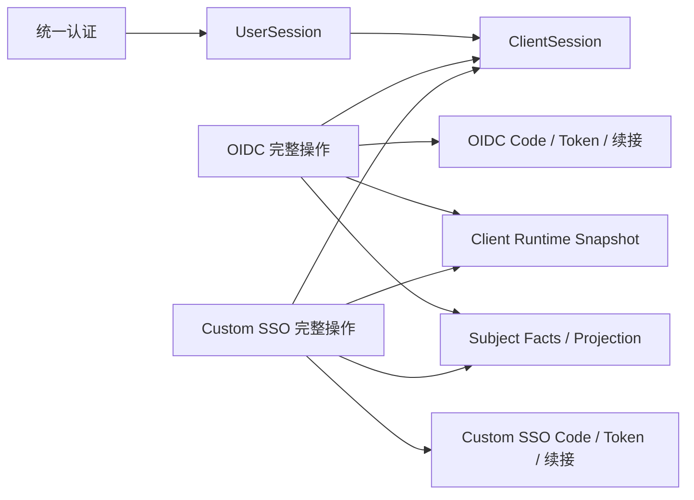

# 两类会话与协议生命周期的收敛设计

> 2026-09-14 后续修订：Q34–Q39 分项已确认并整合到模型、失败矩阵与验收。Custom 业务兑换采用三段 Code；
> 两协议通过适用认证及原实例定位门槛后，兑换失败在本请求内有界尝试撤销；不承诺自动补齐。托管回调不纳入
> 本轮失败策略讨论。维护者已于 Q40 完成修订整体确认并要求同步 #177；详见 §13。

本文承接 [#177](https://github.com/cyy1998/shgas-iam/issues/177) 与
[ADR-0035 的逐项决策](../../adr/0035-unify-user-and-client-session-lifecycles.md)，整合至 2026-09-14 确认的分项行为。
维护者于 2026-09-13 完成 Q33 整体确认，并要求同步更新 #177。当时的业务分项、模型、接口、缓存、失败矩阵
和验收范围均已接受；本轮 Q34–Q39 的修订状态见页首及 §13。本文不是实现验收或部署记录，后续正式 Spec、
拆票和实施仍按各自授权范围推进。

当前源码基线为 `b6481f2de5c2930fc381d99e70520e0783091e9d`，目标分支 `main`，功能分支
`codex/unified-session-lifecycle`。本稿不要求复制 Keycloak 的实体、扩展机制或所有协议功能。

## 1. 目标与 owner

| Owner | 交付职责 |
|---|---|
| 统一认证 | 密码、短信、OA、微信认证、限制和审计，创建 UserSession；保留现有浏览器实现级别。 |
| `@iam/session-kernel` | 仅拥有 UserSession/ClientSession、可信关系、期限、原子 open、确切观察和撤销、必要管理定位。 |
| `@iam/custom-sso` | Code/Token、授权续接、单 callback 自动识别、兑换与交付、ORCAS 编排、本次 Token 补偿及协议维护。 |
| 新 `@iam/oidc` | 完整 OIDC 协议操作及其状态，接回 Code/Token/续接/退出确认、claims 映射、Client 认证和密钥使用。 |
| `apps/api` | 两协议 HTTP、Cookie、重定向、标准错误及 production wiring；保留既有 `/oidc` issuer。 |
| `@iam/api-core` Snapshot 模块 | Client 通行状态和所选协议配置的统一 acquisition；认证敏感数据使用独立窄能力。 |
| Admin API / Admin | 配置、凭据、会话管理、提交结果与实际副作用报告；后端集中授权。 |
| Worker | 一次性统一维护 CLI，装配各 owner 的 inventory/apply/只读 verify；沿现有人工发布流程使用。 |

删除独立 OIDC app、Provider Session/Grant、双重 Code/Token 登记、Claims Snapshot 及其转移/重放。
Kernel 不再拥有 IssuedCredential、ProtocolArtifact、tokenKind、Client 配置 callback、普通配置版本比较或通用
逐协议产物 pending 框架。Subject Access 与 Facts 的既有 owner 保持，不迁入 Kernel。

## 2. 最小模型与配置

以下是逻辑字段，不要求各层复制同一份存储 DTO。跨边界输入、输出与敏感记录分别显式定义。

| 对象 | 字段与不可变部分 |
|---|---|
| UserSession | 独立 ID、subjectIdentifier、authTime、amr、subjectContext、可选 origin、Redis 创建/到期时间及生命周期状态。主体、认证事实、访问代际和原始期限不随协议活动改变。 |
| ClientSession | 独立 ID、userSessionId、clientId、从可信父继承的 subjectIdentifier/subjectContext、protocol、授权/到期时间和生命周期状态。根、Client、主体与实例 ID 不改绑；protocol 可随后续授权更新。 |
| OIDC Code | 随机 Code ID、原确切两类会话/Client 关联、原授权 scope、redirect、PKCE、可选 nonce、必要认证/协议事实和到期时间。只保留未消费记录。 |
| OIDC Access Token | 随机 bearer 的摘要定位、独立管理 ID、原 ClientSession/根/Client 关联、OIDC 用途、自身期限/撤销状态和实际有消费者的授权事实；不保存完整主体投影。 |
| Custom SSO Code | 业务兑换外部格式为 `Code ID.UserSession ID.ClientSession ID`，Code ID 不可预测，存储由协议拥有且不保留消费墓碑；记录保存原确切会话/Client、callback、兑换方、最终落地 URI、state 和期限，用途由签发时已验证回调决定。 |
| Custom SSO Token | 随机 bearer 的摘要定位、独立管理/补偿 ID、原会话/Client 关联、协议用途及固定期限；必要 ORCAS 引用是协议专用数据。 |
| Authentication Continuation | 短期 ID、原 Client/协议、首次接受的请求参数及授权结论、现有等级的浏览器绑定和流程进度；可以在根建立前存在。 |
| 退出确认 | 保留现有单流程确认、Client/hint/redirect/state/浏览器与 CSRF 所需数据；不新增确认页固定根或跨响应 Cookie 保证。 |

UserSession 是 authTime/amr 的权威来源。ClientSession 的中性管理事实可以从父观察复制，不能由协议另外拼接；
认证事实用于协议输出时从可信根观察获得，不建立第二份可独立修改的认证权威。
原授权 scope 如仍保存在 Code/Token，只承担其明确的协议用途，不再限制 UserInfo 的当前披露范围。

### Client 配置

Client 保留稳定业务身份、展示、Role 归属和独立 Internal API 凭据。SSO 配置为可空的严格联合：OIDC 或 Custom SSO，
统一 `ssoEnabled` 表达接入意图。未配置时不能启用；Internal-only Client 仍可存在。

| 配置 | 逻辑形状 |
|---|---|
| OIDC | `clientType`、`redirectUris`、`postLogoutRedirectUris`、`allowedScopes`；Public 对应 `none`，Confidential 对应 `client_secret_basic`，不提供其他认证方法。 |
| Custom SSO | 单个 `callbackEndpoint`、`validRedirectUrls`、`subjectClaims`、可选 ORCAS 配置；删除 mode 和无实际消费者的 Client `logoutEndpoint`。 |
| SSO Secret | 单份当前原文、可识别本次凭据的 ID/更新时间；独立于普通 Runtime 结果。所选接入需要 Secret 时必须存在，Public/托管入口不额外要求提交。 |

已有固定对应关系的字段可在公开 metadata 中派生，不为数据库新增第二份配置权威。普通配置保存、启停、Secret 轮换、
协议选择分别使用明确操作；协议选择更新与相应严格配置在同一 Client 事务内提交。

协议直接切换本身不轮换已有 Secret、不撤销会话、不清旧续接。无配置时协议入口拒绝；重新配置或切回原协议后，
尚未撤销、未过期并满足其他条件的旧访问可以恢复。删除 Client 业务对象和显式会话撤销仍承担各自终止责任。
配置变化后发生的 Code 兑换失败是独立操作，满足 §5/§6 的认证及定位门槛时会尝试撤销原实例；配置可逆不使
该次已成功终止的实例恢复。

## 3. Kernel 公开能力

| 能力 | 最小输入与结果 |
|---|---|
| `createUserSession` | 接受统一认证提供的可信认证结果，生成根 ID/bearer 并返回可信观察；HTTP 输入不能直接成为认证结果。 |
| `resolveUserSession` | 以根 bearer 验证实时状态；内部按 ID 定位另有窄入口，不把 ID 当作 bearer。 |
| `openClientSession` | 接受本操作的父观察及已接受的 Client/协议目标；同根同 Client 原子新建或复用，更新 protocol 并单调延长期限。 |
| `resolveClientSessionForUse` | 按确切实例及预期 Client 取得原 ClientSession 与所属 UserSession 的组合观察，核对身份、父子关系和生命周期；不比较 Token.protocol 与可变 CS.protocol。 |
| `revokeObservedUserSession` / `revokeObservedClientSession` | 终止原确切身份，返回实际作用；管理/撤销不要求根或 Subject Access 仍有效。 |
| 管理/维护出口 | 列表、固定实例集合捕获、精确执行、库存和维护；不暴露任意字段 selector、Redis key 或 Lua。 |

这些方法在完整业务操作的作用域中使用。Kernel factory 私有登记真实观察，并绑定本次操作；调用方复制、序列化、
伪造观察，或拿另一 factory/已结束操作的观察调用，均不成为可信父。公开字段不能被修改后反向改变私有签发依据。
管理 DTO 不能转成在线观察。不得直接复用当前模块级 WeakMap 来宣称已经获得 factory 隔离。

操作内允许复用已取得的有效观察，新的独立操作重新取得；不在提交或响应前追加根状态复查。Subject Access Permission
仍由外层 owner 取得并固定，Kernel 观察不替代账号访问许可。

### 期限与并发

- 根期限由一个服务端 env TTL 决定，创建后固定。ClientSession 使用独立 env TTL，两协议共用。
- 有效实例授权后到期时间为 `min(root.expiresAt, max(old.expiresAt, redisNow + clientSessionTtl))`。
- 只有授权更新目标 ClientSession；兑换、UserInfo、authz 和普通访问不续根、不续 ClientSession 或旧 Code/Token。
- 新 Token 取自身签发 TTL 与两类会话适用剩余期限的最小值。响应与 Cookie 的剩余秒数使用 Redis 观察结果。
- 同根同 Client 原子保持一个有效实例；protocol 不同也复用有效实例。已终止或过期的实例不 restart，新建使用新 ID。
- 允许旧 Snapshot 的在途授权更新同一关系的 protocol；该标记不承担配置新鲜度仲裁，不能因此误拒新协议 Token。
- 根终止后，新在线校验拒绝其派生访问，不依赖子索引完整或逐枚 Token 回收。已观察有效根的在途处理可以完成。

终态、反向 ID 和管理索引遵守同一生命周期。纯产物回收失败不让新模型终态永久取消 TTL；旧无 TTL/pending 库存
在首次升级显式清除。只保留真实消费者需要的索引与确切身份保护，不建立永久历史去重或新通用 pending 系统。

## 4. Snapshot 与 Secret 缓存

Client 通行状态与所选协议配置使用一份 payload，由一次 PostgreSQL Client 行读取形成；存在性、通行状态、SSO
启用意图及可空协议配置分别表达。普通 acquisition 不包含 Secret。

Secret 认证采用同一模块内的敏感 reader，独立 payload/codec/窄出口，与 Client payload 共用该 Client 的 control。
轮换及其他 Client mutation 通过同一次失效使旧 payload 不可用；不让协议操作拿到控制键、generation 或明文列表。
认证 reader 只向认证 owner 提供当前凭据，不扩大普通 Runtime 输出。

| 路径 | 处理 |
|---|---|
| 共同 warm 命中 | 一次 Redis 网络往返取得 control 和统一 Client payload；Secret 认证及其他成本另计。 |
| 缺失/可重建坏 payload | 窄行回源并按原 control 发布 CAS；不接受损坏数据，也不把协议缺失当成 Client 删除。 |
| control 缺失/损坏 | 原子 bootstrap 新随机 epoch 并清本 Client payload，再获取；保留 ABA 保护。 |
| CAS 冲突 | 沿现有一次完整重试预算；再次冲突返回暂态失败。 |
| Redis 连接/读取故障 | 暂态失败，不把故障当缓存 miss 直接绕到 PostgreSQL 放行。 |
| PostgreSQL 已提交、失效失败/未知 | 保留已提交或未知提交的准确结果；旧缓存可能继续生效，使用显式 repair，不自动重放 mutation。 |
| repair/restore | Worker 按当前 owner namespace 执行 targeted/full repair 与独立只读 verify；不轮换 Secret 或撤销会话。 |

默认参数沿现有量级统一为正缓存 30 秒、负缓存 3 秒，进程内 single-flight 按 Client 和实际 reader 合并；
参数可由服务端配置注入，不能将 TTL 当作失效成功证明。只需通行状态的公开能力仍返回窄结果，不要求协议成功启用；
当前已核对成功协议路径都需要配置，不额外保留独立 Gate payload。

两类 reader 各自固定本次接受的观察，Secret 与普通 Runtime 不承诺来自同一个 PostgreSQL 时点。
成功失效阻止旧读取晚到回填，但不追溯推翻已接受的在途认证/配置结果。Secret 无主动重叠期，不等于跨进程瞬间切换。

## 5. OIDC 一次消费与失败分支

外部 Code 为 `Code ID.UserSession ID.ClientSession ID`，不加 MAC/签名或 consumed 墓碑；使用有界格式与不可预测
一次 Code ID。Code/Access Token 的随机格式和存储只由 OIDC 拥有。

完整操作顺序：

1. 取得适用配置；Confidential Client 优先完成 Secret 认证，通过后才进入具有失败撤销作用的流程。
   Public Client 不增加 Secret 要求。完成有界格式、Client 与原根/ClientSession 归属核对，固定原确切实例；
   格式无法解析、实例不存在或归属不符时只拒绝，不猜测目标、不撤销其他 Client 或当前关系槽。
   Gate、协议用途及其他适用前置校验仍在消费前执行；认证与定位门槛通过后的失败按下表尝试撤销。
2. 原子取出并删除该 Code 授权数据；只有明确取得者继续，未知结果停止。
3. 校验保存的根/实例/Client、期限、redirect、PKCE、许可和适用会话有效性。
4. 读取实际需要的已发布 Facts，准备 ID Token 映射/签名；只需要稳定 sub 时不额外读取完整 Facts。
5. 保存 Access Token 并交付；后续失败按下表尝试撤销原 ClientSession，不恢复 Code，不自动换 Token 重发。

Public Client 的失败撤销不以前置 PKCE 成功为条件；明确取得 Code 后仍校验 PKCE。三段定位不构成 Code 曾经
签发的证明，仍接受知道合法实例定位者构造缺失 Code 触发原实例撤销的既有边界。

Code 存储的 lookup/原子操作必须保持所属 Client/实例隔离，不能用 A 的合法定位拼接 B 的 Code ID，先删除 B 的
授权数据再才发现归属不符。可在 owner 私有命名空间限定 Code ID 的定位范围；这不增加 Code 签名、墓碑或消费前
授权数据预读。取得后的 payload 完整性校验仍执行。

| 分支 | Code 与会话结果 |
|---|---|
| Secret 错误、认证失败或尚未确认通过 | 不进入失败撤销流程，不消费 Code。Public Client 无此 Secret 要求。 |
| Code 格式无法解析、目标实例不存在或 Client/根/实例归属不符 | 只拒绝，不消费其他定位范围的 Code，不猜测或扩大撤销目标。 |
| 认证与定位门槛通过后，Gate/协议用途等前置校验拒绝 | 不消费 Code；在本请求内尝试撤销原实例，包括 Maintenance、停用或协议选择不符造成的兑换拒绝。 |
| 明确取得后 redirect/PKCE/后续准备失败 | Code 已烧掉；在本请求内尝试撤销原实例，重新授权。 |
| 明确缺失/竞争未取得 | 在本请求内尝试撤销原实例；允许符合门槛的已知定位者构造不存在的 Code ID 触发该效果。 |
| 自然过期且数据已经消失 | 与明确缺失相同，不建立历史记录区分首次过期和消费重用。 |
| 存储故障、损坏、消费结果未知 | 不冒充缺失；已通过认证与定位门槛时尝试撤销原实例，分别报告兑换错误与实际撤销结果。 |
| Code 消费后 Access Token 写入或交付失败/未知 | 尝试撤销原实例；不重试签发，可能残留未交付 Token。只有实例撤销成功，才能据此保证其后续在线使用拒绝。 |
| A 消费，B 缺失并成功撤销实例，A 晚到写 Token | A 的 Token 仍引用被撤实例，之后在线使用拒绝；B 仅尝试或结果未知不能作为已终止证明。 |

撤销只在本次请求内执行，允许有界重试，且每次只针对原确切实例。失败或未知不承诺实例已经终止，也不承诺
后续自动补齐；重试不重放消费或签发。尚未取得可核对的原目标时不能用请求中的未验证 ID 冒充可信撤销观察。

实例成功终止后，引用它的所有派生在线访问都失效，包括跨协议复用该实例后签出的 Token；新 ID 实例和其他
Client/根保留。根失效不妨碍中性精确终止，但缺失根或不存在实例不能被改绑为当前浏览器根或当前关系槽。

## 6. Custom SSO 接入与失败

每个 Client 只有一个配置 callback，不增加请求侧 mode、delivery 或 callback 选择。业务 callback 接收 Code，
通过 Client Secret 兑换；IAM 托管 callback 由自身入口兑换并设置 Cookie、执行适用 ORCAS 和跳转。
自动判定使用 IAM 实际完整回调地址；初始实现复用服务器配置的 IAM origins 和固定 handler 路径，业务域别名须由
实际部署路由事实提供，不能只凭 URL pathname 或不可信 Forwarded/Host 认定托管。

| 现有 wire | 目标处理 |
|---|---|
| authorize 的 `client/redirectUrl/state` | 保留；`redirectUrl` 是最终业务落地地址，state 仍可选，原值保存。 |
| 固定 `callbackEndpoint` | 统一适用于两种接入，由完整 URL 自动判定；每次 Code 保存实际 callback 和允许兑换方。 |
| `/sso/token` Basic + form `code/redirect_uri` | 保留；此处 `redirect_uri` 仍是原最终落地地址，不静默改成 callback URI；拒绝 query token 兑换输入。 |
| 业务兑换 Code 内容 | 改为 `Code ID.UserSession ID.ClientSession ID`；不加 MAC/签名，不保存消费墓碑。随机生成及状态存储仍由 Custom SSO 独占。 |
| 托管 callback `code/client/redirectUrl` | 保留并核对 Code 原绑定；配置后来改变不把原业务 Code 转成可免 Secret 的托管 Code。 |
| token 响应 `{sid, ttl, subject}` | 保留现有字段名，sid 承载统一协议 bearer；不是新的 ClientSession 内部 ID。 |
| 托管 Cookie/重定向 | 沿现有 HttpOnly/Lax/Path 及实际安全属性，期限来自 Token；保留现有 URL bearer 行为，本轮未修复其暴露问题。 |
| ORCAS | 仅适用托管交付时调用；专用引用留在协议上下文，不进入通用 Projection。 |

Custom SSO 延续现有“先完成适用前置验证，再确认一次消费成功，之后执行交付所需工作”的顺序，不机械复制
OIDC 的所有先删除后校验分支。业务兑换优先验证 Secret，然后核对三段定位中的原根、原 ClientSession 与认证
Client 的归属；认证未通过、格式无法解析、目标实例不存在或归属不符时只拒绝，不猜测或扩大撤销目标。

通过认证与定位门槛后，后续 Gate、用途、callback/兑换方、最终落地地址、会话/许可、Code 消费、投影、Token
签发或交付的任一失败，均按 §5 的请求内有界尝试规则撤销原 ClientSession。Code 明确缺失、自然过期后数据
消失、竞争未取得、存储故障/损坏/未知均纳入该规则；错误回调/兑换方仍不能消费，但不再因此保留原实例。
Secret 与合法实例定位持有者可以构造不存在的 Code ID 触发原实例撤销，无需证明 Code 曾签发。

Code 存储与原子消费必须限定在所属协议、Client 和原实例范围，不能用 A 的合法定位消费 B 的 Code 后才发现
归属不符；记录取得后仍核对完整性。已消费 Code 不恢复，不重放成功交付；当前消费前校验顺序不因统一失败
结果而机械改成 OIDC 的先取删顺序。消费后已知 Token 的既有同步尽力补偿保留，它不能替代原实例撤销，
也不证明实例已终止；本轮不新增 OIDC Token 补偿机制或可靠回收框架。

托管回调不纳入 Q34–Q39 的本轮失败策略讨论，不新增根 Cookie 匹配门槛。其既有成功兑换绑定、消费失败或未知
时不调用 ORCAS，以及消费后投影/ORCAS/签发/交付失败重新授权并同步尽力补偿本次已知 Token 的边界保留；
本轮不据业务兑换的新规则追加托管共享实例撤销。
ORCAS 已成功而响应丢失不代表外部没有会话，其真实幂等、查询、期限与退出仍归 #145。

## 7. 披露、配置与会话关系

| 变化 | 已有状态与后续行为 |
|---|---|
| redirect 允许列表 | 新授权用新列表；已签 Code 和已接受续接保留原实际地址与校验结论。 |
| OIDC 当前 allowedScopes | UserInfo 立即按本操作当前范围披露，新增也影响旧 Token；不与旧原申请范围取交集。 |
| Custom SSO subjectClaims | 同样按当前配置交付，完整 Subject 与 Gateway 最小 Header 分别裁剪。 |
| 已签 ID Token | 内容固定；新签发按实际需要读取 Facts，始终排除 iam:employments/iam:authorization。 |
| Secret 轮换 | 替换当前值并失效缓存；不撤会话/Code/Token；在途及传播失败边界如上。 |
| SSO 启停、Client Disabled/Maintenance | 配置变化本身只暂停对应流量，不暂停 TTL 或批量撤销；后续 Code 兑换满足认证及定位门槛而被拒绝时，按 §5/§6 尝试撤销原实例。恢复后仅未终止且仍满足条件的访问可继续。 |
| Client 协议选择 | 直接保存；有效 ClientSession 后续授权复用并更新 protocol；旧协议暂时拒绝。其后的 Code 兑换失败可能触发原实例撤销，切回只可能恢复尚未终止的旧访问。 |
| 显式撤销/Client 删除/账号生命周期 | 执行各自明确的终止与访问阻断，不按可逆配置编辑处理。 |

两协议都使用已发布 Facts；有效 Redis 命中不读 PostgreSQL，明确缺失/坏 payload 才窄行回源，连接故障暂态失败。
不查 Dirty 新鲜度、不现场聚合；新发布事实可改变后续 UserInfo，稳定 sub/Client/确切实例不改写。
原授权 scope 保留其仍有消费者的协议意义，不能成为偷偷冻结旧披露的第二规则。

schema/wire/Catalog 版本仍属于各自 owner。破坏性变更沿现有人工协调发布、当前唯一 active Catalog 和必要数据
核验处理；不恢复普通配置版本撤销，不混读两代完整协议/会话模型，也不把缓存修复当成业务数据迁移。

## 8. OIDC HTTP 与浏览器兼容边界

| 项目 | 目标基线 |
|---|---|
| issuer/路径 | 保持 `/oidc`；授权 `/auth` GET/POST，token `/token` POST，UserInfo `/me` GET/POST，JWKS `/jwks`，退出 `/session/end` 及 Discovery。 |
| Flow/认证 | Code Flow、Public/Confidential、none/client_secret_basic、两类 Client 强制 S256；不新增 refresh/offline。 |
| scope/参数 | 支持 openid、profile、phone、iam:employments、iam:authorization；保留非空 state、redirect、scope/PKCE 及必要标准校验。 |
| nonce | 沿实际 Code Flow 的可选输入，提供时绑定并回传；现行文档必填而源码可省略的差异在迁移时修正并以 HTTP 验证。 |
| response_mode | 保留当前 query、fragment、form_post 的 Code 响应能力，不因替换库静默只剩 query。 |
| prompt/max_age | 保留现有根复用与重认证拒绝级别，不新增重复认证/MFA；边缘参数与标准错误通过定向 HTTP 验证。 |
| Claims/JWKS | public subject、RS256，标准 iss/aud/iat/exp、nonce、auth_time 等；根认证事实保持真实来源，普通资料按协议映射。 |
| CORS | token 的 Public Client 限已登记 redirect origins；UserInfo 按 Token Client 的允许 origins；Discovery/JWKS 兼容实际公开行为，不从文档误推通配。 |
| 错误 | 标准 OIDC/OAuth form/query、错误响应和安全重定向；不套 IAM REST envelope 或通用 422；未确认安全 redirect 时本地报错。 |
| 暂态 | 区分真实 Maintenance、普通不可用及永久无效；故障不能伪装不存在并误清可恢复 Cookie。 |

claims 参数、request objects、PAR/JAR/DPoP、动态注册、JWT UserInfo、加密、设备流、CIBA、client_credentials、
资源指示及公开 introspection/revocation 等现已关闭能力不因库中存在而新增。关闭/未知参数的精确处理按实际支持
范围做少量兼容测试，不把新库“能处理”当作已授权功能。

继续使用服务器 current RSA JWK 和可选 previous 的配置方式，kid 不重复，密钥与轮换由原人工职责处理；Code 无独立
签名密钥。不引入在线密钥管理。多标签页、完成证明、退出请求目标和同名 Cookie 沿现有实现级别，不追加 Q25–Q27
已经排除的强化保证。

2026-09-14 实施 #190 时，真实旧 Provider HTTP/Redis 证明取消按钮也被外层 middleware 终止根。维护者随后明确授权
修正：取消仅结束本次退出确认，保留根、应用关系、Token 与根 Cookie；确认仍终止提交请求实际观察的根。
该修订不增加确认页固定根、跨标签页协调或 Cookie 响应顺序保证；新旧行为证据及候选接口见
[OIDC 候选退出契约](../oidc/authorization-candidate.md#退出确认与取消修订)。

## 9. Admin、计数与恢复

Client 配置、轮换和会话管理继续属于现有 `iam:admin` 能力，HR 不因此获得入口。Q32 已确认 Secret 重读中的
“超级管理员”就是 `iam:admin`，不新增角色层级；重读设置独立 policy operation 与独立审计 action，HR 不得读取。

Secret 重读只返回当次当前值及可识别凭据身份，普通列表/详情不含原文；审计和日志不含原文。读取审计失败时不交付
Secret，响应丢失可以再次读取当前值，不保证取回历史版本。重读不轮换、不失效缓存，也不消除既有传播修复提示。

| 结果 | 保留的语义 |
|---|---|
| Client 成功 | `{changed, result}`，REST 外层 envelope 与 tRPC 业务结果分别保持；同值规范化保存为 no-op。 |
| 明确已提交、后续 required 失败 | 保留 `ADMIN_MUTATION_COMMITTED` 及刷新/修复提示，不自动重放。 |
| Unknown COMMIT | 保留原错误并尝试保守失效，不冒称已提交或已回滚。 |
| 撤销后审计失败 | 保留 `ADMIN_LOGIN_STATE_AUDIT_FAILED_AFTER_EFFECT`，已发生作用不回滚，页面刷新并提示。 |
| 会话计数 | 协调替换为实际 `userSessions/clientSessions` 终止数；产物回收 attempted/succeeded/failed 单独表达，不伪装成已排队进度。 |
| 当前根排除 | 本人全部下线/重置密码保留根本身，仍处理其 ClientSession；单根撤销保留当前管理根保护。 |

会话列表是记录视图，不宣称“在线用户”或逐目标账号当前可访问。列表不为了判断目标账号状态触发撤销；管理员自身
权限仍检查。前端 capability、结果提示和失效后刷新由服务端契约驱动，不硬编码新角色判断。

批量命令先捕获实例集合，执行及重试只针对原身份；未完成集合可以明确返回供后续授权操作重试。结果丢失无法恢复
集合时重新查询并发起新操作，不自动扩大旧批次，也不新增持久化任务框架。

## 10. 迁移与现有人工发布

首次升级仍全体重新登录，所需 SSO Secret 统一换新；发布/回退沿现有人工流程。日常协议直接切换不执行这套首次
升级流程，不要求维护窗口、批量撤旧或清续接。

| 库存/消费者 | 迁移要求 |
|---|---|
| 旧双协议 Client | 人工输入明确所选协议；没有选择时列为配置待处理，不猜测实际业务用途。Internal-only 保留。 |
| 旧 mode/callback | 转成单个实际 callback；原 Gateway 无明确 callback 的库存补齐已部署 IAM 地址，不能凭 origin 推导声明路由已存在。 |
| 旧协议 Hash | 为最终需要 Secret 的 Client 换新并协调接入方；不要求还原 Hash，不新增 hash-only 重读例外。 |
| Kernel/Provider/Grant/旧 Cookie | 通过对应 owner 的明确库存处理；包括 pending、无 TTL 和无索引对象；旧登录态不进入新模型。 |
| Custom 业务兑换 Code | 随首次全体重新登录切换为三段格式，核对生产方与兑换方的传递、解析及实例隔离；不混读旧不透明业务 Code，也不转换或保留旧消费墓碑。 |
| Snapshot/Gate/Secret 缓存 | 新布局的 namespace/catalog、targeted/full repair 与独立 verify 同步交付；旧 reader/writer 不混跑。 |
| Runtime/部署资产 | OIDC HTTP 并入 API，迁移 env、health/readiness、日志、Gateway upstream、镜像依赖、scripts 和测试 owner；API 共进程的资源与故障范围据实记录。 |
| 前后端/外部消费者 | 单协议配置、新结果计数、当前 Secret、Custom SSO 回调及保留 wire 协调切换；不能把类型通过当作接入方已更新。 |

Worker 统一公开调用方式、退出码与安全结果；各 owner 提供有界库存/apply/只读 verify、非目标保留、未知数据与部分
失败重跑。人工流程取得实际停流、排空、Secret 配置、路由和放流证据；只补齐本次变化的信息，不新增自动发布器。

默认期限配置保留现有模板量级：根 86400 秒、ClientSession 86400 秒、Custom SSO Token 86400 秒、OIDC Access/
ID Token 3600 秒、Code 300 秒；全部通过所属服务端 env 注入。根与 ClientSession 的固定/延长规则以上述契约为准，
这些数值不是硬编码业务约束，也不是当前生产覆盖值的证明。

## 11. 验收与来源核销

| 证明范围 | 必须观察的行为 |
|---|---|
| V1 协议状态 | 两协议 Code 唯一消费、三段定位及跨 Client/实例存储隔离；OIDC 取出后错误烧码、Custom 保留适用前置校验；认证与定位门槛通过后的各类失败撤销尝试，包括缺失/过期/竞争、错误参数、写入/交付及未知 I/O；ID Token 准备与交付。 |
| V2 会话 | 可信观察防伪及作用域、唯一关系、单调期限、protocol 更新复用、Token 在线查原根、漏子索引仍拒绝、显式撤销不恢复；失败撤销成功后跨协议派生访问及晚到 Token 均拒绝，新实例/其他根与 Client 保留；撤销有界重试、失败/未知不计成功且无自动补齐；切回仅恢复尚未终止的访问。 |
| V3 配置/接入/管理 | 统一 Snapshot 一次 warm RTT、Secret 敏感缓存与失效失败；Secret 未通过无撤销、Public 无前置 PKCE 门槛、伪造缺失 Code 的已接受作用；配置变更本身不撤销与后续 Gate/协议拒绝触发兑换失败撤销分别验证；当前披露、原续接、单 callback 原绑定、固定批次及当前根排除。 |
| V4 成本/迁移 | 消除重复权威及实际消费者步骤；新增 ClientSession/根检查和动态投影的实际网络调用、串行波次、完整端点成本；真实 CLI/新进程 verify 与迁移边界。 |

V1/V2 区分实际撤销成功、失败和结果未知；格式不可解析、实例不存在或归属不符只拒绝。Q38 不新增托管失败
策略或 Cookie 认证门槛，托管既有绑定与交付仍按原范围验证。维护中的请求只有在取得了适用认证及确切定位后，
才能产生本轮新增的失败撤销作用，不能由“拒绝了兑换”倒推这些前置条件已经成立。

协议套件固定 `release-v5.2.4` / `ab35a8df4864da35b49eff11483e204e01aa7961`，使用适用 Basic/Config/Logout
计划与 public 补充用例，保留 S256 适配 diff 和逐项通过/失败/未执行/不适用记录，不称完整官方认证。
真实 RP 互操作与 Redis/PG/HTTP 故障测试分别提供证据，不能用自家 RP 成功替代协议矩阵。

成本基线固定本稿源码 SHA，后续实施在可比独立依赖、资源、数据和请求窗口下采样；局部 warm 预算不推导完整
请求延迟。已交付的直接摘要定位、用途匹配、固定 Token 期限不重复记收益，#71/#72 的完整预算仍独立。

#141/#142/#143/#153/#154/#155/#162/#169 按新契约逐项核销；#121 只核对仍需可靠执行的作用，#145 保持独立。
旧断言要替换成当前已确认行为，不能通过删除测试掩盖 owner 迁移或未执行。

## 12. D1–D10 收敛结果

| 原编号 | 本稿落点 | 状态 |
|---|---|---|
| D1 最小模型 | §2 的两类会话、单协议 Client、协议状态与字段 owner | 已确认。 |
| D2 接口与期限 | §3 可信操作观察、组合读取、中性撤销与期限 | 已确认。 |
| D3 消费与失败 | §5/§6 各自消费顺序、共同失败撤销门槛及结果 | Q34–Q39 分项已整合，Q40 修订整体确认已完成。 |
| D4 管理与维护 | §9/§10 固定批次、计数与 Worker owner | 已确认边界已整合。 |
| D5 Admin | §9 权限、Secret 重读、提交与审计 | 已确认，超级管理员为 iam:admin。 |
| D6 迁移 | §10 首次迁移清单、现有人工流程与直接切换区分 | 已确认方向已整合；实际环境证据留给发布 owner。 |
| D7 验收 | §11 固定套件、适配/偏离、真实资源与成本 | 已确认方向已整合。 |
| D8 Custom SSO | §6 单 callback、原 wire、兑换方与补偿 | 已确认方向已整合；实际托管路由作为部署输入。 |
| D9 OIDC | §5/§8 Code、HTTP、参数、密钥与既有浏览器级别 | 已确认范围已整合；兼容差异显式验证。 |
| D10 配置与 Secret | §4/§7 缓存、普通变更、可逆选择与敏感读取 | 已确认。 |

Q33 基线整体确认及 #177 同步已完成。Q34–Q39 的后续修订已在本文整合，维护者于 Q40 完成整体确认并要求
更新该 issue。独立设计提交与分支交接记录由 issue 保存；确认不表示已授权或完成实施、合入、部署或关闭 issue。

## 13. 后续修订：Code 兑换失败与原实例撤销

维护者于 2026-09-13 对兑换失败分类明确选择“全部终止”：Custom SSO 与 OIDC 统一以终止原确切
ClientSession 为失败处理目标。2026-09-14 的 Q35 进一步限定：优先校验 Secret，通过后出现的问题才触发撤销；
Secret 认证失败或未能确认通过时，不因该请求撤销 ClientSession。

适用认证与原实例定位门槛通过后的失败范围覆盖 Gate、用途、Code 缺失或竞争未取得、自然过期后记录消失、明确消费后
的校验/投影/签名/Token 签发或交付失败，以及存储故障、损坏或结果未知。具体目标必须是原确切实例，
不能把归属不符的请求变成跨 Client 撤销。OIDC Public 与托管回调的范围按下述 Q37/Q38 处理。
这同时扩大两协议原有的失败处理目标，不只是让 Custom SSO 复制 §5 的 OIDC 缺失分支。

终止对象仍是原 ClientSession，影响引用该实例的派生在线访问；不把原实例改绑到当前关系槽，不扩大为撤销
UserSession、其他 Client 或后来创建的新实例。有效根可以用于重新授权，已终止实例不能复活。

Q36 已确认撤销只在本次请求内尝试完成，允许有界重试；失败或结果未知时，不承诺会话已终止，也不承诺之后
自动补齐。不新增后台可靠撤销任务或自动恢复承诺。消费结果与撤销结果分别表达，不能将消费未知改记为缺失，
也不能将已尝试撤销改记为已终止；有界重试只针对原确切实例的撤销，不据此重放兑换或重新签发 Token。

Q37 已确认 OIDC Public Client 保留既有定位门槛：通过格式、Client 与原会话实例归属校验后，后续兑换失败
即可触发撤销尝试，不要求先通过 PKCE。记录明确取得后的 PKCE 校验仍执行；缺失记录时无法重读 challenge，
仍接受知道合法实例定位者构造缺失 Code 触发下线的既有后果，不给 Public Client 增加 Secret 要求。

Q38 维护者明确“托管回调不需要考虑”，本轮后续收敛聚焦 Custom 业务端兑换与 OIDC，不为托管回调新增
UserSession Cookie 匹配门槛或其他认证方案。该答复不表示删除托管接入，也不取消其既有成功兑换所需的
callback/兑换方绑定；本轮不继续展开托管失败策略。

Q39 已确认 Custom 业务兑换采用 `Code ID.UserSession ID.ClientSession ID`，不加 MAC/签名或消费墓碑。
先通过 Secret 认证，再核对原根、原实例和认证 Client 的归属；通过后 Code 缺失等后续失败均触发请求内撤销
尝试。持有 Secret 及合法实例定位者可以构造不存在的 Code ID 使该实例下线，不要求证明 Code 曾经签发。
格式无法解析、实例不存在或归属不符只拒绝，不猜测当前关系槽，也不扩大为 Client 全体会话撤销。

模型、§5/§6 失败矩阵、§7 可逆配置与后续失败撤销的区别、迁移和 V1–V4 验收已按 Q34–Q39 分项整合。
Custom 的原消费前校验顺序及本次已知 Token 同步尽力补偿保留，后者不替代原实例撤销；不新增 OIDC Token
补偿或可靠回收框架。失败回复保留协议错误映射，实际撤销结果单独表达，不将未知作用伪装为成功。

Q40：维护者于 2026-09-14 同意本轮整体设计，并要求更新 GitHub #177。Q34–Q39 的模型、门槛、失败撤销、
既有补偿及托管范围均已确认；设计提交与同步记录由 #177 保存。本次确认不表示已实施、验证或部署。
